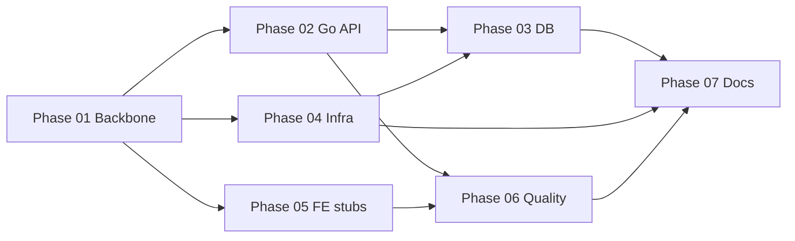

# Phase 1 — Foundation (Snake Backlink Forge)

## Scope

Scaffold fresh Go+TS monorepo on top of existing ClaudeKit `.claude/` bootstrap. Deliverables: Fiber API skeleton booting with `/health` + `/ready`, full §3.1 DDL migrations + 30 dork seed patterns, Postgres 16 + Redis 7 via docker compose, Next.js/Svelte/shared-types stubs compiling, CI + husky quality gates live, docs + git init. **No business logic** — Phase 2+ handles bot, wallet, campaign engine.

## Sub-phases

| # | File | Priority | Effort | Agent | Status |
|---|------|----------|--------|-------|--------|
| 01 | [phase-01-monorepo-backbone.md](./phase-01-monorepo-backbone.md) | P0 | 1.5h | fullstack-developer | pending |
| 02 | [phase-02-go-api-skeleton.md](./phase-02-go-api-skeleton.md) | P0 | 3.5h | fullstack-developer | pending |
| 03 | [phase-03-database-layer.md](./phase-03-database-layer.md) | P0 | 2.5h | fullstack-developer + code-reviewer | pending |
| 04 | [phase-04-local-infra.md](./phase-04-local-infra.md) | P1 | 1h | fullstack-developer | pending |
| 05 | [phase-05-frontend-stubs.md](./phase-05-frontend-stubs.md) | P1 | 1.5h | fullstack-developer | pending |
| 06 | [phase-06-quality-gates.md](./phase-06-quality-gates.md) | P1 | 1.5h | fullstack-developer + tester | pending |
| 07 | [phase-07-docs-housekeeping.md](./phase-07-docs-housekeeping.md) | P2 | 1.5h | docs-manager + git-manager | pending |

**Total effort: ~13h** (1 engineer-day with reviews).

## Execution DAG

Parallel lanes after 01: {02, 04, 05}. **[C1]** 03 waits on BOTH 02 AND 04 (`make migrate-up` requires Postgres from Phase 04 compose). 06 waits on {02, 05} (lint configs need apps/services). 07 is terminal.

## ADR Deviations (MUST ack before implementation)

| Original §1.2 | Used | Reason |
|---------------|------|--------|
| Go 1.23 | **Go 1.26.2** | Go 1.23 EOL April 2026 — no security patches (researcher R1) |
| TypeScript 5.5+ | **TypeScript 6.0.3** | Current stable; 5.5 pre-dates Biome 2 Svelte support (researcher R2) |
| Fiber built-in logger | **fiberzap/v2 contrib** | Built-in logger does NOT emit Zap structured JSON (researcher R1 §2) |

All other §1.2 locked decisions (Fiber v2, pgx v5, goose, sqlc, Redis 7, Postgres 16) unchanged.

## Key Version Pins

- Go 1.26.2, Fiber v2.52.6, pgx v5.9.1, go-redis v9.18.0, goose v3.20+, sqlc v1.30.0, zap v1.27.0, fiberzap/v2 latest contrib
- pnpm 9.15.9, Turborepo 2.9.6, Next.js 15.5, React 19, Svelte 5, Vite 5, @crxjs/vite-plugin 2.4.0, Biome 2.3, TypeScript 6.0.3
- PostgreSQL 16-alpine, Redis 7-alpine, gitleaks 8.18.2, husky 9, commitlint **19.5.0** (v20 not released Apr 2026)
- golangci-lint **v1.68+** (Go 1.26 support), golangci-lint-action **latest stable** (v7+ as of Apr 2026)

## Scout Open Q — Decisions

1. **Git init**: **[C8]** `git init -b main` runs in Phase 01 step 0 (BEFORE `pnpm install`). Phase 07 handles branch creation (`git checkout -b dev`) + initial commit only.
2. **Root `package.json` rename**: YES → `snake-backlink-forge`, version `0.1.0`. Keep husky + commitlint + gitleaks devDeps; drop semantic-release (re-add Phase 10).
3. **ClaudeKit `scripts/`**: Move to `scripts/_claudekit/` namespace. No delete.
4. **Root `.env.example`** (Discord/Telegram hook): rename to `.env.claudekit.example`. New `services/api/.env.example` holds §12.1 vars.
5. **Frontend stubs**: package.json + minimal build config only, NO UI. Enables `pnpm -r build` CI baseline.
6. **User pre-reqs for Phase 2+** (Telegram bot token, SePay merchant, domain, Sectigo OV cert): not blockers for Phase 1 but user must provision before Phase 2 kickoff — flagged in `docs/progress.md`.
7. **[C7] Plans commit policy**: COMMITTED. plans/260424-0247-*/** and plans/reports/** added as `.gitignore` exceptions — plan files are project history/audit artifacts.

## Success Gate (Phase 1 → Phase 2)

`pnpm install` clean · `docker compose up -d --wait` healthy · `make migrate-up` applies §3.1 clean · `make migrate-down` reverts zero-residue · `go test ./... -race` pass · `curl localhost:8080/health` → 200, `/ready` → 200 with PG+Redis up / 503 when down · `turbo run lint typecheck build` clean · initial commit landed on `dev`.

---

## Pre-Cook Checklist

- [ ] Git repo initialized (Phase 01 step 0 — `git init -b main` before `pnpm install`)
- [ ] plans/ commit exceptions added to `.gitignore` (`!plans/260424-0247-*/**` + `!plans/reports/**`)
- [x] LICENSE = **proprietary** (user confirmed 2026-04-24); applied Phase 01 step 7 overwrite of MIT
- [ ] sqlc generated code commit policy decided: **COMMIT** (no sqlc CLI required for fresh clone)
- [ ] Windows dev path = Git Bash (primary); WSL2 optional. Docker Desktop WSL2 integration enabled.
- [ ] golangci-lint-action pinned to latest stable supporting Go 1.26 (v1.68+ golangci-lint, v7+ action)
- [ ] Phase 03 reviewer role clarified: DDL correctness + migrate-down reversibility + stored proc atomicity

---

## Red-Team Patches Applied

Source: `plans/reports/red-team-260424-0247-phase-1-foundation.md` · Date: 2026-04-24

| Batch | Applied | Skipped |
|-------|---------|---------|
| Critical C1–C8 | all 8 | — |
| High H1–H10 | all 10 | — |
| Medium | M2, M3, M6, M9 | M1, M4, M5, M7, M8 (report: no-fix) |
| Nits | N1, N6 | N2–N5, N7–N10 |

**Controller decisions applied:** (1) plans committed to git; (2) **LICENSE=proprietary from Phase 01** (user confirmed 2026-04-24); (3) sqlc generated code committed; (4) golangci-lint v1.68+ / action v7+; (5) Windows = Git Bash primary + WSL2 optional; (6) phase-03 code-reviewer role scoped.

## Cook Checkpoints (user-directed)

- **Checkpoint 1 (after Phase 01):** user reviews git init + file structure + `pnpm install` success before proceeding.
- **Checkpoint 2 (after Phase 04):** user manually tests `docker compose up -d --wait` + `curl /health` 200 + kill PG → `/ready` 503 + restart → `/ready` 200 before proceeding.
- After Checkpoint 2: auto-chain remaining phases per DAG (02 must run before 04 per DAG; remaining after Checkpoint 2 = 03, 05, 06, 07).
