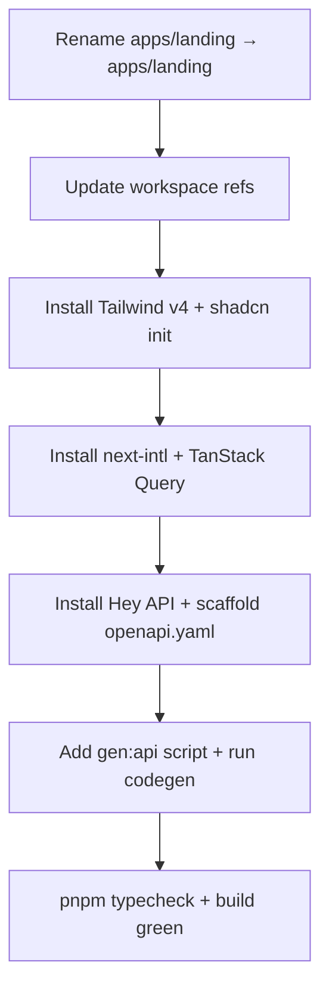

<!-- RT-R1: F14 (shadcn non-interactive), F-supply-chain-dlx (pin versions), F15 (Go contract test), F4-shadcn-slim (4 components only), F8 (drop next-intl from Phase 3) -->
<!-- RT-R2: F12 (drop kin-openapi entirely), revert-R1-F-shadcn-slim (re-add Sheet+DropdownMenu), F-bundled-pnpm-dlx (shadcn devDep + pnpm exec), F-bundled-env-loader (lib/env.ts Zod), F-bundled-env-list (.env.example complete) -->
<!-- Effort delta: 3.5h → 3h (drop kin-openapi -30min, add env loader +15min, re-add 2 shadcn components +5min, switch dlx → devDep +0min) -->

<!-- ⚠️ OPTION A OVERRIDE (Phase 0 lock 2026-04-27): KEEP `apps/landing` directory + `@sbf/landing` package name. SKIP Step 1 rename entirely. Vercel project already imported with Root Directory: apps/landing — renaming would force Vercel re-config + 30min refactor for zero benefit. All `apps/web` / `@sbf/web` references in this file were find/replaced to `apps/landing` / `@sbf/landing` to match reality. Other phase files (02-08) still reference `apps/web` and will be overridden similarly when cooked. -->

## Context Links

- Research R1: `plans/260426-0237-phase3-web-saas-foundation/research/researcher-r1-frontend-foundation.md` (lines 12-90, 91-205, 208-322 — Next.js 15.5, shadcn install, Tailwind v4, next-intl v4)
- Research R2: `plans/260426-0237-phase3-web-saas-foundation/research/researcher-r2-plumbing-deploy.md` (lines 18-73 — Hey API codegen)
- Scout: `plans/260426-0237-phase3-web-saas-foundation/reports/scout-codebase-state.md` (§1 — bare landing scaffold; §4 — empty shared-types; §5 — pnpm/turbo state; §6 — env state)
- Master prompt: `docs/MASTER_PROMPT.md` §5.5 lines 1336-1358 (stack lock + engineering bar)

## Overview

- **Priority:** P0 (blocks all other phases)
- **Status:** completed
- **Brief:** Rename `apps/landing/` to `apps/landing/`; install Tailwind v4, shadcn/ui, next-intl, TanStack Query v5, Hey API; configure Biome includes; write `.env.example`; scaffold OpenAPI 3.1 skeleton at `packages/shared-types/openapi.yaml`; wire `pnpm gen:api` codegen script. Compile baseline must pass `pnpm -r typecheck && pnpm -r build`.

## Key Insights

- Existing `apps/landing/` is a bare placeholder (single h1) — safe to rename without losing content
- `next@15.5.0`, `react@19.1.0` already installed; only missing infra is Tailwind/shadcn/intl/Query/codegen
- Tailwind v4 has NO `tailwind.config.js` — config lives in CSS via `@theme inline { ... }` and `:root { ... }`
- shadcn `init` auto-creates `components.json`, `lib/utils.ts`, `globals.css`, alias paths
- pnpm workspace globs already include `apps/*` — no `pnpm-workspace.yaml` change needed for rename
- Biome ignore list (`biome.json`) needs review: `apps/landing` may be referenced explicitly — switch to `apps/landing` if so
- Hey API config file (`hey-api.config.ts`) reads from `packages/shared-types/openapi.yaml` and writes to `packages/shared-types/src/generated/`
- Turbo cache will invalidate on rename (different package name) — that is expected

## Requirements

### Functional

- `apps/landing/` runs `pnpm dev` and serves a placeholder root page on `localhost:3000`
- `pnpm gen:api` produces TypeScript client + types in `packages/shared-types/src/generated/`
- `pnpm typecheck` passes across all workspaces
- `pnpm build` produces `.next/` output for `apps/landing/` and stub bundle for `packages/shared-types`
- `pnpm dlx shadcn@latest add button` succeeds in `apps/landing/` (validates init)
- `apps/landing/.env.example` documents `NEXT_PUBLIC_API_BASE_URL` and `NEXT_PUBLIC_APP_URL`
- Workspace deps reference `@sbf/landing` (not `@sbf/landing`)
- Tailwind directive `@import "tailwindcss"` resolves; OKLCH tokens render

### Non-functional

- Zero new test files in this phase (test infra arrives in Phase 8)
- Zero secrets committed (`.env.example` only)
- All TS strict mode preserved (`tsconfig.base.json` `strict: true`)
- Biome `pnpm biome ci .` exits 0
- React 19 + Next 15.5 versions pinned exactly (no `^` ranges) per R1 fintech-adjacent guidance

## Architecture

### Repo layout after rename

```
apps/
├── web/                          ← renamed from landing/
│   ├── src/
│   │   ├── app/
│   │   │   ├── globals.css       ← Tailwind v4 @import + @theme inline + OKLCH vars
│   │   │   ├── layout.tsx
│   │   │   └── page.tsx
│   │   └── lib/
│   │       └── utils.ts          ← shadcn cn() helper
│   ├── components.json           ← shadcn config
│   ├── next.config.ts            ← withNextIntl wrapper
│   ├── package.json              ← name: @sbf/landing
│   ├── tsconfig.json
│   ├── biome.json overrides if needed
│   ├── postcss.config.mjs        ← @tailwindcss/postcss
│   └── .env.example
└── extension/                    ← unchanged (deprecated marker only)

packages/
└── shared-types/
    ├── openapi.yaml              ← NEW: 3.1 skeleton (info, servers, components stub)
    ├── hey-api.config.ts         ← NEW: codegen config
    ├── src/
    │   ├── index.ts              ← re-export from generated/
    │   └── generated/            ← gitignored output
    │       └── .gitkeep
    └── package.json              ← scripts.gen:api, devDeps for hey-api
```

### Dependency graph



## Related Code Files

### Create

<!-- RT-R1: F13 — query-client.ts dropped; F8 — i18n/ dropped from Phase 3; F4-shadcn-slim — only 4 components added -->

- `apps/landing/src/app/globals.css` (Tailwind v4 + OKLCH theme tokens)
- `apps/landing/src/app/providers.tsx` (`"use client"` ThemeProvider only — no Query)
- `apps/landing/src/lib/utils.ts` (shadcn `cn` helper, manually pre-canned)
- `apps/landing/components.json` (shadcn config — manually pre-canned, NOT generated by CLI)
- `apps/landing/postcss.config.mjs`
- `apps/landing/.env.example`
- `apps/landing/next.config.ts` (minimal — no next-intl plugin)
- `packages/shared-types/openapi.yaml` (3.1 skeleton)
- `packages/shared-types/hey-api.config.ts`
- `packages/shared-types/src/generated/.gitkeep`
- `apps/landing/.gitignore` (add `.next/`, `node_modules/`, `next-env.d.ts`)
- `apps/landing/src/lib/env.ts` (Zod-validated env loader for all `NEXT_PUBLIC_*` vars — RT-R2: F-bundled-env-loader)
<!-- RT-R2: F12 — services/api/internal/api/openapi_contract_test.go DROPPED entirely. Plan.md OpenAPI authored for Hey API codegen only, no Go-side validation. -->

### Modify

- `apps/landing/package.json` (name `@sbf/landing`, deps add list below)
- `apps/landing/tsconfig.json` (paths alias `@/*` → `./src/*`)
- `apps/landing/src/app/layout.tsx` (import `globals.css`, wrap children in `<Providers>`)
- `apps/landing/src/app/page.tsx` (placeholder content with shadcn `Button` smoke test)
- `apps/landing/next.config.mjs` → rename to `next.config.ts` (minimal, no plugin)
- `packages/shared-types/package.json` (deps + scripts; pinned versions)
- `packages/shared-types/src/index.ts` (re-export generated/)
- Root `package.json` (add `gen:api` workspace runner)
- Root `biome.json` (replace any `apps/landing` reference with `apps/landing`)
- `ops/templates/api-env.example` (add `NEXT_PUBLIC_API_BASE_URL` doc; backend is unaffected but ops template lists web URL)
<!-- RT-R2: F12 — services/api/go.mod kin-openapi require DROPPED. No Go contract test. -->

### Delete

- `apps/landing/` (after rename — handled by `git mv`)
- `apps/landing/next.config.mjs` (replaced by `.ts`)

## Implementation Steps

### Step 1 — Rename app directory ⚠️ SKIPPED (Option A lock)

**SKIPPED** per Phase 0 Option A decision (2026-04-27). `apps/landing/` stays as-is, `@sbf/landing` package name stays as-is. Vercel project already wired to `apps/landing` Root Directory; renaming would invalidate that wiring for zero benefit.

Verify state already true: `pnpm --filter @sbf/landing dev` boots on `:3000` (will be re-verified after Step 8).

### Step 2 — Tailwind v4 + shadcn (non-interactive, pre-canned config) (25 min)

<!-- RT-R1: F14 — shadcn init wizard fails non-interactively in CI / fresh clones; pre-create config files manually to avoid prompt -->
<!-- RT-R1: F-supply-chain-dlx — pin all `pnpm dlx` invocations to exact versions; never `@latest` -->
<!-- RT-R2: revert-R1-F-shadcn-slim — re-add Sheet + DropdownMenu. R1 dropped them in favor of native <details>; R2 found custom replacements have CSP issues + accessibility gaps. Re-adding for proper a11y + route-close behavior. -->
<!-- RT-R2: F-bundled-pnpm-dlx — install shadcn as devDependency at exact version 2.1.6, run via `pnpm exec` so lockfile applies (real pinning, not just dlx convenience). -->

Pin shadcn CLI as devDep (RT-R2: F-bundled-pnpm-dlx). Verify latest stable per https://ui.shadcn.com/docs/cli (2.1.6 as of 2026-04-26).

```bash
cd apps/landing

# Tailwind v4 (pin)
pnpm add tailwindcss@4.0.0 @tailwindcss/postcss@4.0.0

# RT-R2: F-bundled-pnpm-dlx — shadcn as devDep, exact version, lockfile-pinned
pnpm add -D shadcn@2.1.6

# shadcn — DO NOT run `init` wizard (interactive, fragile). Pre-create config below, then `add` non-interactively.
# RT-R2: revert-R1-F-shadcn-slim — Components installed: Button, Input, Card, Label, Sheet, DropdownMenu (6 total).
# Sheet for MobileNav; DropdownMenu for UserMenu (proper a11y + Esc/click-outside/route-close).
pnpm exec shadcn add button input card label sheet dropdown-menu
```

**Pinning rationale:** `@latest` introduces supply-chain risk + non-deterministic build. devDep+lockfile = audited, reproducible. Update via PR after manual review.

Pre-create these files BEFORE `shadcn add` (since we skipped `init`):

`apps/landing/components.json`:

```json
{
  "$schema": "https://ui.shadcn.com/schema.json",
  "style": "new-york",
  "rsc": true,
  "tsx": true,
  "tailwind": {
    "config": "",
    "css": "src/app/globals.css",
    "baseColor": "zinc",
    "cssVariables": true
  },
  "aliases": {
    "components": "@/components",
    "utils": "@/lib/utils",
    "ui": "@/components/ui",
    "lib": "@/lib",
    "hooks": "@/hooks"
  },
  "iconLibrary": "lucide"
}
```

`apps/landing/src/lib/utils.ts`:

```ts
import { clsx, type ClassValue } from 'clsx'
import { twMerge } from 'tailwind-merge'
export function cn(...inputs: ClassValue[]) { return twMerge(clsx(inputs)) }
```

`apps/landing/postcss.config.mjs`:

```js
export default { plugins: { '@tailwindcss/postcss': {} } }
```

`apps/landing/src/app/globals.css` — Tailwind v4 + OKLCH theme variables (canonical R1 lines 124-147).

Edit `apps/landing/src/app/layout.tsx`:

```tsx
import './globals.css'
export default function RootLayout({ children }) {
  return (
    <html lang="vi" suppressHydrationWarning>
      <body>{children}</body>
    </html>
  )
}
```

`suppressHydrationWarning` mandatory for next-themes (R1 line 185).

### Step 3 — Theme provider only (no TanStack Query, no system theme) (10 min)

<!-- RT-R1: F13 — TanStack Query install removed; pure RSC + router.refresh() in Phase 4. If a phase later needs Query, install scoped there. -->
<!-- RT-R1: F-shadcn-slim — DropdownMenu deferred; theme toggle becomes a single button cycling light/dark (no "system" option in v1). -->

```bash
pnpm add next-themes@0.4.6
```

Create `apps/landing/src/app/providers.tsx` (no Query — only theme):

```tsx
'use client'
import { ThemeProvider } from 'next-themes'
export function Providers({ children }: { children: React.ReactNode }) {
  return (
    <ThemeProvider attribute="class" defaultTheme="light" enableSystem={false}>
      {children}
    </ThemeProvider>
  )
}
```

Wrap children in `layout.tsx` with `<Providers>{children}</Providers>`. `defaultTheme="light"` + `enableSystem={false}` matches Phase 4 simplified theme toggle (drop "system" choice for v1).

### Step 4 — next.config.ts (no next-intl, no plugin wrapper) (5 min)

<!-- RT-R1: F8 — next-intl deferred to Phase 9 (when EN expansion + pricing flow ship together). VN-only landing in Phase 6. No `[locale]/`, no messages, no createNextIntlPlugin. -->

`apps/landing/next.config.ts`:

```ts
import type { NextConfig } from 'next'
const config: NextConfig = { reactStrictMode: true }
export default config
```

(Phase 7 will wrap with `withSentryConfig` later.)

### Step 5 — Hey API + OpenAPI skeleton (45 min)

<!-- RT-R1: F-supply-chain-dlx — pin Hey API versions to current major; auditable upgrades only -->

```bash
# In packages/shared-types
cd packages/shared-types
pnpm add @hey-api/client-fetch@0.13.0
pnpm add -D @hey-api/openapi-ts@0.79.0
```

(Confirm latest stable major before pinning. Pinned to current. Update via PR after manual review.)

Create `packages/shared-types/openapi.yaml` (skeleton — endpoints filled in Phase 02):

```yaml
openapi: 3.1.0
info:
  title: Snake Backlink Forge API
  version: 0.3.0
servers:
  - url: https://snake-backlink-api.fly.dev
    description: Production
  - url: http://localhost:8080
    description: Development
components:
  securitySchemes:
    BearerApiKey:
      type: http
      scheme: bearer
      bearerFormat: sbf_live_*
  schemas:
    Error:
      type: object
      required: [error]
      properties:
        error: { type: string }
paths: {}
```

Create `packages/shared-types/hey-api.config.ts`:

```ts
import { defineConfig } from '@hey-api/openapi-ts'
export default defineConfig({
  input: './openapi.yaml',
  output: { path: './src/generated', format: 'biome' },
  plugins: ['@hey-api/client-fetch'],
})
```

Update `packages/shared-types/package.json`:

```json
{
  "name": "@sbf/shared-types",
  "version": "0.1.0",
  "private": true,
  "main": "./src/index.ts",
  "scripts": {
    "gen:api": "openapi-ts",
    "typecheck": "tsc --noEmit"
  },
  "dependencies": { "@hey-api/client-fetch": "^0.x" },
  "devDependencies": { "@hey-api/openapi-ts": "^0.x" }
}
```

Update `src/index.ts`:

```ts
// Re-export generated client + types. Run pnpm gen:api after openapi.yaml changes.
export * from './generated'
```

Add to root `package.json` scripts:

```json
"gen:api": "pnpm --filter @sbf/shared-types gen:api"
```

Add `apps/landing` workspace dep:

```bash
pnpm --filter @sbf/landing add @sbf/shared-types@workspace:*
```

### Step 6 — `apps/landing/.env.example` + Zod loader (15 min)

<!-- RT-R2: F-bundled-env-list — list ALL `NEXT_PUBLIC_*` vars used across Phase 3-8, not just Phase 1. Forward-declares deps so Phase 7 deploy doesn't surprise the operator. -->
<!-- RT-R2: F-bundled-env-loader — Zod-validated loader at lib/env.ts; throws at module-load on missing required vars (fail-loud at boot). All components import from `lib/env.ts`, never `process.env` directly. -->

`apps/landing/.env.example` (RT-R2: F-bundled-env-list — complete forward-declaration):

```
# Public — bundled into client JS. ALL Phase 3-8 NEXT_PUBLIC_* listed here.
NEXT_PUBLIC_API_BASE_URL=https://snake-backlink-api.fly.dev
NEXT_PUBLIC_APP_URL=http://localhost:3000
NEXT_PUBLIC_TELEGRAM_BOT_USERNAME=SnakeBacklinkForgeBot
NEXT_PUBLIC_SENTRY_DSN=
NEXT_PUBLIC_PLAUSIBLE_DOMAIN=snakebacklink.com

# Auto-set by Vercel — do NOT set manually
# NEXT_PUBLIC_VERCEL_URL=

# Server-only (NO NEXT_PUBLIC_ prefix) — set in Vercel for prod
# SENTRY_AUTH_TOKEN=
# SENTRY_ORG=
# SENTRY_PROJECT=sbf-web
```

Append `apps/landing/.env.local` to `.gitignore` (root) — already covered by `.env*` pattern; verify.

`apps/landing/src/lib/env.ts` (RT-R2: F-bundled-env-loader — Zod schema, fail-loud at boot):

```ts
import { z } from 'zod'

const envSchema = z.object({
  NEXT_PUBLIC_API_BASE_URL: z.string().url(),
  NEXT_PUBLIC_APP_URL: z.string().url(),
  NEXT_PUBLIC_TELEGRAM_BOT_USERNAME: z.string().min(1),
  NEXT_PUBLIC_SENTRY_DSN: z.string().min(1),
  NEXT_PUBLIC_PLAUSIBLE_DOMAIN: z.string().min(1),
  NEXT_PUBLIC_VERCEL_URL: z.string().optional(), // auto-set by Vercel on previews
})

const parsed = envSchema.safeParse({
  NEXT_PUBLIC_API_BASE_URL: process.env.NEXT_PUBLIC_API_BASE_URL,
  NEXT_PUBLIC_APP_URL: process.env.NEXT_PUBLIC_APP_URL,
  NEXT_PUBLIC_TELEGRAM_BOT_USERNAME: process.env.NEXT_PUBLIC_TELEGRAM_BOT_USERNAME,
  NEXT_PUBLIC_SENTRY_DSN: process.env.NEXT_PUBLIC_SENTRY_DSN,
  NEXT_PUBLIC_PLAUSIBLE_DOMAIN: process.env.NEXT_PUBLIC_PLAUSIBLE_DOMAIN,
  NEXT_PUBLIC_VERCEL_URL: process.env.NEXT_PUBLIC_VERCEL_URL,
})

if (!parsed.success) {
  // Fail-loud: throws at module-load, prevents boot with misconfigured env
  throw new Error(`Invalid env: ${JSON.stringify(parsed.error.flatten().fieldErrors)}`)
}

export const env = parsed.data
```

**Convention:** all components import `import { env } from '@/lib/env'` — NEVER `process.env.NEXT_PUBLIC_*` directly. Lint review enforces this.

### Step 7 — Biome includes audit (5 min)

Run `grep -r "apps/landing" biome.json package.json turbo.json` — replace any hits with `apps/landing`. Scout reported Biome ignores `services/api`, `scripts`, `plans`, `.claude*`, `.agents`, `docs/MASTER_PROMPT.md` (no `apps/landing` reference) — this is a precaution.

### Step 8 — Compile baseline (15 min)

<!-- RT-R2: F12 — Go contract test scaffold (kin-openapi) DROPPED. Plan.md OpenAPI is authored for Hey API codegen only; no Go-side validation. Drift caught by Playwright E2E + manual smoke instead. -->

Verify baseline compiles:

```bash
pnpm install
pnpm --filter @sbf/shared-types gen:api  # produces src/generated/
pnpm -r typecheck
pnpm -r build
pnpm biome ci .

# Backend (no contract test — RT-R2: F12)
cd services/api
go mod tidy
go build ./...
```

All commands must exit 0 before moving to Phase 02.

## Todo List

- [x] Step 1 — ⚠️ SKIPPED (Option A lock 2026-04-27): keep `apps/landing` + `@sbf/landing` as-is
- [x] Step 2 — install Tailwind v4 (pinned) + shadcn devDep@2.1.6 (RT-R2: F-bundled-pnpm-dlx) + pre-canned `components.json` + `pnpm exec shadcn add button input card label sheet dropdown-menu` (6 components — RT-R2: revert-R1-F-shadcn-slim)
- [x] Step 3 — install next-themes (pinned); create `Providers` with light theme default, no system, no Query
- [x] Step 4 — `next.config.ts` minimal (no next-intl plugin)
- [x] Step 5 — install Hey API (pinned versions); write `openapi.yaml` skeleton + codegen config
- [x] Step 6 — write `apps/landing/.env.example` (all NEXT_PUBLIC_* — RT-R2: F-bundled-env-list) + `lib/env.ts` Zod loader (RT-R2: F-bundled-env-loader)
- [x] Step 7 — audit Biome includes for stale `apps/landing` refs
- [x] Step 8 — green `pnpm -r typecheck && pnpm -r build && pnpm gen:api && pnpm biome ci . && go build ./...` (no Go contract test — RT-R2: F12)
- [x] Sanity: `pnpm --filter @sbf/landing build` renders placeholder route with shadcn-capable app shell

## Completion Notes

Completed 2026-04-27 on branch `dev`.

Accepted deviations:
- Kept Option A override: `apps/landing` + `@sbf/landing`; no directory rename.
- Tailwind CSS and `@tailwindcss/postcss` bumped lockstep from `4.0.0` to `4.2.4` to avoid Tailwind v4.0.0 scanner ABI failure.
- shadcn CLI root-write issue mitigated with explicit workspace `baseUrl: "."` in `apps/landing/tsconfig.json`; same guard added to `packages/shared-types/tsconfig.json`.
- Added required shadcn peer/runtime deps `class-variance-authority` and `lucide-react`; Radix deps exact-pinned after CLI wrote caret ranges.
- Hey API installed as `@hey-api/openapi-ts@0.96.1`; standalone `@hey-api/client-fetch` omitted because it is bundled/deprecated in current Hey API releases.
- Hey API config uses canonical `openapi-ts.config.ts`; generated files are gitignored except `.gitkeep`.

Final verification passed:
- `pnpm -r typecheck`
- `pnpm -r build`
- `pnpm gen:api`
- `pnpm biome ci .`
- `cd services/api && go build ./... && cd ../..`

## Success Criteria

- `pnpm install` clean (no peer warning blockers)
- `pnpm --filter @sbf/landing dev` boots and renders shadcn `Button` on `/`
- `pnpm gen:api` produces `packages/shared-types/src/generated/` with `client.ts`, `types.gen.ts`, etc.
- `pnpm -r typecheck && pnpm -r build` exits 0
- `pnpm biome ci .` exits 0
- `apps/landing/.env.example` committed; no actual `.env` committed
- Branch builds in CI on push (existing `node` job covers it via `pnpm -r typecheck && pnpm -r build`)

## Risk Assessment

| Risk | Likelihood | Impact | Mitigation |
|------|-----------|--------|-----------|
| Tailwind v4 + shadcn CLI mismatch (early-2026 churn) | Med | High | Pin versions exactly in `package.json`; if CLI fails, fall back to manual install per shadcn `manual-installation` doc |
| Hey API codegen schema validation strictness on empty `paths: {}` | Low | Med | Add at least 1 path in skeleton (e.g., `GET /api/v1/health`) to avoid empty-paths error; remove if validator complains |
| Workspace alias resolution (`@sbf/shared-types` not seen by web app) | Med | Med | Verify via `pnpm install` log + explicit add `pnpm --filter @sbf/landing add @sbf/shared-types@workspace:*` |
| React 19 forwardRef removal causes shadcn component breakage | Low | High | shadcn updated for R19 (R1 line 96); verify `add button` smoke test before proceeding |
| Missing required env var causes silent runtime failure | Med | Med | RT-R2: F-bundled-env-loader — `lib/env.ts` Zod schema throws at module-load; CI catches via `pnpm build` |
<!-- RT-R2: F12 — kin-openapi 3.1 incompat risk row REMOVED (kin-openapi dropped entirely) -->

## Security Considerations

- `apps/landing/.env.example` contains ZERO secrets — only `NEXT_PUBLIC_*` URLs
- Audit `next build` output: grep bundle for any leaked env starting with `SBF_`, `JWT_`, `TELEGRAM_`, `WP_`, `SEPAY_` — all must be absent
- `.gitignore` covers `.env`, `.env.local`, `.env.*.local`
- Hey API generated code lives in `src/generated/` and is committed (per @hey-api convention) OR gitignored — adopt **gitignored** for Phase 3 (regenerated on every CI build); add `packages/shared-types/src/generated/*` to gitignore EXCEPT `.gitkeep`

## Next Steps

- **Depends on:** none (greenfield)
- **Unblocks:** Phase 02 (backend uses same OpenAPI spec for paths definition), Phase 03 (FE auth uses `@sbf/shared-types` client), Phase 06 (next-intl skeleton becomes real)
- **Follow-up tasks:** none in-phase; Phase 02 will populate `openapi.yaml` paths section
