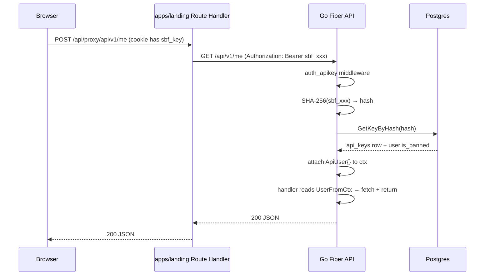

<!-- RT-R1: F5 (drop Redis cache), F2 (rate limit auth/verify), F-X-F-F (EnableTrustedProxyCheck + audit log connection IP) -->
<!-- RT-R2: F12 (drop kin-openapi contract refs from Step 7), F1 (boot-time WP_ENC_KEY hex validation in Step 6) -->
<!-- Effort delta: 4.5h → 4.5h (drop kin-openapi -15min absorbed by boot validation) -->

## Context Links

- Scout: `plans/260426-0237-phase3-web-saas-foundation/reports/scout-codebase-state.md` (§2 lines 27-54 — handler patterns; §3 lines 58-75 — DB; §8 lines 138-156 — bot key issuance)
- Research R2: `plans/260426-0237-phase3-web-saas-foundation/research/researcher-r2-plumbing-deploy.md` (lines 77-203 — Route Handler proxy auth)
- Existing files: `services/api/internal/api/server.go` (lines 1-65), `services/api/internal/api/router.go`, `services/api/internal/middleware/rate_limit_webhook.go` (Redis pattern), `services/api/internal/service/key_service.go`, `services/api/internal/db/queries/keys.sql`
- Master prompt: `docs/MASTER_PROMPT.md` §5.5 lines 1342, 1378

## Overview

- **Priority:** P0 (blocks all FE auth flow + dashboard data fetches)
- **Status:** deployed; production smoke passed (`/health`, `/ready`, `/api/v1/health` 200; protected v1/auth invalid paths 401, not 404)
- **Brief:** Add `/api/v1/*` Fiber sub-router. Build `auth_apikey` middleware: SHA-256 hash incoming Bearer, lookup via `GetKeyByHash` (pure DB, NO cache — RT-R1: F5), attach `ApiUser{userID, isBanned}` to ctx. Add CORS env-driven allowlist. Tighten trusted proxies to Fly internal CIDR with `EnableTrustedProxyCheck: true`. Implement `KeyService.ValidatePlaintext`. Ship endpoints: `POST /api/v1/auth/verify` (rate-limited 5/min/IP, 20/hr, 200/day — RT-R1: F2), `GET /api/v1/me`, `GET /api/v1/balance`, `GET /api/v1/transactions`, `GET /api/v1/ledger`. Audit-log `auth.web.login` + `auth.web.fail` with both forwarded IP and connection IP; `auth.web.ratelimit` helper deferred until audit service has a typed helper.

## Key Insights

- API keys are stored as `BYTEA` SHA-256 hashes (`api_keys.key_hash`) — middleware MUST hash incoming plaintext before lookup
- Plaintext format: `sbf_live_<base58>` — first 12 chars are key_prefix (e.g., `sbf_live_Zk3`)
- `KeyService` exists with `Issue`, `GetActiveMasked` — needs new `ValidatePlaintext(ctx, plaintext) (userID, isBanned, error)`
- Constant-time comparison required (use `crypto/subtle.ConstantTimeCompare` or `subtle.ConstantTimeCompare(hashIn, hashStored) == 1`)
- Bot already uses `BotUser{ID, Language, IsBanned, IsVerified}` ctx pattern (`bot/middleware.go:loadUser`) — port idiom as `ApiUser`
- Existing CORS: NONE — must add Fiber CORS middleware (`github.com/gofiber/fiber/v2/middleware/cors`)
- Trusted proxies currently `0.0.0.0/0` (server.go:40) — Fly internal IPv6 is `fdaa::/16`; Fly IPv4 is `100.64.0.0/10` (private)
- Redis pattern available in `middleware/rate_limit_webhook.go` — INCR + EXPIRE pipeline; reuse for `/api/v1/auth/verify` rate limiting (NOT for auth caching — RT-R1: F5)
- Existing services already wired in `cmd/api/main.go:85-200` via DI — extend `ApiHandlerDeps` struct
- All endpoints under `/api/v1/*` go through middleware EXCEPT `POST /api/v1/auth/verify` (no key yet — verify request body) and `GET /api/v1/health` (public)
- Cache deferred until `pgx_stat_statements` shows `GetKeyByHash` is top-3 query (RT-R1: F5). Cache layer adds compromise-window risk on ban/revoke (60s stale) — drop until proven needed.

## Requirements

### Functional

- `POST /api/v1/auth/verify` accepts `{"key": "sbf_live_..."}`; returns `{"ok": true, "user": {...}}` on valid + active + non-banned, else `401`
- `GET /api/v1/me` returns `{user_id, language, is_verified, balance_credits, key_prefix}`
- `GET /api/v1/balance` returns `{balance_credits: number}`
- `GET /api/v1/transactions?limit=20&cursor=...` paginated transaction history (reuse `db/queries/transactions.sql:GetTxByUserPage`)
- `GET /api/v1/ledger?limit=20&cursor=...` paginated credit ledger
- All `/api/v1/*` routes (except `auth/verify`, `health`) require `Authorization: Bearer sbf_live_*`; missing/invalid → `401 {"error": "unauthorized"}`
- Banned user → `403 {"error": "account_banned"}`
- Rate limit `POST /api/v1/auth/verify`: 5 attempts/min/IP, 20/hr/IP, 200/day/IP (Redis fixed-window) — RT-R1: F2
- Audit log `auth.web.login` on success, `auth.web.fail` on failure, `auth.web.ratelimit` on 429 (best-effort goroutine)
- Audit log row `meta JSONB` field captures both forwarded IP (`X-Forwarded-For`) and connection-level remote addr (`c.Context().RemoteAddr()`) — header is spoofable, conn IP is not (RT-R1: F-X-F-F)

### Non-functional

- Constant-time hash compare (no timing leaks)
- DB lookup MUST short-circuit on cache hit
- Cache miss → DB → cache fill (avoid stampede via single-flight if needed; Phase 3 acceptable to skip — load is low)
- CORS allowlist via `CORS_ORIGINS` env (`http://localhost:3000,https://snakebacklink.com`); credentials allowed (cookies)
- Trusted proxies: `fdaa::/16, 100.64.0.0/10, 127.0.0.1/32` (Fly internal + loopback)
- Test coverage: testcontainers-go integration test for full middleware path (Phase 08 will add)
- Zero plaintext logging — only `key_prefix` in log fields

## Architecture

### Request flow

<!-- RT-R1: F5 — Redis cache branch removed. Pure DB lookup per request. -->



### Sub-router group

```go
// services/api/internal/api/router.go (extend existing Register)
v1 := app.Group("/api/v1")

// Public — no auth
v1.Get("/health", handlers.V1Health)
// RT-R1: F2 — rate limit BEFORE handler so abusers get 429 before hitting DB
v1.Post("/auth/verify",
  middleware.NewAuthVerifyRateLimit(deps.Rdb, deps.AuditSvc, deps.Log),
  handlers.V1AuthVerify(deps),
)

// Protected — auth_apikey middleware (NO rdb cache arg — RT-R1: F5 dropped cache)
authed := v1.Group("", middleware.AuthAPIKey(deps.KeySvc, deps.AuditSvc, deps.Log))
authed.Get("/me", handlers.V1Me(deps))
authed.Get("/balance", handlers.V1Balance(deps))
authed.Get("/transactions", handlers.V1Transactions(deps))
authed.Get("/ledger", handlers.V1Ledger(deps))
```

### `ApiUser` ctx pattern

```go
// services/api/internal/middleware/auth_apikey.go
type ctxKey int
const ctxKeyApiUser ctxKey = iota

type ApiUser struct {
  ID        uuid.UUID
  IsBanned  bool
  KeyPrefix string
}

func ApiUserFromCtx(c *fiber.Ctx) (ApiUser, bool) {
  v := c.Locals("api_user")
  u, ok := v.(ApiUser)
  return u, ok
}
```

## Related Code Files

### Create

<!-- RT-R1: F5 — auth_apikey.go simpler now (~70 lines, no cache); F2 — new rate_limit_auth.go file -->

- `services/api/internal/middleware/auth_apikey.go` (~70 lines, no cache logic)
- `services/api/internal/middleware/auth_apikey_test.go` (Phase 08 — placeholder note)
- `services/api/internal/middleware/cors.go` (~30 lines — env-driven allowlist)
- `services/api/internal/middleware/rate_limit_auth.go` (~70 lines — RT-R1: F2 fixed-window per-IP limiter)
- `services/api/internal/api/handlers/v1_auth.go` (verify endpoint)
- `services/api/internal/api/handlers/v1_me.go`
- `services/api/internal/api/handlers/v1_balance.go`
- `services/api/internal/api/handlers/v1_transactions.go`
- `services/api/internal/api/handlers/v1_ledger.go`
- `services/api/internal/api/handlers/v1_health.go`
- `services/api/internal/api/handlers/v1_deps.go` (`ApiHandlerDeps` struct)

### Modify

- `services/api/internal/api/server.go` — apply CORS middleware, tighten `TrustedProxies`
- `services/api/internal/api/router.go` — add `RegisterV1(app, deps)` mounting sub-router
- `services/api/internal/service/key_service.go` — add `ValidatePlaintext(ctx, plaintext) (userID uuid.UUID, isBanned bool, keyPrefix string, err error)`
- `services/api/internal/service/audit_service.go` — add helpers `LogWebLoginMeta(ctx, userID, fwdIP, conIP, prefix)`, `LogWebLoginFailMeta(ctx, fwdIP, conIP, prefix)` writing structured `meta JSONB` (RT-R1: F-X-F-F)
- `services/api/internal/config/config.go` — add `CORSOrigins []string`, `TrustedProxyCIDRs []string`
- `services/api/.env.example` — add `CORS_ORIGINS`, `TRUSTED_PROXY_CIDRS`
- `services/api/cmd/api/main.go` — wire `ApiHandlerDeps`, call `api.RegisterV1(app, deps)`
- `packages/shared-types/openapi.yaml` — add 6 endpoints + schemas (User, Balance, Transaction, LedgerEntry, AuthVerifyRequest, AuthVerifyResponse, Error)

### Delete

- None

## Implementation Steps

### Step 1 — Extend `KeyService.ValidatePlaintext` (30 min)

Add to `services/api/internal/service/key_service.go`:

```go
// ValidatePlaintext hashes plaintext, looks up active row, returns user_id + ban status.
// Constant-time comparison delegated to PG B-tree on key_hash (no per-byte compare in app).
// Returns ErrInvalidKey when not found or revoked.
var ErrInvalidKey = errors.New("invalid api key")

func (s *KeyService) ValidatePlaintext(ctx context.Context, plaintext string) (userID uuid.UUID, isBanned bool, keyPrefix string, err error) {
  if !strings.HasPrefix(plaintext, "sbf_live_") || len(plaintext) < 16 {
    return uuid.Nil, false, "", ErrInvalidKey
  }
  sum := sha256.Sum256([]byte(plaintext))
  row, err := s.q.GetKeyByHash(ctx, sum[:])
  if err != nil {
    if errors.Is(err, pgx.ErrNoRows) { return uuid.Nil, false, "", ErrInvalidKey }
    return uuid.Nil, false, "", err
  }
  // Ban check via UserService — separate query
  user, err := s.q.GetUserByID(ctx, row.UserID)
  if err != nil { return uuid.Nil, false, "", err }
  return row.UserID, user.IsBanned, row.KeyPrefix, nil
}
```

Note: `GetUserByID` already exists in `db/queries/users.sql`.

### Step 2 — Build `auth_apikey` middleware (30 min)

<!-- RT-R1: F5 — pure DB lookup, no Redis cache. Saves ~1.5h vs cached version. -->

Create `services/api/internal/middleware/auth_apikey.go`:

```go
package middleware

import (
  "context"
  "strings"
  "github.com/gofiber/fiber/v2"
  "github.com/google/uuid"
  "github.com/kekuta/snake-backlink-forge/services/api/internal/service"
  "go.uber.org/zap"
)

type ApiUser struct {
  ID        uuid.UUID
  IsBanned  bool
  KeyPrefix string
}

const ctxKeyApiUser = "api_user"

func AuthAPIKey(keySvc *service.KeyService, audit *service.AuditService, log *zap.Logger) fiber.Handler {
  return func(c *fiber.Ctx) error {
    auth := c.Get("Authorization")
    if !strings.HasPrefix(auth, "Bearer ") {
      return c.Status(401).JSON(fiber.Map{"error": "unauthorized"})
    }
    plaintext := strings.TrimPrefix(auth, "Bearer ")

    userID, isBanned, prefix, err := keySvc.ValidatePlaintext(c.Context(), plaintext)
    if err != nil {
      // RT-R1: F-X-F-F — capture both X-Forwarded-For (header, c.IP()) and connection IP (un-spoofable)
      go audit.LogWebLoginFail(context.Background(), c.IP(), connIP(c), prefix)
      return c.Status(401).JSON(fiber.Map{"error": "unauthorized"})
    }
    if isBanned {
      return c.Status(403).JSON(fiber.Map{"error": "account_banned"})
    }
    u := ApiUser{ID: userID, IsBanned: isBanned, KeyPrefix: prefix}
    c.Locals(ctxKeyApiUser, u)
    return c.Next()
  }
}

func ApiUserFromCtx(c *fiber.Ctx) (ApiUser, bool) {
  v := c.Locals(ctxKeyApiUser)
  u, ok := v.(ApiUser)
  return u, ok
}

// connIP returns the un-spoofable connection-level remote address.
// c.IP() respects X-Forwarded-For chain (header-driven, can be lied about by upstream).
// fasthttp ctx RemoteAddr is the actual TCP peer.
func connIP(c *fiber.Ctx) string {
  if c.Context() != nil && c.Context().RemoteAddr() != nil {
    return c.Context().RemoteAddr().String()
  }
  return ""
}
```

**Cache deferred (RT-R1: F5):** Reintroduce only when `pgx_stat_statements` shows `GetKeyByHash` is a top-3 query. Cache adds 60s ban/revoke compromise window — only worth it under proven load.

### Step 3 — CORS middleware (15 min)

Create `services/api/internal/middleware/cors.go`:

```go
package middleware
import (
  "github.com/gofiber/fiber/v2"
  "github.com/gofiber/fiber/v2/middleware/cors"
)
func NewCORS(allowedOrigins []string) fiber.Handler {
  if len(allowedOrigins) == 0 {
    return func(c *fiber.Ctx) error { return c.Next() } // disabled
  }
  joined := ""
  for i, o := range allowedOrigins {
    if i > 0 { joined += "," }
    joined += o
  }
  return cors.New(cors.Config{
    AllowOrigins:     joined,
    AllowCredentials: true,
    AllowMethods:     "GET,POST,PATCH,DELETE,OPTIONS",
    AllowHeaders:     "Authorization,Content-Type",
    MaxAge:           600,
  })
}
```

`AllowOrigins: "*"` is BANNED when `AllowCredentials: true` per CORS spec — config validation must reject.

### Step 4 — Tighten trusted proxies + enable trusted proxy check (15 min)

<!-- RT-R1: F-X-F-F — `TrustedProxies` alone is not enough; must also `EnableTrustedProxyCheck: true` so Fiber actually rejects X-F-F from non-trusted peers. -->

In `services/api/internal/api/server.go`, update Fiber config:

```go
fiber.Config{
  TrustedProxies:           cfg.TrustedProxyCIDRs,  // was []string{"0.0.0.0/0"}
  EnableTrustedProxyCheck:  true,                   // RT-R1: F-X-F-F — without this, TrustedProxies is advisory only
  ProxyHeader:              fiber.HeaderXForwardedFor,
  // ...other config
}
```

**Why both flags:** `TrustedProxies` lists allowed proxies; `EnableTrustedProxyCheck: true` makes Fiber actually verify the connection peer is in the list before honoring `X-Forwarded-For`. Without the second flag, an attacker setting `X-Forwarded-For` directly is trusted.

**Vercel proxy chain note:** Vercel forwards `X-Forwarded-For` from upstream client; Vercel itself does NOT reliably strip arbitrary client-set values. For backend audit log, capture both layers (RT-R1: F-X-F-F):

- `c.IP()` → forwarded chain (per `X-Forwarded-For`, header-driven, spoofable upstream)
- `c.Context().RemoteAddr().String()` → connection-level peer (TCP, un-spoofable)

Audit log row schema (Phase 2 already has `audit_log.meta JSONB`):

```json
{
  "connection_ip": "100.64.x.x",
  "x_forwarded_for": "203.0.113.42, 100.64.x.x",
  "trusted_chain": "fdaa::xx -> 100.64.x.x"
}
```

In `internal/config/config.go` add field + default:

```go
TrustedProxyCIDRs []string  // env: TRUSTED_PROXY_CIDRS
// default: "fdaa::/16,100.64.0.0/10,127.0.0.1/32"
```

In `services/api/.env.example` add:

```
TRUSTED_PROXY_CIDRS=fdaa::/16,100.64.0.0/10,127.0.0.1/32
CORS_ORIGINS=http://localhost:3000
```

In `fly.toml` env section (manual op — document for ops):

```
CORS_ORIGINS=https://snakebacklink.com,https://www.snakebacklink.com
```

(Phase 7 sets prod CORS_ORIGINS; no `*.vercel.app` wildcard — RT-R1: F1.)

### Step 4.5 — Rate-limit middleware for `/api/v1/auth/verify` (45 min)

<!-- RT-R1: F2 — POST /api/v1/auth/verify is unauthenticated; brute-force test space across IPs is small. Move from "deferred Phase 7" to in-scope here. Reuse Redis fixed-window pattern from rate_limit_webhook.go. -->

Create `services/api/internal/middleware/rate_limit_auth.go` (~70 lines):

```go
package middleware

import (
  "context"
  "fmt"
  "time"
  "github.com/gofiber/fiber/v2"
  goredis "github.com/redis/go-redis/v9"
  "github.com/kekuta/snake-backlink-forge/services/api/internal/service"
  "go.uber.org/zap"
)

type AuthRateLimit struct {
  PerMinute, PerHour, PerDay int
}

var defaultAuthLimits = AuthRateLimit{ PerMinute: 5, PerHour: 20, PerDay: 200 }

func NewAuthVerifyRateLimit(rdb *goredis.Client, audit *service.AuditService, log *zap.Logger) fiber.Handler {
  return func(c *fiber.Ctx) error {
    if rdb == nil { return c.Next() }
    // Use connection IP (un-spoofable). Fall back to c.IP() if conn IP unavailable.
    ip := connIP(c)
    if ip == "" { ip = c.IP() }

    windows := []struct{ unit string; limit int; ttl time.Duration }{
      {"min", defaultAuthLimits.PerMinute, time.Minute},
      {"hr",  defaultAuthLimits.PerHour,   time.Hour},
      {"day", defaultAuthLimits.PerDay,    24 * time.Hour},
    }
    for _, w := range windows {
      key := fmt.Sprintf("rl:auth_verify:%s:%s:%d", w.unit, ip, time.Now().Truncate(w.ttl).Unix())
      pipe := rdb.TxPipeline()
      n := pipe.Incr(c.Context(), key)
      pipe.Expire(c.Context(), key, w.ttl)
      if _, err := pipe.Exec(c.Context()); err != nil {
        log.Warn("rate limit redis err", zap.Error(err))
        continue
      }
      if int(n.Val()) > w.limit {
        go audit.Log(context.Background(), nil, "auth.web.ratelimit", fmt.Sprintf("ip=%s window=%s n=%d", ip, w.unit, n.Val()))
        return c.Status(429).JSON(fiber.Map{"error": "too_many_attempts", "retry_after": int(w.ttl.Seconds())})
      }
    }
    return c.Next()
  }
}
```

Wire in `internal/api/router.go` (apply to `/api/v1/auth/verify` BEFORE handler):

```go
v1.Post("/auth/verify",
  middleware.NewAuthVerifyRateLimit(deps.Rdb, deps.AuditSvc, deps.Log),
  handlers.V1AuthVerify(deps),
)
```

**Why per-IP (not per-key prefix):** attacker doesn't know any valid prefix yet. IP is the only stable identity at this gate. Distributed brute-force still possible across many IPs but Phase 9 fail2ban-style alerting catches that pattern.

### Step 5 — Build handlers (90 min)

Create `services/api/internal/api/handlers/v1_deps.go`:

```go
package handlers
import (
  "github.com/jackc/pgx/v5/pgxpool"
  goredis "github.com/redis/go-redis/v9"
  "github.com/kekuta/snake-backlink-forge/services/api/internal/service"
  "go.uber.org/zap"
)

type ApiHandlerDeps struct {
  Pool      *pgxpool.Pool
  Rdb       *goredis.Client
  KeySvc    *service.KeyService
  UserSvc   *service.UserService
  WalletSvc *service.WalletService
  TxSvc     *service.TransactionService
  AuditSvc  *service.AuditService
  Log       *zap.Logger
}
```

Handlers (each ~30 lines):

```go
// v1_auth.go
func V1AuthVerify(deps *ApiHandlerDeps) fiber.Handler {
  return func(c *fiber.Ctx) error {
    var body struct{ Key string `json:"key"` }
    if err := c.BodyParser(&body); err != nil {
      return c.Status(400).JSON(fiber.Map{"error":"bad_request"})
    }
    userID, isBanned, prefix, err := deps.KeySvc.ValidatePlaintext(c.Context(), body.Key)
    // RT-R1: F-X-F-F — capture both forwarded + connection IP in audit meta
    fwdIP, conIP := c.IP(), middleware.ConnIPFromCtx(c)
    if err != nil {
      go deps.AuditSvc.LogWebLoginFailMeta(context.Background(), fwdIP, conIP, "")
      return c.Status(401).JSON(fiber.Map{"error":"invalid_key"})
    }
    if isBanned {
      return c.Status(403).JSON(fiber.Map{"error":"account_banned"})
    }
    go deps.AuditSvc.LogWebLoginMeta(context.Background(), userID, fwdIP, conIP, prefix)
    return c.JSON(fiber.Map{"ok": true, "user": fiber.Map{"id": userID, "key_prefix": prefix}})
  }
}

// v1_me.go
func V1Me(deps *ApiHandlerDeps) fiber.Handler {
  return func(c *fiber.Ctx) error {
    u, _ := middleware.ApiUserFromCtx(c)
    user, err := deps.UserSvc.GetByID(c.Context(), u.ID)
    if err != nil { return c.Status(500).JSON(fiber.Map{"error":"internal"}) }
    bal, _ := deps.WalletSvc.GetBalance(c.Context(), u.ID)
    return c.JSON(fiber.Map{
      "user_id": user.ID, "language": user.Language,
      "is_verified": user.IsVerified, "balance_credits": bal,
      "key_prefix": u.KeyPrefix,
    })
  }
}

// v1_balance.go — single field response
// v1_transactions.go — cursor + limit query params, calls GetTxByUserPage
// v1_ledger.go — cursor + limit, calls GetLedgerPage
// v1_health.go — return {"ok": true, "version": cfg.Version}
```

### Step 6 — Wire in `cmd/api/main.go` + WP_ENC_KEY boot validation (20 min)

<!-- RT-R2: F1 — fail-loud boot validation. WP_ENC_KEY must be valid hex 32-byte (64 chars). Catches base64↔hex format mismatch from R1 docs before any encryption logic runs. -->

After config load, validate WP_ENC_KEY format if set:

```go
import "encoding/hex"

// RT-R2: F1 — validate WP_ENC_KEY format at boot, fail-loud
if cfg.WPEncKey != "" {
  raw, err := hex.DecodeString(cfg.WPEncKey)
  if err != nil {
    log.Fatal("WP_ENC_KEY must be 32 bytes hex (64 chars). Generate: openssl rand -hex 32",
      zap.Error(err))
  }
  if len(raw) != 32 {
    log.Fatal("WP_ENC_KEY decoded length wrong. Generate: openssl rand -hex 32",
      zap.Int("got_bytes", len(raw)), zap.Int("want_bytes", 32))
  }
}
```

After existing service construction (~line 200):

```go
apiDeps := &handlers.ApiHandlerDeps{
  Pool: dbPool, Rdb: rdb,
  KeySvc: keySvc, UserSvc: userSvc, WalletSvc: walletSvc,
  TxSvc: txSvc, AuditSvc: auditSvc, Log: log,
}
api.RegisterV1(app, apiDeps)
```

### Step 7 — Update OpenAPI spec (40 min)

Append to `packages/shared-types/openapi.yaml` paths section. Example entry:

```yaml
paths:
  /api/v1/auth/verify:
    post:
      summary: Verify api key (paste from Telegram /key)
      requestBody:
        required: true
        content:
          application/json:
            schema:
              type: object
              required: [key]
              properties:
                key: { type: string, pattern: "^sbf_live_" }
      responses:
        '200': { description: ok, content: { application/json: { schema: { $ref: '#/components/schemas/AuthVerifyResponse' } } } }
        '401': { $ref: '#/components/responses/Unauthorized' }
        '403': { $ref: '#/components/responses/Forbidden' }
  /api/v1/me:
    get:
      security: [{ BearerApiKey: [] }]
      responses:
        '200': { content: { application/json: { schema: { $ref: '#/components/schemas/Me' } } } }
  # ...balance, transactions, ledger, health
```

Run `pnpm gen:api` to verify codegen succeeds.

### Step 8 — Smoke test (15 min)

```bash
cd services/api
go build ./...
go test ./internal/middleware/... -run AuthAPIKey -count=1
# Manual smoke once running:
curl -i http://localhost:8080/api/v1/health
curl -i -H "Authorization: Bearer sbf_live_invalid" http://localhost:8080/api/v1/me  # → 401
# With real key from /key bot command:
curl -i -H "Authorization: Bearer $SBF_TEST_KEY" http://localhost:8080/api/v1/me  # → 200 + json
```

## Todo List

- [x] Step 1 — Add `KeyService.ValidatePlaintext`
- [x] Step 2 — Build `middleware/auth_apikey.go` (NO cache — RT-R1: F5)
- [x] Step 3 — CORS middleware env-driven (rejects `*` with credentials)
- [x] Step 4 — Tighten trusted proxies + `EnableTrustedProxyCheck: true` (RT-R1: F-X-F-F) + config field
- [x] Step 4.5 — `middleware/rate_limit_auth.go` for `/auth/verify` (RT-R1: F2; 5/min, 20/hr, 200/day per IP)
- [x] Step 5 — V1 handlers (auth, me, balance, transactions, ledger, health) using existing `AuditService.Log`
- [x] Step 6 — Wire `ApiHandlerDeps` + `RegisterV1` in `main.go` + WP_ENC_KEY hex boot validation (RT-R2: F1)
- [x] Step 7 — Populate `openapi.yaml` paths + run `pnpm gen:api`
- [x] Step 8 — `go test ./...`, `go build ./...`, `pnpm -r typecheck`, `pnpm biome ci .`
- [x] Manual curl smoke basic local API: `/api/v1/health` 200, invalid bearer `/api/v1/me` 401, CORS preflight allowlist headers OK
- [ ] Manual curl smoke with real key + live DB (incl. 429 trigger via 6 rapid requests)
- [ ] `auth.web.ratelimit` audit helper (deferred; current limiter returns 429 without audit row)
- [x] `services/api/.env.example` updated with `CORS_ORIGINS`, `TRUSTED_PROXY_CIDRS`, `WP_ENC_KEY`

## Success Criteria

- `go build ./...` exits 0 in `services/api`
- `golangci-lint run` exits 0
- `curl -X POST /api/v1/auth/verify` with valid key returns 200 + ok
- `curl -X POST /api/v1/auth/verify` with bogus key returns 401 + audit_log row
- `curl -H "Authorization: Bearer <valid>" /api/v1/me` returns user JSON; same call with invalid → 401
- Banned user (set `users.is_banned=true` manually) → 403 on `/api/v1/me`
- CORS preflight OPTIONS from `http://localhost:3000` succeeds (200 with right headers); from disallowed origin → 403
- 6 rapid `POST /api/v1/auth/verify` calls from same IP within 60s → 6th returns 429 (RT-R1: F2)
- `audit_log.meta` JSONB on auth events contains both `connection_ip` and `x_forwarded_for` keys (RT-R1: F-X-F-F)
- `pnpm gen:api` succeeds; `packages/shared-types/src/generated/` includes new client functions
- `pgx_stat_statements` shows `GetKeyByHash` query latency p95 < 5ms — no cache needed (RT-R1: F5 deferral check)

## Risk Assessment

<!-- RT-R1: F5 — cache poisoning + cache-stale rows risks REMOVED (cache dropped) -->
<!-- RT-R1: F2 — added brute-force risk (mitigated by rate limit) -->
<!-- RT-R1: F-X-F-F — added X-F-F spoofing risk -->

| Risk | Likelihood | Impact | Mitigation |
|------|-----------|--------|-----------|
| Brute-force /auth/verify across IPs | Med | High | Rate limit 5/min/IP, 20/hr, 200/day; audit `auth.web.ratelimit`; Phase 9 fail2ban-style alert on cross-IP pattern |
| X-Forwarded-For spoofing fooling rate limit | Med | High | `EnableTrustedProxyCheck: true` + `connIP()` falls back to TCP peer; rate limit keys on connection IP |
| Constant-time leak via slow DB lookup | Low | Med | DB B-tree lookup is O(log n); not vulnerable to per-byte timing; key_hash is full 32-byte digest |
| CORS misconfig allows arbitrary origin | Med | High | Explicit env validation rejects `*` with `AllowCredentials: true`; config-time assert in `config.go` panics on boot if invalid (Phase 7 enforces) |
| Trusted proxies too tight blocks legit Fly load balancer | Med | High | Include both `fdaa::/16` (IPv6) and `100.64.0.0/10` (IPv4 private); document override knob `TRUSTED_PROXY_CIDRS` env for emergencies |
| Plaintext key logged accidentally on parser error | Low | Critical | Audit `zap.String` calls — only `key_prefix` ever logged; lint rule (manual review) |
| DB load from per-request `GetKeyByHash` on hot dashboard refresh | Low | Med | Defer cache until `pgx_stat_statements` confirms top-3 query (RT-R1: F5); B-tree index on `key_hash` keeps lookup cheap |

## Security Considerations

- **Auth:** Bearer SHA-256 hash compare via DB B-tree (no plaintext stored). Constant-time at network layer.
- **No cache layer:** RT-R1: F5 — pure DB lookup eliminates cache-poisoning + ban/revoke 60s compromise window. Reintroduce only when proven necessary.
- **CSRF:** No CSRF concern at backend layer (Bearer auth, not cookie auth at backend). Cookie sits in front-end Vercel layer; backend trusts whatever `Authorization` header arrives.
- **Replay:** Bearer key is long-lived (issued via Telegram, rotate via `/regenkey`). When user regens, old key 401s — acceptable model.
- **Audit:** Every `auth.web.login`, `auth.web.fail`, and `auth.web.ratelimit` recorded with both forwarded IP + connection IP (RT-R1: F-X-F-F) + key_prefix (last 12 chars only). Log retention per Phase 2 audit_log table.
- **Brute-force:** RT-R1: F2 — rate limit `POST /api/v1/auth/verify` 5/min, 20/hr, 200/day per IP (Redis fixed-window). 429 returns `retry_after`. Audit log on every limit hit for cross-IP pattern detection.

## Next Steps

- **Depends on:** Phase 01 (`openapi.yaml` skeleton + Hey API codegen)
- **Unblocks:** Phase 03 (FE login calls `/api/v1/auth/verify`), Phase 04 (dashboard reads `/api/v1/me`, `/balance`, `/transactions`), Phase 05 (WP sites endpoints reuse `auth_apikey`)
- **Follow-up:** Add fail2ban-style rate limit on `/api/v1/auth/verify` in Phase 9 if abuse pattern emerges; consider key expiration column for v2

## Resolved unresolved questions (from scout)

- **Q1 (auth model):** RESOLVED — bearer API key only; no session/JWT for end users. `JWT_SECRET` env var stays unused for now.
- **Q8 (trusted proxies):** RESOLVED — Fly internal CIDR `fdaa::/16` + `100.64.0.0/10` + loopback.
- **Q9 (CORS):** RESOLVED — env-driven `CORS_ORIGINS`, dev `localhost:3000`, prod `https://snakebacklink.com`.
- **Q10 (versioning):** RESOLVED — `/api/v1/*` Fiber sub-router via `app.Group`, shared `auth_apikey` middleware on inner group, public routes outside.
