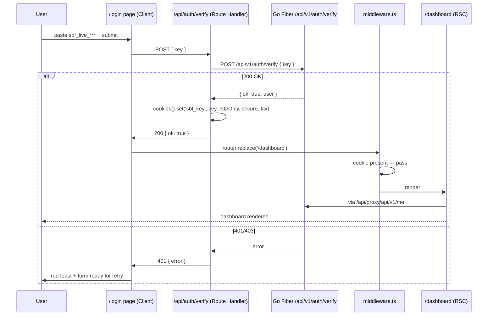

<!-- RT-R1: F9 (sanitizeNext at consumer), F10 (cookie hardening — __Host- prefix, SameSite=Strict on /verify, Origin check) -->
<!-- RT-R2: F5 (Vercel preview Origin allowlist via VERCEL_URL fallback), F8 (proxy 1MB body cap) -->
<!-- Effort delta: 5h → 5h (security additions absorbed) -->

## Context Links

- Research R2: `plans/260426-0237-phase3-web-saas-foundation/research/researcher-r2-plumbing-deploy.md` (lines 77-203 — Route Handler proxy + httpOnly cookie)
- Research R1: `plans/260426-0237-phase3-web-saas-foundation/research/researcher-r1-frontend-foundation.md` (lines 46-61 — Route Handlers over Server Actions)
- Phase 02: `phase-02-backend-auth-and-cors.md` (`/api/v1/auth/verify` endpoint contract)
- Phase 01: `phase-01-setup-and-deps.md` (Hey API client `@sbf/shared-types`)
- Master prompt: `docs/MASTER_PROMPT.md` §5.5 line 1357 (Engineering bar)

## Overview

- **Priority:** P0 (gates dashboard access)
- **Status:** implementation complete; local route + deployed-backend auth smoke passed
- **Brief:** Build the only auth UX: paste `sbf_live_*` key in `/login`, validate via `/api/v1/auth/verify`, set httpOnly cookie, redirect to `/dashboard`. Add `middleware.ts` redirect gate (unauth → `/login`, authed-on-`/login` → `/dashboard`). Add `/api/proxy/[...path]` Route Handler that injects `Authorization: Bearer <cookie>` for all dashboard data fetches. Handle invalid key, banned, network errors with shadcn toasts.

## Key Insights

- **No Server Actions for auth** — Route Handlers chosen for explicit HTTP semantics (R1 line 46-61). Server Actions hide the auth boundary; bearer-key model needs visible HTTP layer.
- httpOnly cookie format: name `sbf_key`, value = raw plaintext key, `Secure`, `SameSite=Lax`, `Max-Age=2592000` (30d), `Path=/`
- `cookies()` API in Next 15 is async (`await cookies()`) — required for both reading and setting
- `middleware.ts` (Next 15 still supports; `proxy.ts` is the new name in Next 16+) — gate matcher excludes `/api/auth/*`, `/_next`, static files
- `/api/proxy/[...path]/route.ts` forwards EVERY method (GET/POST/PATCH/DELETE) to backend, copies query string, copies content-type, sets `Authorization` from cookie
- On backend 401 from proxy → clear cookie + redirect `/login?reason=expired` (handled in proxy response logic)
- Hey API client's `baseUrl` should point to `/api/proxy` so all calls auto-proxied through Next; backend URL never reaches browser

## Requirements

### Functional

- `GET /login` renders paste-key form (shadcn `Form` + `Input` + `Button`)
- Form submit → `POST /api/auth/verify` (Route Handler)
- Route Handler validates with backend `POST /api/v1/auth/verify`; on success sets `sbf_key` cookie + returns `{ ok: true }`
- On invalid: returns `400 {error: "invalid_key"}`; UI shows red toast "Khóa không hợp lệ — kiểm tra lại"
- On banned: `403 {error: "account_banned"}`; UI shows red toast + disable form
- On network: client catches; shows neutral toast "Mạng lỗi — thử lại"
- After success → client `router.replace('/dashboard')` (or `next` query param if present)
- `POST /api/auth/logout` clears cookie + 204
- `middleware.ts`: 
  - if path starts with public list (`/login`, `/_next`, `/api/auth`, `/`, `/vi`, `/en`, `/pricing`, etc.) → pass
  - if cookie absent + path requires auth → redirect `/login?next=<encoded path>`
  - if cookie present + on `/login` → redirect `/dashboard`
- `/api/proxy/[...path]/route.ts`:
  - reads cookie; if missing → 401
  - forwards `req.method`, `req.body`, `?` search to `${NEXT_PUBLIC_API_BASE_URL}/api/v1/<path>`
  - sets `Authorization: Bearer <key>` and forwards response status + body
  - on backend 401 → returns 401 + sets `Set-Cookie: sbf_key=; Max-Age=0` (force re-login)

### Non-functional

- Cookie MUST be httpOnly + secure (only http-secure in dev OK, prod requires https)
- Plaintext key NEVER reaches client JS bundle (only travels in form POST → server → cookie)
- `next` redirect param sanitized: only same-origin paths (regex `^/[a-z0-9/_-]*$`); reject absolute URLs (open redirect)
- Form state preserved on error (paste once, edit, retry)
- Loading state during submit (disable button, show spinner)
- Accessibility: form has `aria-describedby` for error, label tied to input

## Architecture

### Auth flow



### Cookie envelope (RT-R1: F10 hardened)

```
# Verify endpoint sets:
Set-Cookie: __Host-sbf_key=sbf_live_<base58>;
            Path=/;
            HttpOnly;
            Secure;
            SameSite=Strict;       # verify only — strict same-site for state-setting endpoint
            Max-Age=2592000

# Logout / refresh paths use SameSite=Lax for navigation compat
```

`__Host-` prefix → browser-enforced: `Secure` + `Path=/` + no `Domain`. Browser refuses to set if any constraint missing, eliminating subdomain-leak bug class.

## Related Code Files

### Create

<!-- RT-R1: F9 — redirect-safe.ts moved to consumer-side use; F10 — cookies.ts hardened with __Host- prefix -->

- `apps/landing/src/app/(auth)/login/page.tsx` (RSC wrapper, renders client form)
- `apps/landing/src/app/(auth)/login/login-form.tsx` (`"use client"`, RHF + zod, calls `sanitizeNext`)
- `apps/landing/src/app/(auth)/login/layout.tsx` (auth layout — minimal centered card)
- `apps/landing/src/app/api/auth/verify/route.ts` (Route Handler with Origin check + Strict cookie set — RT-R1: F10)
- `apps/landing/src/app/api/auth/logout/route.ts` (Route Handler)
- `apps/landing/src/app/api/proxy/[...path]/route.ts` (catch-all forward)
- `apps/landing/middleware.ts` (root file — Next reads this; auth-only, no intl)
- `apps/landing/src/lib/auth/cookies.ts` (helper: `getApiKeyCookie`, `setApiKeyCookie`, `clearApiKeyCookie` — RT-R1: F10 `__Host-` prefix, `secure: NODE_ENV !== 'development'`, optional `strict: true` for verify)
- `apps/landing/src/lib/auth/redirect-safe.ts` (helper: `sanitizeNext` deep checks — RT-R1: F9; loops, API paths, encoded escapes; tested in Phase 8)
- `apps/landing/src/lib/api/client.ts` (configured Hey API client pointing to `/api/proxy/api/v1`)

### Modify

- `apps/landing/src/app/layout.tsx` (add `<Toaster />` from sonner for toast root)
- `apps/landing/src/app/providers.tsx` (already wraps children — no change needed)
- `apps/landing/.env.example` (already has `NEXT_PUBLIC_API_BASE_URL`)

### Delete

- None

## Implementation Steps

### Step 1 — Cookie helpers with `__Host-` prefix hardening (20 min)

<!-- RT-R1: F10 — `__Host-` prefix forces Path=/, no Domain attribute, Secure → strongest cookie envelope. Browser refuses to set if any constraint violated. -->

`apps/landing/src/lib/auth/cookies.ts`:

```ts
import 'server-only'
import { cookies } from 'next/headers'

// RT-R1: F10 — __Host- prefix forces Secure + Path=/ + no Domain.
// Browser rejects the cookie if any of those constraints are wrong, eliminating
// subdomain leak / wrong-path attacks in one shot.
const COOKIE_NAME = '__Host-sbf_key'
const MAX_AGE = 60 * 60 * 24 * 30 // 30 days

// secure flag: true in EVERYTHING except local dev. NODE_ENV is 'development' only on `next dev`.
// Production + preview + test → secure=true. RT-R1: F10.
const isSecure = process.env.NODE_ENV !== 'development'

export async function getApiKeyCookie(): Promise<string | null> {
  return (await cookies()).get(COOKIE_NAME)?.value ?? null
}

export async function setApiKeyCookie(key: string, opts?: { strict?: boolean }) {
  ;(await cookies()).set(COOKIE_NAME, key, {
    httpOnly: true,
    secure: isSecure,
    // RT-R1: F10 — verify endpoint sets state, must be strictly same-site.
    // Other writes (logout) keep Lax for navigation compatibility.
    sameSite: opts?.strict ? 'strict' : 'lax',
    path: '/',
    maxAge: MAX_AGE,
  })
}

export async function clearApiKeyCookie() {
  ;(await cookies()).set(COOKIE_NAME, '', {
    httpOnly: true,
    secure: isSecure,
    sameSite: 'lax',
    path: '/',
    maxAge: 0,
  })
}
```

`'server-only'` import crashes build if accidentally imported into a client component (R1 line 85).

**Why `__Host-` over plain name:** the prefix is browser-enforced — a cookie named `__Host-sbf_key` is REJECTED by Chrome/Firefox/Safari unless `Secure`, `Path=/`, and no `Domain` attribute. Eliminates accidental subdomain scope.

### Step 2 — Verify Route Handler with Origin check (35 min)

<!-- RT-R1: F10 — verify endpoint MUST validate Origin header to prevent cross-site form abuse. SameSite=Lax allows top-level cross-site GET, which combined with form actions could be exploited. Origin check + Strict cookie on /verify closes the gap. -->

`apps/landing/src/app/api/auth/verify/route.ts`:

```ts
import { NextResponse } from 'next/server'
import { setApiKeyCookie } from '@/lib/auth/cookies'

const BACKEND = process.env.NEXT_PUBLIC_API_BASE_URL!

// RT-R1: F10 — env-driven allowlist; reject all other origins
// RT-R2: F5 — Vercel preview deploys auto-fall back to VERCEL_URL (auto-injected by Vercel runtime).
// Without this, login is broken on every preview branch deploy.
const ALLOWED_ORIGINS: string[] = (() => {
  const list: string[] = []
  if (process.env.NEXT_PUBLIC_APP_URL) list.push(process.env.NEXT_PUBLIC_APP_URL)
  if (process.env.VERCEL_ENV === 'preview' && process.env.VERCEL_URL) {
    list.push(`https://${process.env.VERCEL_URL}`)
  }
  if (process.env.NODE_ENV === 'development') {
    list.push('http://localhost:3000', 'http://127.0.0.1:3000')
  }
  return list
})()

export async function POST(req: Request) {
  // RT-R1: F10 — Origin header check (defense-in-depth on top of SameSite)
  const origin = req.headers.get('origin')
  if (!origin || !ALLOWED_ORIGINS.includes(origin)) {
    return NextResponse.json({ error: 'forbidden_origin' }, { status: 403 })
  }

  let body: { key?: string }
  try { body = await req.json() } catch { return NextResponse.json({ error: 'bad_request' }, { status: 400 }) }
  const key = body.key?.trim()
  if (!key || !key.startsWith('sbf_live_')) {
    return NextResponse.json({ error: 'invalid_format' }, { status: 400 })
  }
  const r = await fetch(`${BACKEND}/api/v1/auth/verify`, {
    method: 'POST',
    headers: { 'Content-Type': 'application/json' },
    body: JSON.stringify({ key }),
    cache: 'no-store',
  })
  if (r.status === 401) return NextResponse.json({ error: 'invalid_key' }, { status: 401 })
  if (r.status === 403) return NextResponse.json({ error: 'account_banned' }, { status: 403 })
  if (r.status === 429) return NextResponse.json({ error: 'too_many_attempts' }, { status: 429 })
  if (!r.ok) return NextResponse.json({ error: 'backend_error' }, { status: 502 })
  const data = await r.json()
  // RT-R1: F10 — verify endpoint sets state; cookie scoped SameSite=Strict (override default Lax)
  await setApiKeyCookie(key, { strict: true })
  return NextResponse.json({ ok: true, user: data.user })
}
```

### Step 3 — Logout Route Handler (5 min)

`apps/landing/src/app/api/auth/logout/route.ts`:

```ts
import { NextResponse } from 'next/server'
import { clearApiKeyCookie } from '@/lib/auth/cookies'
export async function POST() {
  await clearApiKeyCookie()
  return new NextResponse(null, { status: 204 })
}
```

### Step 4 — Proxy catch-all Route Handler (40 min)

`apps/landing/src/app/api/proxy/[...path]/route.ts`:

```ts
import { NextRequest, NextResponse } from 'next/server'
import { getApiKeyCookie, clearApiKeyCookie } from '@/lib/auth/cookies'

const BACKEND = process.env.NEXT_PUBLIC_API_BASE_URL!

async function forward(req: NextRequest, ctx: { params: Promise<{ path: string[] }> }) {
  // RT-R2: F8 — 1MB body cap. Reject before any body read to prevent OOM via malicious large POST.
  const cl = parseInt(req.headers.get('content-length') ?? '0', 10)
  if (cl > 1024 * 1024) {
    return NextResponse.json({ error: 'payload_too_large', max_bytes: 1048576 }, { status: 413 })
  }

  const { path } = await ctx.params
  const key = await getApiKeyCookie()
  if (!key) return NextResponse.json({ error: 'unauthorized' }, { status: 401 })

  const url = new URL(req.url)
  const target = `${BACKEND}/${path.join('/')}${url.search}`

  const headers: Record<string, string> = {
    Authorization: `Bearer ${key}`,
  }
  const ct = req.headers.get('content-type')
  if (ct) headers['Content-Type'] = ct

  const init: RequestInit = {
    method: req.method,
    headers,
    cache: 'no-store',
  }
  if (!['GET', 'HEAD', 'OPTIONS'].includes(req.method)) {
    init.body = await req.text()
  }

  const r = await fetch(target, init)

  // Auto-clear cookie on backend 401 (key rotated/banned)
  if (r.status === 401) {
    await clearApiKeyCookie()
  }

  // Stream body back
  const text = await r.text()
  return new NextResponse(text, {
    status: r.status,
    headers: { 'Content-Type': r.headers.get('content-type') ?? 'application/json' },
  })
}

export const GET = forward
export const POST = forward
export const PATCH = forward
export const PUT = forward
export const DELETE = forward
```

**Why path is `/api/proxy/api/v1/me` (double `/api`):** keeps the backend path 1:1 with OpenAPI spec. Cleaner than rewriting paths.

### Step 5 — `middleware.ts` (root) redirect gate (15 min)

<!-- RT-R1: F8 — Phase 6 dropped next-intl; middleware is auth-only, no intl combination. -->

`apps/landing/middleware.ts`:

```ts
import { NextRequest, NextResponse } from 'next/server'

const COOKIE_NAME = '__Host-sbf_key' // RT-R1: F10 — match cookie helper
const PUBLIC_PATHS = ['/login', '/_next', '/api/auth', '/favicon.ico']
const APP_PATH_PREFIXES = ['/dashboard', '/sites', '/settings', '/campaigns']
// landing route is at / only (VN-only landing per RT-R1: F8 simplification)

// RT-R1: F9 — middleware-side regex is first defense; consumer (login page) does deeper sanitization
const SAFE_NEXT = /^\/[a-zA-Z0-9/_-]*$/

export function middleware(req: NextRequest) {
  const { pathname } = req.nextUrl
  if (PUBLIC_PATHS.some(p => pathname === p || pathname.startsWith(p + '/'))) {
    return NextResponse.next()
  }
  const hasKey = req.cookies.has(COOKIE_NAME)
  const requiresAuth = APP_PATH_PREFIXES.some(p => pathname === p || pathname.startsWith(p + '/'))

  if (requiresAuth && !hasKey) {
    const url = req.nextUrl.clone()
    url.pathname = '/login'
    if (SAFE_NEXT.test(pathname)) url.searchParams.set('next', pathname)
    return NextResponse.redirect(url)
  }
  if (pathname === '/login' && hasKey) {
    const url = req.nextUrl.clone()
    url.pathname = '/dashboard'
    return NextResponse.redirect(url)
  }
  return NextResponse.next()
}

export const config = {
  matcher: ['/((?!_next/static|_next/image|.*\\..*).*)'],
}
```

### Step 6 — Login page + form (45 min)

`apps/landing/src/app/(auth)/login/page.tsx` (RSC):

```tsx
import { LoginForm } from './login-form'
export default function LoginPage() {
  return (
    <main className="min-h-screen flex items-center justify-center p-6">
      <LoginForm />
    </main>
  )
}
```

`apps/landing/src/lib/auth/redirect-safe.ts` (NEW — RT-R1: F9 deep sanitizer used at login consumer):

```ts
// RT-R1: F9 — middleware regex is broad; consumer must reject loops, API paths, encoded escapes.
const SAFE = /^\/[a-zA-Z0-9/_-]*$/

export function sanitizeNext(raw: string | null | undefined): string {
  if (!raw) return '/dashboard'
  // Reject any URL-encoded variants, double slashes, backslashes
  if (raw.includes('//') || raw.includes('\\') || raw.includes('%2F') || raw.includes('%5C')) return '/dashboard'
  // Decode and re-check (catches single-encoded payloads like /dashboard%2F..%2Fadmin)
  let decoded: string
  try { decoded = decodeURIComponent(raw) } catch { return '/dashboard' }
  if (decoded !== raw) return '/dashboard' // any change = suspicious
  // Reject loops + API redirects
  if (raw.startsWith('/login')) return '/dashboard'
  if (raw.startsWith('/api/')) return '/dashboard'
  // Final shape check
  if (!SAFE.test(raw)) return '/dashboard'
  return raw
}
```

`apps/landing/src/app/(auth)/login/login-form.tsx` (Client):

```tsx
'use client'
import { useState, useTransition } from 'react'
import { useRouter, useSearchParams } from 'next/navigation'
import { toast } from 'sonner'
import { sanitizeNext } from '@/lib/auth/redirect-safe' // RT-R1: F9
import { Button } from '@/components/ui/button'
import { Input } from '@/components/ui/input'
import { Card, CardHeader, CardTitle, CardContent, CardDescription } from '@/components/ui/card'

export function LoginForm() {
  const router = useRouter()
  const params = useSearchParams()
  // RT-R1: F9 — sanitize at consumer, not just middleware. Deep checks for loops, API paths, encoded escapes.
  const next = sanitizeNext(params.get('next'))
  const [key, setKey] = useState('')
  const [pending, start] = useTransition()

  async function onSubmit(e: React.FormEvent) {
    e.preventDefault()
    start(async () => {
      const r = await fetch('/api/auth/verify', {
        method: 'POST',
        headers: { 'Content-Type': 'application/json' },
        body: JSON.stringify({ key: key.trim() }),
      })
      if (r.ok) {
        toast.success('Đăng nhập thành công')
        router.replace(next) // already sanitized
        return
      }
      const data = await r.json().catch(() => ({}))
      const msg = {
        invalid_format: 'Khóa phải bắt đầu bằng sbf_live_',
        invalid_key: 'Khóa không hợp lệ — kiểm tra lại',
        account_banned: 'Tài khoản bị khóa — liên hệ hỗ trợ',
        too_many_attempts: 'Quá nhiều lần thử — đợi 1 phút',
        backend_error: 'Server lỗi — thử lại sau',
        forbidden_origin: 'Yêu cầu không hợp lệ',
      }[data.error as string] ?? 'Đã có lỗi'
      toast.error(msg)
    })
  }

  return (
    <Card className="w-full max-w-md">
      <CardHeader>
        <CardTitle>Đăng nhập Snake Backlink Forge</CardTitle>
        <CardDescription>
          Dán khóa API từ bot Telegram. Lệnh <code>/key</code> trên bot để xem khóa.
        </CardDescription>
      </CardHeader>
      <CardContent>
        <form onSubmit={onSubmit} className="space-y-4">
          <Input
            type="password" autoComplete="off" required
            placeholder="sbf_live_..." value={key}
            onChange={e => setKey(e.target.value)} disabled={pending}
            aria-label="API key"
          />
          <Button type="submit" className="w-full" disabled={pending || !key.trim()}>
            {pending ? 'Đang kiểm tra...' : 'Đăng nhập'}
          </Button>
        </form>
      </CardContent>
    </Card>
  )
}
```

Add `<Toaster richColors position="top-right" />` to root layout from `sonner`.

### Step 7 — Hey API client wrapper (15 min)

`apps/landing/src/lib/api/client.ts`:

```ts
import { client } from '@sbf/shared-types'
client.setConfig({
  baseUrl: typeof window !== 'undefined' ? '/api/proxy' : process.env.NEXT_PUBLIC_API_BASE_URL,
  credentials: 'include',
})
export { client }
```

This lets server-side fetch hit backend directly (avoiding double-hop) and client-side go through proxy.

### Step 8 — Smoke test (15 min)

```bash
pnpm --filter @sbf/web dev
# Browser: http://localhost:3000/dashboard → redirect /login?next=/dashboard
# Paste valid key → toast success → redirected to /dashboard
# Paste invalid key → red toast
# F12 Application → Cookies → confirm sbf_key has HttpOnly + Secure (only in prod) flags
# Browse /login while authed → redirect /dashboard
# DELETE sbf_key cookie manually → /dashboard redirects to /login
```

## Todo List

- [ ] Step 1 — Cookie helpers `lib/auth/cookies.ts` (server-only) — `__Host-` prefix, `secure: NODE_ENV !== 'development'`, `strict` opt for verify (RT-R1: F10)
- [ ] Step 2 — `/api/auth/verify` Route Handler with Origin header allowlist incl. VERCEL_URL preview fallback (RT-R1: F10 + RT-R2: F5) + `setApiKeyCookie(key, {strict:true})`
- [ ] Step 3 — `/api/auth/logout` Route Handler
- [ ] Step 4 — `/api/proxy/[...path]` catch-all + 1MB body cap (RT-R2: F8)
- [ ] Step 5 — Root `middleware.ts` redirect gate (auth-only, no intl per Phase 6 simplification)
- [ ] Step 6 — `/login` page + form + `sanitizeNext` consumer call (RT-R1: F9) + sonner toaster
- [ ] Step 6b — `lib/auth/redirect-safe.ts` `sanitizeNext()` deep checks (RT-R1: F9)
- [ ] Step 7 — Hey API `client.setConfig` baseUrl branched (server vs browser)
- [ ] Step 8 — Manual smoke: valid → dashboard, invalid → toast, banned → toast, expired → cookie cleared, `?next=//evil.com` → defaults to /dashboard

## Success Criteria

- Pasting a real `sbf_live_*` key from `/key` bot output authenticates and lands on `/dashboard`
- Pasting bogus key shows red toast within 500ms
- Cookie `__Host-sbf_key` is `HttpOnly` + `Secure` + `Path=/` + no `Domain` (browser DevTools verification — RT-R1: F10)
- Direct visit to `/dashboard` without cookie redirects to `/login?next=/dashboard`
- After login, `/login` redirects to `/dashboard`
- `/api/proxy/api/v1/me` request from authed page returns user JSON
- Logout: `POST /api/auth/logout` clears cookie; subsequent `/dashboard` redirects to login
- Open-redirect attempts ALL fall back to `/dashboard` (RT-R1: F9): `?next=https://evil.com`, `?next=//evil.com`, `?next=/login`, `?next=/api/proxy/x`, `?next=/dashboard%2F..%2Fadmin`
- POST `/api/auth/verify` with `Origin: https://evil.com` returns 403 `forbidden_origin` (RT-R1: F10)
- No plaintext key in `document.cookie`, no `sbf_live_` substring in any client bundle (run `grep -r sbf_live apps/landing/.next/static/`)

## Risk Assessment

<!-- RT-R1: F9, F10 — open-redirect + cookie hardening -->

| Risk | Likelihood | Impact | Mitigation |
|------|-----------|--------|-----------|
| XSS exfiltrates `__Host-sbf_key` cookie | Med | Critical | `httpOnly: true` blocks `document.cookie` access; CSP added in Phase 07 (`script-src 'self'`); Next.js auto-escapes JSX |
| Open-redirect via `next` param (RT-R1: F9) | Med | Med | Two-layer defense: middleware regex first; `sanitizeNext()` at consumer rejects loops (`/login`), API paths (`/api/`), `//` patterns, `\\`, URL-encoded escapes (`%2F`, `%5C`); tested in Phase 8 |
| CSRF on `/api/auth/verify` (RT-R1: F10) | Low | Med | `SameSite=Strict` cookie set on verify (override default Lax for state-setter); explicit `Origin` header allowlist check rejects non-allowed origins; double layer beats SameSite-only |
| Cookie escapes Path/Domain isolation | Low | Med | `__Host-` prefix browser-enforces Secure + Path=/ + no Domain; cookie REJECTED by browser on missing flag (RT-R1: F10) |
| Cookie leaks via `document.referrer` to logged URLs | Low | Low | Cookie is httpOnly — not in URL; no leak path |
| Edge runtime + cookies ergonomics mismatch | Low | Med | Force Node runtime via `export const runtime = 'nodejs'` in Route Handlers if any edge-only issues arise |
| Vercel preview branch login broken (Origin allowlist missing) | High | Med | RT-R2: F5 — `VERCEL_URL` auto-fallback when `VERCEL_ENV === 'preview'`; documented in Phase 7 deploy guide |
| Proxy OOM via large body POST | Med | High | RT-R2: F8 — `content-length` check rejects >1MB pre-body-read with 413; Playwright 2MB upload test (Phase 8) |

## Security Considerations

- **Cookie envelope (RT-R1: F10):** `__Host-sbf_key`, `httpOnly`, `secure: NODE_ENV !== 'development'` (true in prod + preview + test), `sameSite='strict'` on verify-set / `'lax'` elsewhere, `path=/`, `maxAge=30d`. `__Host-` prefix browser-enforces all envelope constraints.
- **CSRF (RT-R1: F10):** Layered defense: (1) `SameSite=Strict` on verify cookie; (2) explicit `Origin` header allowlist check in verify Route Handler; (3) verify endpoint requires JSON body with key field → cross-site form POST won't send key.
- **Open-redirect (RT-R1: F9):** Two-layer sanitization: middleware regex + `sanitizeNext()` consumer with loop guards (`/login`), API path rejection (`/api/`), encoded-escape rejection (`%2F`, `%5C`, `//`, `\\`). Tested in Phase 8.
- **Plaintext exposure:** Key only in (a) form input field momentarily and (b) httpOnly cookie. Never serialized to client JS state, never logged, never sent to analytics.
- **Logging:** `console.log` in Route Handlers MUST NOT log key/body — write a guard helper or strict review.
- **Backend 401 handling:** Auto-clear cookie on backend 401 inside proxy → graceful re-login UX without leaking that the cookie was treated as expired.
- **HTTPS:** dev allows http; prod Vercel auto-https. `secure: NODE_ENV !== 'development'` flag covers preview deploys too (RT-R1: F10).

## Next Steps

- **Depends on:** Phase 01 (apps/landing infra), Phase 02 (`/api/v1/auth/verify` exists)
- **Unblocks:** Phase 04 (dashboard data fetches all flow through `/api/proxy`), Phase 05 (WP sites endpoints same proxy path)
- **Follow-up:** Phase 07 adds Sentry capture for proxy 5xx; Phase 08 adds Playwright login flow E2E

## Resolved unresolved questions (from scout)

- **Q1 (auth model):** RESOLVED — bearer key paste, httpOnly cookie. No JWT, no email/password.
- **Q2 (web→bot login UX):** RESOLVED — DROPPED. No deep-link round-trip. User pastes key after seeing it via Telegram `/key` command.
- **Q3 (email):** RESOLVED — none. Telegram-only identity.
