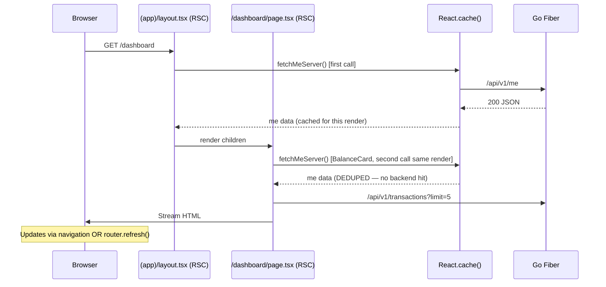

<!-- RT-R1: F13 (drop TanStack Query claim — pure RSC), F-balance-dup (drop BalancePill from TopBar), F-skeletons (drop per-card skeleton files; inline shadcn Skeleton), F-shadcn-slim (drop Sheet/Dialog/DropdownMenu — native HTML alternatives) -->
<!-- RT-R2: revert-R1-F-shadcn-slim (re-add Sheet+DropdownMenu — native <details> had CSP+a11y gaps), F6 (Sheet for MobileNav), F13 (DropdownMenu for UserMenu), F-bundled-cache-dedup (React.cache() for fetchMeServer), F11 (drop /settings page entirely — UserMenu absorbs) -->
<!-- Effort delta: 5h → 4.5h (drop /settings -30min, re-add 2 shadcn components +0min wash, add cache() +5min) -->

## Context Links

- Research R1: `plans/260426-0237-phase3-web-saas-foundation/research/researcher-r1-frontend-foundation.md` (lines 26-90 — RSC split, lines 64-77 — streaming Suspense, lines 187-205 — Radix component map)
- Phase 02: `phase-02-backend-auth-and-cors.md` (`/api/v1/me`, `/balance`, `/transactions`, `/ledger` contracts)
- Phase 03: `phase-03-frontend-auth-flow.md` (`/api/proxy` mount, cookie helpers)
- Scout: `plans/260426-0237-phase3-web-saas-foundation/reports/scout-codebase-state.md` (§7 — wallet/transaction services, §8 — bot deep-link reuse `t.me/SnakeBacklinkForgeBot?start=...`)
- Master prompt: `docs/MASTER_PROMPT.md` §5.5 line 1364 (Phase 3 dashboard scope)

## Overview

- **Priority:** P0 (first user-facing app surface after login)
- **Status:** implementation complete; local route smoke passed; happy-path dashboard E2E needs safe real API key
- **Brief:** Build App Router groups: `(public)/`, `(auth)/login/`, `(app)/dashboard|sites/`. App shell: persistent sidebar nav (mobile via shadcn `Sheet` — RT-R2: revert-R1-F-shadcn-slim/F6), top bar with brand + theme toggle button + UserMenu (shadcn `DropdownMenu` — RT-R2: F13; absorbs masked API key, regen-key link, logout — RT-R2: F11; no balance pill — RT-R1: F-balance-dup). `/dashboard`: 3 cards — balance, recent transactions, quick actions. All cards pure RSC fetch (NO TanStack Query — RT-R1: F13); updates via `router.refresh()`. Shared `fetchMeServer` wrapped in React `cache()` to dedupe layout `<UserMenuShell>` + dashboard `<BalanceCard>` `/me` calls (RT-R2: F-bundled-cache-dedup). NO `/settings` page (RT-R2: F11 — absorbed into UserMenu dropdown). Suspense fallback uses inline `<Skeleton />` (RT-R1: F-skeletons).

## Key Insights

- **Route groups** `(public)`, `(auth)`, `(app)` keep layouts isolated without affecting URL paths
- **Pure RSC, no client-side query lib (RT-R1: F13):** Server fetches via `fetchMeServer()` etc. directly in async RSC components. Client-side updates via `router.refresh()` from interactive elements. Auto-refresh deferred to Phase 4 (article gen) when needed.
- **shadcn Sheet + DropdownMenu (RT-R2: revert-R1-F-shadcn-slim/F6/F13):** R1 dropped both in favor of native `<details>` to slim install. R2 found native `<details>` has CSP issues (inline scripts to close-on-link), accessibility gaps (no Esc, no focus trap, no arrow-key nav), and route-close awkwardness. Sheet auto-closes on Esc, click-outside, route navigation. DropdownMenu provides keyboard nav + click-outside dismiss + focus management. Re-adding both components is the right tradeoff vs custom replacements.
- **React.cache() dedup (RT-R2: F-bundled-cache-dedup):** Layout's `<UserMenuShell>` calls `fetchMeServer()` for `key_prefix` + `key_last4`. Dashboard's `<BalanceCard>` calls `fetchMeServer()` for `balance_credits`. Without dedup → 2 backend `/me` calls per render. Wrapping in `cache()` collapses to 1 call within a single render pass.
- **No /settings page (RT-R2: F11):** R1 had `/settings/page.tsx` + `logout-button.tsx` separately. UserMenu dropdown duplicates the responsibilities (masked key display, regen-key link, logout). Drop standalone page → simpler nav, fewer files, less maintenance.
- Backend already returns balance from `/api/v1/me` — avoid extra `/balance` call on dashboard (use single fetch)
- Recent transactions: reuse `GET /api/v1/transactions?limit=5` — no new endpoint needed
- Quick action "Open Telegram bot" = `https://t.me/SnakeBacklinkForgeBot` (already wired as env `TELEGRAM_BOT_USERNAME`); expose via `NEXT_PUBLIC_TELEGRAM_BOT_USERNAME`
- "Top up" CTA → opens Telegram bot deep link `t.me/<bot>?start=topup` (Phase 2 bot already handles `topup` callback) — no in-web payment yet
- "Regenerate API key" → opens deep link `t.me/<bot>?start=regenkey` from UserMenu directly via `<a target="_blank">`
- Theme toggle (RT-R1: F-shadcn-slim): single `<button>` cycling light ↔ dark only. Drop "system" option for v1 (matches Phase 1 `enableSystem={false}`).
- Balance display (RT-R1: F-balance-dup): only on dashboard `BalanceCard`. Top bar has brand + theme + user menu only.
- Skeletons (RT-R1: F-skeletons): inline `<Skeleton className="h-32 w-full" />` from shadcn `skeleton` primitive. No per-card skeleton files. No `loading.tsx`.

## Requirements

### Functional

- App layout `(app)/layout.tsx`:
  - Sidebar (left desktop only) — items: Dashboard, Sites (Campaigns disabled for Phase 3, "Coming soon" badge)
  - Top bar (right) — brand + theme toggle + UserMenu dropdown (key prefix masked, regen-key link, logout)
  - Mobile: hamburger toggles shadcn `<Sheet>` (RT-R2: F6)
- `/dashboard` page renders 3 cards via RSC + Suspense:
  - **Balance card:** balance + "Top up" button → opens `t.me/<bot>?start=topup`
  - **Recent transactions card:** last 5 transactions, each row: date, amount, status, package
  - **Quick actions card:** "Open Telegram bot", "Connect WordPress site" (→ `/sites/connect`), "Top up"
- **NO `/settings` page** (RT-R2: F11). UserMenu dropdown contains:
  - Masked API key display: `{keyPrefix}•••{keyLast4}`
  - "Tạo lại key" → `t.me/SnakeBacklinkForgeBot?start=regenkey` (target=_blank)
  - "Đăng xuất" → `POST /api/auth/logout` → redirect `/login`
- All routes within `(app)` use `dynamic = 'force-dynamic'` (no caching, fresh per request)
- Loading: inline Suspense `<Skeleton>` per card

### Non-functional

- Lighthouse score ≥ 90 for `/dashboard` (post-auth, so test with seeded cookie)
- LCP < 2.5s on 4G simulated (Vercel measure)
- WCAG AA: keyboard nav full sidebar/menu, ARIA labels, focus rings visible
- No layout shift on theme switch (CSS variables only)
- No client-side query cache (RT-R1: F13). RSC fetch + `cache: 'no-store'` per request.
- React.cache() dedupes `/me` between layout + dashboard within single render (RT-R2: F-bundled-cache-dedup)

## Architecture

### Route tree

```
apps/landing/src/app/
├── (public)/
│   └── (none for Phase 3)        ← landing at root page.tsx (Phase 06)
├── (auth)/
│   └── login/                    ← Phase 03
├── (app)/
│   ├── layout.tsx                ← sidebar + top bar shell
│   ├── dashboard/
│   │   └── page.tsx              ← RSC, 3 cards in Suspense
│   ├── sites/                    ← Phase 05
│   └── campaigns/
│       └── page.tsx              ← "Coming soon" placeholder
├── api/                          ← Route Handlers (Phase 03)
├── globals.css
├── layout.tsx                    ← root <html><body><Providers>{children}<Toaster /></Providers>
├── page.tsx                      ← landing (Phase 06)
└── providers.tsx
```

**No `/settings` page** (RT-R2: F11). UserMenu absorbs.

### Data flow — Dashboard (pure RSC + React.cache dedup, RT-R1: F13 + RT-R2: F-bundled-cache-dedup)



**Staleness model (RT-R1: F13):** balance updates require manual page refresh OR navigation. KISS: skip the lib until Phase 4 (article gen) needs polling.

### Component map

| Component | Type | Source | Purpose |
|-----------|------|--------|---------|
| `<AppShell>` | Server | `(app)/layout.tsx` | Sidebar + top bar wrapper |
| `<SidebarNav>` | Server (links) + Client (active highlight) | `components/layout/sidebar-nav.tsx` | Nav items |
| `<MobileNav>` | Client | `components/layout/mobile-nav.tsx` | shadcn `Sheet` (RT-R2: F6) |
| `<TopBar>` | Server | `components/layout/top-bar.tsx` | Brand + theme button + UserMenu |
| `<UserMenu>` | Client | `components/layout/user-menu.tsx` | shadcn `DropdownMenu` (RT-R2: F13) — masked key, regen-key link, logout |
| `<ThemeToggle>` | Client | `components/theme-toggle.tsx` | Single button toggling light↔dark via next-themes |
| `<BalanceCard>` | Server | `components/dashboard/balance-card.tsx` | RSC fetch (deduped via cache — RT-R2: F-bundled-cache-dedup) |
| `<RecentTxCard>` | Server | `components/dashboard/recent-tx-card.tsx` | RSC fetch |
| `<QuickActionsCard>` | Server | `components/dashboard/quick-actions-card.tsx` | Static links |

## Related Code Files

### Create

<!-- RT-R1: F-skeletons — per-card skeleton files dropped; F13 — lib/queries/* dropped -->
<!-- RT-R2: revert-R1-F-shadcn-slim/F6/F13 — Sheet + DropdownMenu via shadcn (proper a11y); F11 — /settings/page.tsx + logout-button.tsx DROPPED -->

- `apps/landing/src/app/(app)/layout.tsx`
- `apps/landing/src/app/(app)/dashboard/page.tsx`
- `apps/landing/src/app/(app)/campaigns/page.tsx` ("Coming soon" placeholder)
- `apps/landing/src/components/layout/sidebar-nav.tsx`
- `apps/landing/src/components/layout/mobile-nav.tsx` (Client `'use client'` — shadcn `<Sheet>` — RT-R2: F6)
- `apps/landing/src/components/layout/top-bar.tsx` (brand + theme button + user menu only)
- `apps/landing/src/components/layout/user-menu.tsx` (Client `'use client'` — shadcn `<DropdownMenu>` — RT-R2: F13/F11)
- `apps/landing/src/components/theme-toggle.tsx` (`'use client'`, single button light↔dark cycle)
- `apps/landing/src/components/dashboard/balance-card.tsx`
- `apps/landing/src/components/dashboard/recent-tx-card.tsx`
- `apps/landing/src/components/dashboard/quick-actions-card.tsx`
- `apps/landing/src/lib/api/server-fetch.ts` (server-side fetch helper with cookie injection + `React.cache()` wrap — RT-R2: F-bundled-cache-dedup)
- `apps/landing/src/lib/format/currency.ts` (VND format helper)
- `apps/landing/src/lib/format/date.ts` (locale date helper)
- `apps/landing/src/components/ui/skeleton.tsx` (shadcn skeleton primitive — installed via `pnpm exec shadcn add skeleton`)

<!-- RT-R2: F11 — DROPPED:
  - apps/landing/src/app/(app)/settings/page.tsx
  - apps/landing/src/app/(app)/settings/logout-button.tsx
UserMenu dropdown absorbs the responsibilities. -->

### Modify

- `apps/landing/.env.example` — add `NEXT_PUBLIC_TELEGRAM_BOT_USERNAME=SnakeBacklinkForgeBot` (already done in Phase 1 — RT-R2: F-bundled-env-list)
- `apps/landing/src/app/layout.tsx` — already wraps `<Providers>` (Phase 01)
- `services/api/internal/api/handlers/v1_me.go` — extend response with `key_last4_hash` (last 4 hex chars of `sha256(plaintext)`) for masked display

### Delete

- None

## Implementation Steps

### Step 1 — App layout shell (30 min)

<!-- RT-R2: F6 — `<MobileNav>` uses shadcn `<Sheet>` (proper a11y); RT-R1: F-balance-dup — TopBar no balance pill -->

`apps/landing/src/app/(app)/layout.tsx`:

```tsx
import { ReactNode } from 'react'
import { SidebarNav } from '@/components/layout/sidebar-nav'
import { TopBar } from '@/components/layout/top-bar'
import { MobileNav } from '@/components/layout/mobile-nav'

export const dynamic = 'force-dynamic'

export default function AppLayout({ children }: { children: ReactNode }) {
  return (
    <div className="min-h-screen flex flex-col">
      <header className="border-b sticky top-0 bg-background z-40 flex items-center px-4 h-14">
        <MobileNav className="md:hidden" />
        <span className="ml-2 md:ml-0 font-semibold">Snake Backlink Forge</span>
        <div className="ml-auto"><TopBar /></div>
      </header>
      <div className="flex flex-1">
        <aside className="hidden md:block w-56 border-r"><SidebarNav /></aside>
        <main className="flex-1 p-6">{children}</main>
      </div>
    </div>
  )
}
```

### Step 2 — Sidebar + MobileNav with shadcn Sheet (30 min)

<!-- RT-R2: revert-R1-F-shadcn-slim/F6 — replaced native <details> with shadcn Sheet. Sheet auto-closes on Esc, click-outside, route navigation. Standard React handlers, no inline scripts (CSP-friendly). -->

`apps/landing/src/components/layout/sidebar-nav.tsx`:

```tsx
import Link from 'next/link'
import { LayoutDashboard, Globe2, Sparkles } from 'lucide-react'

// RT-R2: F11 — dropped /settings nav item; UserMenu absorbs
const items = [
  { href: '/dashboard', label: 'Dashboard', icon: LayoutDashboard },
  { href: '/sites', label: 'WordPress Sites', icon: Globe2 },
  { href: '/campaigns', label: 'Campaigns', icon: Sparkles, comingSoon: true },
]

export function SidebarNav() {
  return (
    <nav className="flex flex-col p-3 gap-1">
      {items.map(({ href, label, icon: Icon, comingSoon }) => (
        <Link key={href} href={href} className="flex items-center gap-2 rounded-md px-3 py-2 hover:bg-accent">
          <Icon className="h-4 w-4" />
          <span>{label}</span>
          {comingSoon && <span className="ml-auto text-xs text-muted-foreground">Soon</span>}
        </Link>
      ))}
    </nav>
  )
}
```

`mobile-nav.tsx` (Client — shadcn Sheet, RT-R2: F6):

```tsx
'use client'
import { useState } from 'react'
import { Menu } from 'lucide-react'
import { usePathname } from 'next/navigation'
import { useEffect } from 'react'
import { Sheet, SheetContent, SheetTrigger } from '@/components/ui/sheet'
import { Button } from '@/components/ui/button'
import { SidebarNav } from './sidebar-nav'

export function MobileNav({ className }: { className?: string }) {
  const [open, setOpen] = useState(false)
  const pathname = usePathname()
  // Auto-close on route change
  useEffect(() => { setOpen(false) }, [pathname])

  return (
    <Sheet open={open} onOpenChange={setOpen}>
      <SheetTrigger asChild>
        <Button variant="ghost" size="icon" className={className} aria-label="Mở menu">
          <Menu className="h-5 w-5" />
        </Button>
      </SheetTrigger>
      <SheetContent side="left" className="w-64 p-4">
        <SidebarNav />
      </SheetContent>
    </Sheet>
  )
}
```

Sheet handles Esc, click-outside dismiss automatically. Route-change close via `useEffect(pathname)`.

### Step 3 — Top bar (20 min)

<!-- RT-R1: F-balance-dup — drop BalancePill; balance lives only on dashboard BalanceCard. TopBar = brand area + theme + user menu only. -->
<!-- RT-R2: F-bundled-cache-dedup — `fetchMeServer` deduped via React.cache(); BalanceCard's call shares the same fetch as UserMenuShell's. -->

`apps/landing/src/components/layout/top-bar.tsx`:

```tsx
import { Suspense } from 'react'
import { ThemeToggle } from '@/components/theme-toggle'
import { UserMenu } from '@/components/layout/user-menu'
import { fetchMeServer } from '@/lib/api/server-fetch'

export function TopBar() {
  return (
    <div className="flex items-center gap-3">
      <ThemeToggle />
      <Suspense fallback={<div className="h-8 w-24 bg-muted rounded animate-pulse" />}>
        <UserMenuShell />
      </Suspense>
    </div>
  )
}

async function UserMenuShell() {
  const me = await fetchMeServer()  // RT-R2: F-bundled-cache-dedup — same call deduped with BalanceCard
  return <UserMenu keyPrefix={me.key_prefix} keyLast4={me.key_last4_hash} />
}
```

### Step 4 — Server-side fetch helper with React.cache (20 min)

<!-- RT-R2: F-bundled-cache-dedup — wrap fetchMeServer in React.cache() to dedupe layout + dashboard calls within single render pass. Without this, /me hits backend twice per dashboard load. -->

`apps/landing/src/lib/api/server-fetch.ts`:

```ts
import 'server-only'
import { cache } from 'react'
import { getApiKeyCookie } from '@/lib/auth/cookies'
import { redirect } from 'next/navigation'
import { env } from '@/lib/env'

const BACKEND = env.NEXT_PUBLIC_API_BASE_URL

async function backendFetch<T>(path: string, init: RequestInit = {}): Promise<T> {
  const key = await getApiKeyCookie()
  if (!key) redirect('/login')
  const r = await fetch(`${BACKEND}${path}`, {
    ...init,
    headers: { ...(init.headers ?? {}), Authorization: `Bearer ${key}` },
    cache: 'no-store',
  })
  if (r.status === 401) redirect('/login?reason=expired')
  if (!r.ok) throw new Error(`backend ${r.status}: ${await r.text()}`)
  return r.json() as Promise<T>
}

// RT-R2: F-bundled-cache-dedup — `cache()` wraps the fetcher so layout's UserMenuShell
// and dashboard's BalanceCard share a single `/me` request within one render pass.
export const fetchMeServer = cache(async (): Promise<MeResponse> => {
  return backendFetch<MeResponse>('/api/v1/me')
})

export const fetchRecentTxServer = (limit = 5) => backendFetch<TxList>(`/api/v1/transactions?limit=${limit}`)
export const fetchSitesServer = () => backendFetch<SitesList>('/api/v1/wp-sites')

// Types from @sbf/shared-types after pnpm gen:api
type MeResponse = { user_id: string; language: string; is_verified: boolean; balance_credits: number; key_prefix: string; key_last4_hash: string }
type TxList = { items: TxItem[]; next_cursor?: string }
type TxItem = { id: string; created_at: string; amount: number; status: string; package: string }
type SitesList = { items: WpSite[] }
type WpSite = { id: string; base_url: string; label: string; status: string; last_validated_at?: string }
```

**Architecture note:** Layout renders `<UserMenuShell>` calling `fetchMeServer()`. Dashboard renders `<BalanceCard>` calling `fetchMeServer()`. Both calls within same render → React.cache returns first result on second call → 1 backend hit total per render.

### Step 5 — Dashboard page + 3 cards (60 min)

<!-- RT-R1: F-skeletons — inline Skeleton from shadcn/ui, NO per-card skeleton files -->

`apps/landing/src/app/(app)/dashboard/page.tsx`:

```tsx
import { Suspense } from 'react'
import { BalanceCard } from '@/components/dashboard/balance-card'
import { RecentTxCard } from '@/components/dashboard/recent-tx-card'
import { QuickActionsCard } from '@/components/dashboard/quick-actions-card'
import { Skeleton } from '@/components/ui/skeleton'

export const dynamic = 'force-dynamic'

export default function DashboardPage() {
  return (
    <div className="space-y-6 max-w-5xl">
      <h1 className="text-2xl font-semibold">Tổng quan</h1>
      <div className="grid grid-cols-1 md:grid-cols-3 gap-4">
        <Suspense fallback={<Skeleton className="h-32 w-full" />}><BalanceCard /></Suspense>
        <Suspense fallback={<Skeleton className="h-32 w-full" />}><RecentTxCard /></Suspense>
        <QuickActionsCard />
      </div>
    </div>
  )
}
```

`balance-card.tsx`:

```tsx
import { Card, CardHeader, CardTitle, CardContent } from '@/components/ui/card'
import { Button } from '@/components/ui/button'
import { fetchMeServer } from '@/lib/api/server-fetch'
import { formatCredits } from '@/lib/format/currency'
import { env } from '@/lib/env'
import Link from 'next/link'

export async function BalanceCard() {
  const me = await fetchMeServer()  // RT-R2: F-bundled-cache-dedup — deduped with layout
  const botUrl = `https://t.me/${env.NEXT_PUBLIC_TELEGRAM_BOT_USERNAME}?start=topup`
  return (
    <Card>
      <CardHeader><CardTitle>Số dư</CardTitle></CardHeader>
      <CardContent className="space-y-3">
        <div className="text-3xl font-bold">{formatCredits(me.balance_credits)}</div>
        <Button asChild className="w-full"><Link href={botUrl} target="_blank">Nạp thêm</Link></Button>
      </CardContent>
    </Card>
  )
}
```

`recent-tx-card.tsx` — fetch + render rows:

```tsx
import { Card, CardHeader, CardTitle, CardContent } from '@/components/ui/card'
import { fetchRecentTxServer } from '@/lib/api/server-fetch'
import { formatDate } from '@/lib/format/date'
import { formatCredits } from '@/lib/format/currency'

export async function RecentTxCard() {
  const { items } = await fetchRecentTxServer(5)
  return (
    <Card>
      <CardHeader><CardTitle>Giao dịch gần đây</CardTitle></CardHeader>
      <CardContent>
        {items.length === 0 ? (
          <p className="text-sm text-muted-foreground">Chưa có giao dịch nào.</p>
        ) : (
          <ul className="space-y-2 text-sm">
            {items.map(t => (
              <li key={t.id} className="flex justify-between">
                <span>{formatDate(t.created_at)} — {t.package}</span>
                <span>{formatCredits(t.amount)}</span>
              </li>
            ))}
          </ul>
        )}
      </CardContent>
    </Card>
  )
}
```

`quick-actions-card.tsx` — three buttons (Open Bot, Connect WP, Top up). All `<Link>` — no client interactivity needed.

### Step 6 — UserMenu with shadcn DropdownMenu (30 min)

<!-- RT-R2: revert-R1-F-shadcn-slim/F13 — shadcn DropdownMenu (proper keyboard nav, click-outside, focus trap) -->
<!-- RT-R2: F11 — UserMenu absorbs ALL responsibilities formerly on /settings page: masked key, regen-key link, logout -->

`user-menu.tsx` (Client, shadcn DropdownMenu):

```tsx
'use client'
import { useRouter } from 'next/navigation'
import {
  DropdownMenu,
  DropdownMenuContent,
  DropdownMenuItem,
  DropdownMenuLabel,
  DropdownMenuSeparator,
  DropdownMenuTrigger,
} from '@/components/ui/dropdown-menu'
import { Button } from '@/components/ui/button'
import { env } from '@/lib/env'

export function UserMenu({ keyPrefix, keyLast4 }: { keyPrefix: string; keyLast4: string }) {
  const router = useRouter()
  const regenUrl = `https://t.me/${env.NEXT_PUBLIC_TELEGRAM_BOT_USERNAME}?start=regenkey`

  async function logout() {
    await fetch('/api/auth/logout', { method: 'POST' })
    router.replace('/login')
  }

  return (
    <DropdownMenu>
      <DropdownMenuTrigger asChild>
        <Button variant="ghost" size="sm" className="font-mono text-xs">
          {keyPrefix}•••{keyLast4}
        </Button>
      </DropdownMenuTrigger>
      <DropdownMenuContent align="end" className="w-56">
        <DropdownMenuLabel>Khóa API</DropdownMenuLabel>
        <DropdownMenuItem className="font-mono text-xs text-muted-foreground" disabled>
          {keyPrefix}•••{keyLast4}
        </DropdownMenuItem>
        <DropdownMenuSeparator />
        <DropdownMenuItem asChild>
          <a href={regenUrl} target="_blank" rel="noopener noreferrer">Tạo lại key</a>
        </DropdownMenuItem>
        <DropdownMenuSeparator />
        <DropdownMenuItem onClick={logout} className="text-destructive focus:text-destructive">
          Đăng xuất
        </DropdownMenuItem>
      </DropdownMenuContent>
    </DropdownMenu>
  )
}
```

DropdownMenu auto-handles: Esc dismiss, click-outside dismiss, arrow-key nav, focus trap, ARIA attributes.

### Step 7 — Theme toggle (10 min)

<!-- RT-R1: F-shadcn-slim — single button cycling light↔dark; matches Phase 1 enableSystem={false} -->

`theme-toggle.tsx`:

```tsx
'use client'
import { useTheme } from 'next-themes'
import { Moon, Sun } from 'lucide-react'
import { Button } from '@/components/ui/button'

export function ThemeToggle() {
  const { theme, setTheme } = useTheme()
  return (
    <Button
      variant="ghost"
      size="icon"
      aria-label="Đổi giao diện"
      onClick={() => setTheme(theme === 'dark' ? 'light' : 'dark')}
    >
      <Sun className="h-4 w-4 dark:hidden" />
      <Moon className="h-4 w-4 hidden dark:block" />
    </Button>
  )
}
```

### Step 8 — Backend extension for `key_last4_hash` (10 min)

In `services/api/internal/api/handlers/v1_me.go`, expand response to include `key_last4_hash` derived from `key_hash` BYTEA (last 2 bytes → 4 hex chars). No new query — use existing `api_keys` row already loaded by middleware.

### Step 9 — Smoke test (15 min)

```bash
pnpm --filter @sbf/web dev
# Login then visit /dashboard
# All 3 cards load. Verify network tab: /me hit ONCE per render (RT-R2: F-bundled-cache-dedup).
# UserMenu dropdown: keyboard Tab to open trigger, Enter open, arrow keys nav, Esc close
# Mobile (resize <768px): hamburger reveals Sheet nav, Esc closes, click-outside closes, route nav closes
# Visit /campaigns: shows "Coming soon" placeholder
# Logout from UserMenu: cookie cleared, redirect to login
```

## Todo List

- [ ] Step 1 — `(app)/layout.tsx` shell with `MobileNav` Sheet (RT-R2: F6) + `TopBar` (no balance pill — RT-R1: F-balance-dup)
- [ ] Step 2 — `SidebarNav` (3 items, no /settings — RT-R2: F11) + `MobileNav` shadcn Sheet (RT-R2: revert-R1-F-shadcn-slim/F6)
- [ ] Step 3 — `TopBar` with theme + UserMenu only
- [ ] Step 4 — `lib/api/server-fetch.ts` with React.cache() wrap on fetchMeServer (RT-R2: F-bundled-cache-dedup)
- [ ] Step 5 — Dashboard page + 3 cards (Balance/RecentTx/QuickActions) with inline `<Skeleton>` (RT-R1: F-skeletons)
- [ ] Step 6 — UserMenu shadcn DropdownMenu (RT-R2: revert-R1-F-shadcn-slim/F13/F11): masked key + regen-key link + logout
- [ ] Step 7 — ThemeToggle (single button light↔dark)
- [ ] Step 8 — Backend `key_last4_hash` field added to `/api/v1/me`
- [ ] Step 9 — Manual smoke desktop + mobile (verify Sheet a11y, DropdownMenu keyboard nav, /me deduped to 1 call)

## Success Criteria

- `/dashboard` renders 3 cards with real data after login
- Network DevTools: `/me` called ONCE per dashboard render (RT-R2: F-bundled-cache-dedup verification)
- Mobile viewport (<768px) shows hamburger; tapping reveals Sheet; Esc/click-outside/route-nav all close it
- UserMenu dropdown: Tab focuses trigger; Enter opens; arrow keys nav items; Esc closes; click-outside closes
- Theme toggle switches light/dark; localStorage persists
- Balance updates after a top-up by manual page refresh OR navigation (RT-R1: F13)
- UserMenu shows masked key like `sbf_live_Zk3•••a3f9`
- Logout from UserMenu: cookie cleared, redirect to login
- "Tạo lại key" item opens `t.me/.../regenkey` in new tab
- Lighthouse mobile score ≥ 90 for `/dashboard`
- Keyboard-only nav: Tab → sidebar items focusable, focus rings visible
- Direct visit `/dashboard` without cookie → redirect to login (Phase 03 middleware)

## Risk Assessment

<!-- RT-R2: revert-R1-F-shadcn-slim — CSP risk note REMOVED (no inline scripts; standard React handlers) -->

| Risk | Likelihood | Impact | Mitigation |
|------|-----------|--------|-----------|
| Suspense boundary leaks fetch errors as 500 | Med | Med | Add `error.tsx` per route group with friendly fallback + retry; log to Sentry (Phase 07) |
| RSC fetch redirect loop (cookie expired mid-render) | Low | High | `server-fetch.ts` `redirect('/login?reason=expired')` is idempotent; middleware handles loop break |
| Server vs client time formatting drift | Med | Med | Use `Intl.DateTimeFormat` with explicit locale + timeZone='Asia/Ho_Chi_Minh' on both sides |
| `key_last4_hash` exposes brute-force surface | Low | Low | Only last 4 hex chars (16 bits); brute force still infeasible against SHA-256 + DB lookup; not a secret |
| User wants auto-balance refresh after top-up | Low | Low | RT-R1: F13 — auto-refresh deferred. Manual page refresh OR navigation works. Phase 4 may add polling when needed. |
| Sheet/DropdownMenu bundle size impact | Low | Low | RT-R2: revert-R1-F-shadcn-slim — Radix primitives are tree-shakeable; ~12KB gzip total acceptable for proper a11y vs custom implementations |
| React.cache() doesn't dedup if fetcher signatures differ | Low | Med | RT-R2: F-bundled-cache-dedup — `fetchMeServer()` takes zero args, signature stable; verify via DevTools network |

## Security Considerations

- All `(app)` routes are `dynamic = 'force-dynamic'` — no caching of authenticated data
- `server-fetch.ts` redirects on 401 → cookie auto-cleared via Phase 03 proxy on next request
- No `localStorage` of any auth-related data — all state in httpOnly cookie + RSC
- Theme preference in localStorage is non-sensitive
- External Telegram links use `target="_blank" rel="noopener noreferrer"` — prevents tabnabbing
- `key_last4_hash` shown in UI is informational only (not a secret) — derived from public hash output, last 4 chars
- Sheet + DropdownMenu use standard React event handlers — no inline scripts → CSP `script-src 'self' https://plausible.io` works without `unsafe-inline` (RT-R2: revert-R1-F-shadcn-slim)

## Next Steps

- **Depends on:** Phase 01 (apps/landing infra incl. Sheet + DropdownMenu install — RT-R2: revert-R1-F-shadcn-slim), Phase 02 (`/me` `/transactions` endpoints), Phase 03 (cookie + proxy)
- **Unblocks:** Phase 05 (sites list reuses sidebar layout), Phase 06 (landing fits into root page.tsx), Phase 08 (Playwright `dashboard-load.spec.ts`)
- **Follow-up:** Phase 4 (AI articles) adds `/articles` nav item; Phase 7 (campaigns) replaces "Coming soon" placeholder

## Resolved unresolved questions (from R1, scout)

- **R1 Q4 (`localePrefix: 'always'` vs `'as-needed'`):** RESOLVED for Phase 06 — `'always'` (`/vi`, `/en`) for SEO consistency. Note: deferred to Phase 9 entirely.
- **Scout Q6 (shadcn confirmed):** RESOLVED — shadcn confirmed; component install list per Phase 01 Step 2 (6 components: Button, Input, Card, Label, Sheet, DropdownMenu — RT-R2: revert-R1-F-shadcn-slim).
