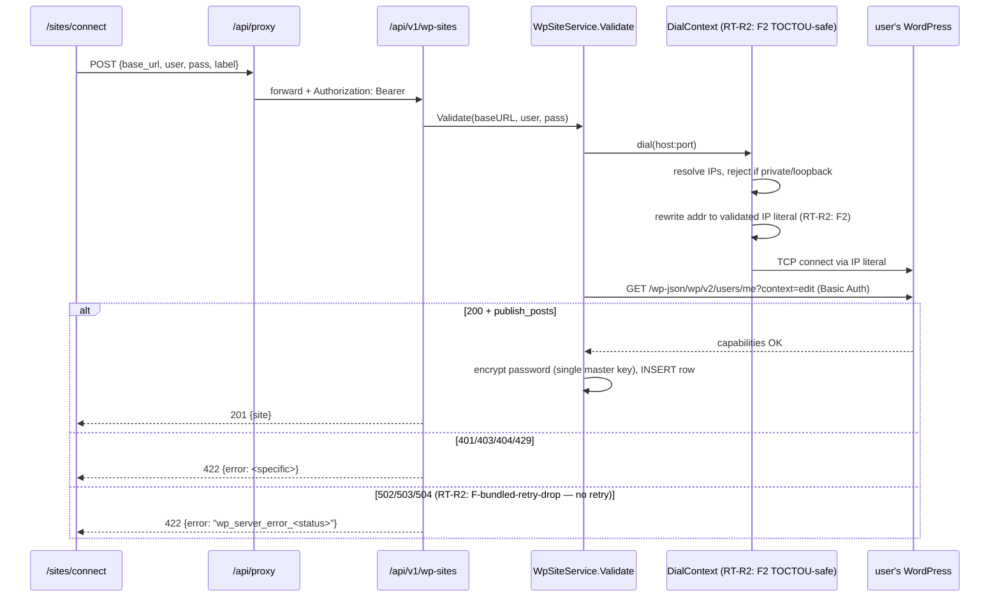

<!-- RT-R1: F3 (SSRF block in WP Validate), F12 (/wp-json/ root diagnostic), F7 (enc_key_version + HKDF + rotation runbook), F4 (retry/backoff on 5xx) -->
<!-- RT-R2: revert-R1-F7 (drop HKDF + enc_key_version + rotation infra — defer to Phase 11 ticket); F2 (DNS rebinding TOCTOU fix in DialContext); F3 (sites-table useTransition + router.refresh — drop TanStack Query); F-bundled-retry-drop (single attempt per HTTP call, no retry @ 2s) -->
<!-- Effort delta: 7h → 5.5h (drop HKDF -1h, drop CLI scaffold -30min, drop runbook -15min, drop retry -15min, add TOCTOU fix +30min, sites-table rewrite +0min wash) -->

## Context Links

- Research R2: `plans/260426-0237-phase3-web-saas-foundation/research/researcher-r2-plumbing-deploy.md` (lines 277-388 — WP App Password + Basic Auth + validation flow + error matrix + gotchas)
- Phase 02: `phase-02-backend-auth-and-cors.md` (`auth_apikey` middleware reuse, `ApiUser` ctx)
- Phase 04: `phase-04-app-shell-and-dashboard.md` (sidebar `/sites` nav item, app shell)
- Scout: `plans/260426-0237-phase3-web-saas-foundation/reports/scout-codebase-state.md` (§3 — migration convention `YYYYMMDD<seq>_<slug>.sql`, sqlc pipeline, §2 — service+sqlc pattern, audit_log goroutine)
- Master prompt: `docs/MASTER_PROMPT.md` §5.5 line 1342, line 1366 (`wp_sites` table; Phase 5 publish builds on this connection)

## Overview

- **Priority:** P0 (gates Phase 5 publish; first user data they create in web app)
- **Status:** pending
- **Brief:** Add `wp_sites` table (encrypted `app_password_enc` — single master key, no version column — RT-R2: revert-R1-F7). Build `WpSiteService` with `Validate(baseURL, user, pass)` calling WP REST: first `GET /wp-json/` root for diagnostic (RT-R1: F12), then `GET /wp-json/wp/v2/users/me?context=edit` Basic Auth. SSRF defense: custom HTTP transport rejects private/loopback/link-local IPs after DNS resolution **AND** rewrites addr to validated IP literal to eliminate DNS rebinding TOCTOU window (RT-R2: F2); production HTTPS-only (RT-R1: F3). Endpoints: `POST /api/v1/wp-sites`, `GET /api/v1/wp-sites`, `DELETE /api/v1/wp-sites/:id`, `POST /api/v1/wp-sites/:id/revalidate`. UI: `/sites` (table list, revalidate/delete via `useTransition` + `router.refresh()` — RT-R2: F3) + `/sites/connect` (4-field form). Single attempt per HTTP call (no retry @ 2s — RT-R2: F-bundled-retry-drop); 5xx returns specific error codes for clear UI message.

## Key Insights

- **Application Passwords** (WP 5.6+, built-in core feature) — no plugin install needed for WP user. Generate from `WP Admin → Users → Profile → Application Passwords`.
- App password format: `xxxx xxxx xxxx xxxx xxxx xxxx` (24 chars, 4-char groups, spaces optional). Most users paste WITH spaces — store as user typed (after trim leading/trailing).
- **Encryption (CRITICAL — RT-R2: revert-R1-F7 simplified):** Store `app_password_enc` as AES-256-GCM ciphertext. Single master key from `WP_ENC_KEY` env (32 bytes hex-decoded). Random 12-byte nonce per encrypt. NO HKDF, NO `enc_key_version` column, NO multi-version reads. Rotation = Phase 11 ticket; if leaked, action is re-deploy with new key + force user re-entry of all wp_sites credentials. Acceptable risk for v1 (zero stored creds at launch, rotation only meaningful post-launch).
- HTTPS required by WP for Basic Auth — reject non-https `base_url` at API layer
- `?context=edit` parameter forces `capabilities` field — needed to confirm `publish_posts: true` (R2 line 332)
- Common gotchas: Apache `.htaccess` strips `Authorization` header; security plugins block `/wp-json`; reverse proxies drop headers. Surface as actionable error messages.
- Reuse pgxpool + sqlc + audit_log pattern from Phase 2
- Migration filename: `20260427001_phase3_wp_sites.sql` (next available date+seq after `20260425001_key_unique_active.sql`)
- **DNS rebinding TOCTOU (RT-R2: F2):** R1 transport resolved IP, checked private ranges, then let `baseDial` resolve again — attacker DNS could return public IP for check, private IP for connect. Fix: rewrite `addr` to validated IP literal so single resolution flows through.
- **No retry on 5xx (RT-R2: F-bundled-retry-drop):** R1 retried once @ 2s on 502/503/504. Real WP hosts that return 5xx during validate are usually mid-incident; retry @ 2s won't help and adds 2s latency to the user. Drop retry; map 5xx to specific error codes for clear UI feedback. Total budget 12s (5s connect + 5s read + 2s buffer).

## Requirements

### Functional

- **Migration `20260427001_phase3_wp_sites.sql`:**
  - Table `wp_sites` (id, user_id, base_url, app_username, app_password_enc, label, status, last_validated_at, last_error, created_at, updated_at, deleted_at)
  - <!-- RT-R2: revert-R1-F7 — `enc_key_version SMALLINT` column DROPPED. Single master key model. -->
  - FK `user_id REFERENCES users(id) ON DELETE CASCADE`
  - Unique index `(user_id, base_url) WHERE deleted_at IS NULL`
  - Status enum `wp_site_status`: `pending`, `connected`, `error`
  - Indexes: `idx_wp_sites_user (user_id)`
- **`WpSiteService.Validate(ctx, baseURL, user, pass)`** returns `(capabilitiesOK bool, err error)`:
  - Reject if `baseURL` not https (and not `localhost`/`127.0.0.1` for dev test)
  - Make `GET <baseURL>/wp-json/wp/v2/users/me?context=edit` with `req.SetBasicAuth(user, pass)`
  - 5s timeout
  - Status 200 → parse JSON, check `capabilities.publish_posts == true`
  - Status 401 → `ErrInvalidCredentials`
  - Status 403 → `ErrInsufficientCapability`
  - Status 404 → `ErrRestApiNotFound`
  - Status 429 → `ErrRateLimited`
  - Status 502 → `ErrWpServerError502` (RT-R2: F-bundled-retry-drop — no retry, specific code)
  - Status 503 → `ErrWpServerError503`
  - Status 504 → `ErrWpServerError504`
  - Other / network → `ErrNetwork(detail)`
- **`WpSiteService.Create(ctx, userID, baseURL, user, pass, label)`**:
  - Normalize `baseURL` (lowercase host, strip trailing slash)
  - Validate first (call `.Validate`)
  - On success: encrypt password (single master key), INSERT row with `status='connected'`, `last_validated_at=NOW()`
  - On validation error: return error WITHOUT inserting (don't store bad creds)
- **`WpSiteService.List(ctx, userID)`** returns `[]WpSite` (without `app_password_enc`) — sorted by created_at DESC
- **`WpSiteService.Delete(ctx, userID, id)`** soft-deletes (set `deleted_at=NOW()`); audit-log
- **`WpSiteService.Revalidate(ctx, userID, id)`** decrypts password (single master key), re-runs Validate, updates `status` + `last_validated_at` + `last_error`
- **Endpoints (all under `/api/v1/wp-sites`, gated by `auth_apikey` middleware):**
  - `POST /` body `{base_url, app_username, app_password, label}` → 201 `{site}` or 400/422
  - `GET /` → `{items: [...]}`
  - `DELETE /:id` → 204
  - `POST /:id/revalidate` → 200 `{status, last_validated_at}`
- **UI `/sites`:**
  - Table: Label | URL | Status badge | Last validated | Actions (Revalidate, Delete)
  - Actions use `useTransition` + `router.refresh()` (RT-R2: F3 — NO TanStack Query)
  - Empty state: "Chưa kết nối site nào — Kết nối ngay" CTA → `/sites/connect`
- **UI `/sites/connect`:**
  - Form (RHF + Zod): `base_url` (URL pattern), `app_username` (string), `app_password` (password input, monospace), `label` (string, optional)
  - Helper text under each field; explanation block linking to WP docs
  - Submit → POST → toast success → redirect `/sites`
  - On error: inline form error mapped to specific field where possible

### Non-functional

- WP HTTP client timeout: 5s connect + 5s read (10s total worst case). Context budget 12s (RT-R2: F-bundled-retry-drop — no retry buffer, just 2s margin).
- Encryption: AES-256-GCM via `crypto/aes` + `crypto/cipher` (Go stdlib). Nonce 12 bytes random per encrypt, prepended to ciphertext. Single master key from env hex-decoded.
- Rate limit on `/api/v1/wp-sites/*` endpoints: 60/min/user (Phase 9 may tighten)
- Audit log every Create / Delete / Revalidate (action: `wp_site.create`, `wp_site.delete`, `wp_site.revalidate`)
- Plaintext app password NEVER logged (zap field allowlist enforced via lint review)
- Migration MUST run cleanly on existing prod DB (no destructive change to existing tables)
- DNS rebinding TOCTOU eliminated: addr rewritten to validated IP literal (RT-R2: F2)

## Architecture

### DDL

<!-- RT-R2: revert-R1-F7 — `enc_key_version` column DROPPED. Single master key from WP_ENC_KEY env. Rotation = Phase 11 ticket. -->

```sql
-- 20260427001_phase3_wp_sites.sql
-- +goose Up
-- +goose StatementBegin
CREATE TYPE wp_site_status AS ENUM ('pending', 'connected', 'error');

CREATE TABLE wp_sites (
  id                 UUID PRIMARY KEY DEFAULT gen_random_uuid(),
  user_id            UUID NOT NULL REFERENCES users(id) ON DELETE CASCADE,
  base_url           VARCHAR(512) NOT NULL,
  app_username       VARCHAR(120) NOT NULL,
  app_password_enc   BYTEA NOT NULL,
  label              VARCHAR(120) NOT NULL DEFAULT '',
  status             wp_site_status NOT NULL DEFAULT 'pending',
  last_validated_at  TIMESTAMPTZ,
  last_error         TEXT,
  created_at         TIMESTAMPTZ NOT NULL DEFAULT NOW(),
  updated_at         TIMESTAMPTZ NOT NULL DEFAULT NOW(),
  deleted_at         TIMESTAMPTZ
);

CREATE UNIQUE INDEX idx_wp_sites_user_url_active
  ON wp_sites (user_id, base_url) WHERE deleted_at IS NULL;
CREATE INDEX idx_wp_sites_user ON wp_sites (user_id) WHERE deleted_at IS NULL;
-- +goose StatementEnd

-- +goose Down
-- +goose StatementBegin
DROP INDEX IF EXISTS idx_wp_sites_user;
DROP INDEX IF EXISTS idx_wp_sites_user_url_active;
DROP TABLE IF EXISTS wp_sites;
DROP TYPE IF EXISTS wp_site_status;
-- +goose StatementEnd
```

### Encryption helper (`internal/util/aesgcm.go`) — single master key

<!-- RT-R2: revert-R1-F7 — HKDF dropped. Single master key from WP_ENC_KEY (32 bytes hex). Random 12-byte nonce per encrypt. No version, no info string, no per-row derivation. -->

```go
package util

import (
  "crypto/aes"
  "crypto/cipher"
  "crypto/rand"
  "encoding/hex"
  "errors"
  "fmt"
)

var ErrEncKeyMissing = errors.New("WP_ENC_KEY not configured")

// loadMasterKey decodes hex-encoded WP_ENC_KEY env into 32 raw bytes.
// Boot validation in Phase 2 main.go ensures format correctness.
func loadMasterKey(masterHex string) ([]byte, error) {
  if masterHex == "" { return nil, ErrEncKeyMissing }
  k, err := hex.DecodeString(masterHex)
  if err != nil { return nil, fmt.Errorf("WP_ENC_KEY hex decode: %w", err) }
  if len(k) != 32 { return nil, fmt.Errorf("WP_ENC_KEY must be 32 bytes, got %d", len(k)) }
  return k, nil
}

// EncryptAESGCM encrypts plaintext under master key. Returns nonce||ciphertext.
func EncryptAESGCM(masterHex string, plaintext []byte) ([]byte, error) {
  key, err := loadMasterKey(masterHex)
  if err != nil { return nil, err }
  block, _ := aes.NewCipher(key)
  gcm, _ := cipher.NewGCM(block)
  nonce := make([]byte, gcm.NonceSize())
  if _, err := rand.Read(nonce); err != nil { return nil, err }
  ct := gcm.Seal(nonce, nonce, plaintext, nil)
  return ct, nil
}

// DecryptAESGCM decrypts nonce||ciphertext blob produced by EncryptAESGCM.
func DecryptAESGCM(masterHex string, ciphertext []byte) ([]byte, error) {
  key, err := loadMasterKey(masterHex)
  if err != nil { return nil, err }
  block, _ := aes.NewCipher(key)
  gcm, _ := cipher.NewGCM(block)
  ns := gcm.NonceSize()
  if len(ciphertext) < ns { return nil, errors.New("ciphertext too short") }
  nonce, ct := ciphertext[:ns], ciphertext[ns:]
  return gcm.Open(nil, nonce, ct, nil)
}
```

`go.mod` does NOT need `golang.org/x/crypto` (no HKDF — RT-R2: revert-R1-F7).

### sqlc queries (`internal/db/queries/wp_sites.sql`)

<!-- RT-R2: revert-R1-F7 — InsertWpSite no longer takes `enc_key_version` param -->

```sql
-- name: InsertWpSite :one
INSERT INTO wp_sites (user_id, base_url, app_username, app_password_enc, label, status, last_validated_at)
VALUES ($1, $2, $3, $4, $5, $6, $7) RETURNING *;

-- name: ListWpSitesByUser :many
SELECT id, user_id, base_url, app_username, label, status, last_validated_at, last_error, created_at
FROM wp_sites WHERE user_id = $1 AND deleted_at IS NULL ORDER BY created_at DESC;

-- name: GetWpSiteByID :one
SELECT * FROM wp_sites WHERE id = $1 AND user_id = $2 AND deleted_at IS NULL LIMIT 1;

-- name: SoftDeleteWpSite :exec
UPDATE wp_sites SET deleted_at = NOW() WHERE id = $1 AND user_id = $2;

-- name: UpdateWpSiteStatus :exec
UPDATE wp_sites SET status = $1, last_validated_at = NOW(), last_error = $2, updated_at = NOW()
WHERE id = $3 AND user_id = $4;
```

NOTE: `ListWpSitesByUser` selects EXCLUDES `app_password_enc` to avoid accidental return.

### WP HTTP client flow



## Related Code Files

### Create

<!-- RT-R1: F3 + F12 — safe transport, diagnostic errors -->
<!-- RT-R2: F2 — DNS rebinding TOCTOU fix (rewrite addr to IP literal); F-bundled-retry-drop — single attempt per HTTP call -->
<!-- RT-R2: revert-R1-F7 — DROPPED: aesgcm HKDF code, rotate-wp-enc-key CLI, runbook -->

- `services/api/internal/migrations/20260427001_phase3_wp_sites.sql` (NO `enc_key_version` column — RT-R2: revert-R1-F7)
- `services/api/internal/db/queries/wp_sites.sql`
- `services/api/internal/util/aesgcm.go` (single master key, random nonce — RT-R2: revert-R1-F7)
- `services/api/internal/util/aesgcm_test.go`
- `services/api/internal/service/wp_site_service.go`
- `services/api/internal/service/wp_site_service_test.go`
- `services/api/internal/integration/wp/client.go` (SSRF-safe TOCTOU-fixed transport + /wp-json/ diagnostic — RT-R1: F3, F12 + RT-R2: F2; NO retry — RT-R2: F-bundled-retry-drop)
- `services/api/internal/integration/wp/client_test.go` (Go unit test simulating split-horizon DNS via in-process resolver mock — RT-R2: F2)
- `services/api/internal/integration/wp/errors.go` (typed errors incl. `ErrSSRFBlocked`, `ErrWpServerError502/503/504`)
- `services/api/internal/api/handlers/v1_wp_sites.go`
- `apps/web/src/app/(app)/sites/page.tsx` (RSC list)
- `apps/web/src/app/(app)/sites/loading.tsx`
- `apps/web/src/app/(app)/sites/sites-table.tsx` (`'use client'` — `useTransition` + `router.refresh()`, NO TanStack Query — RT-R2: F3)
- `apps/web/src/app/(app)/sites/connect/page.tsx` (RSC wrapper)
- `apps/web/src/app/(app)/sites/connect/connect-form.tsx` (`'use client'` RHF + Zod)
- `apps/web/src/lib/zod/wp-site.ts` (form schema)

<!-- RT-R2: revert-R1-F7 — DROPPED:
  - services/api/cmd/rotate-wp-enc-key/main.go (CLI scaffold)
  - docs/runbook-wp-enc-key.md (rotation runbook)
Rotation = Phase 11 ticket; revisit when stored creds become non-trivial. -->

### Modify

- `services/api/internal/config/config.go` — add `WPEncKey` field (env `WP_ENC_KEY`). NO `WPEncKeyPrev` (RT-R2: revert-R1-F7).
- `services/api/cmd/api/main.go` — construct `WpSiteService(encKey, ...)`. WP_ENC_KEY hex format validation (added in Phase 2 — RT-R2: F1).
- `services/api/internal/api/router.go` — add `RegisterV1WpSites` group
- `services/api/.env.example` — `WP_ENC_KEY=` (with comment "32 bytes hex; openssl rand -hex 32") + `DEV_MODE=false` (RT-R1: F3 — `true` allows http + private IPs in dev). NO `WP_ENC_KEY_PREV` (RT-R2: revert-R1-F7).
- `services/api/Makefile` — `make sqlc-gen` already covers new query file
- `packages/shared-types/openapi.yaml` — add 4 endpoints + WpSite schema

### Delete

- None

## Implementation Steps

### Step 1 — Generate encryption key + env (5 min)

```bash
openssl rand -hex 32  # → 64 hex chars (32 bytes) — RT-R2: F1 hex format mandatory
# add to local .env as WP_ENC_KEY=<hex>
# add to fly secrets: flyctl secrets set WP_ENC_KEY=<hex> --app snake-backlink-api
```

Update `services/api/.env.example`:

```
# 32-byte hex key for AES-256-GCM encryption of WordPress app passwords.
# Generate: openssl rand -hex 32
# IF KEY ROTATES: re-deploy with new key + force user re-entry of all wp_sites credentials.
# Rotation tooling = Phase 11 ticket.
WP_ENC_KEY=

# Dev-only: set true to allow http + private/loopback IPs for local WP testing.
DEV_MODE=false
```

### Step 2 — AES-GCM helpers + tests (20 min)

<!-- RT-R2: revert-R1-F7 — single master key, no HKDF, no version. Tests: round-trip, reject short, reject missing key. -->

Implement `internal/util/aesgcm.go` (snippet above). Test:

```go
func TestRoundTrip(t *testing.T) {
  key := hex.EncodeToString(make([]byte, 32))
  ct, err := EncryptAESGCM(key, []byte("xxxx xxxx xxxx xxxx xxxx xxxx"))
  require.NoError(t, err)
  pt, err := DecryptAESGCM(key, ct)
  require.NoError(t, err)
  require.Equal(t, "xxxx xxxx xxxx xxxx xxxx xxxx", string(pt))
}
func TestRejectShort(t *testing.T) {
  _, err := DecryptAESGCM(hex.EncodeToString(make([]byte, 32)), []byte{1,2,3})
  require.Error(t, err)
}
func TestRejectMissingKey(t *testing.T) {
  _, err := EncryptAESGCM("", []byte("x"))
  require.ErrorIs(t, err, ErrEncKeyMissing)
}
func TestRejectShortKey(t *testing.T) {
  _, err := EncryptAESGCM(hex.EncodeToString(make([]byte, 16)), []byte("x"))
  require.Error(t, err)
}
```

### Step 3 — Migration + sqlc gen (15 min)

Write `internal/migrations/20260427001_phase3_wp_sites.sql` (DDL above; NO `enc_key_version`). Run:

```bash
cd services/api
make sqlc-gen           # regenerates sqlcdb package
go build ./...          # verify compiles
go run ./cmd/api &      # boot — migrator auto-applies
psql $DATABASE_URL -c "\\d wp_sites"  # verify columns; confirm NO enc_key_version
```

### Step 4 — WP HTTP client with TOCTOU-safe SSRF block + diagnostic (60 min)

<!-- RT-R1: F3 (SSRF), F12 (/wp-json/ root diagnostic) -->
<!-- RT-R2: F2 — fix DNS rebinding TOCTOU. R1 resolved IP, checked, then `baseDial` resolved AGAIN — split-horizon DNS could return public IP for check + private IP for connect. Fix: rewrite `addr` to validated IP literal so single resolution flows through. -->
<!-- RT-R2: F-bundled-retry-drop — single attempt per HTTP call. 5xx returns clear error code. -->

`internal/integration/wp/errors.go`:

```go
package wp
import "errors"
var (
  ErrInvalidCredentials      = errors.New("invalid_credentials")
  ErrInsufficientCapability  = errors.New("insufficient_capability")
  ErrRestApiNotFound         = errors.New("rest_api_not_found")
  ErrRestApiDisabled         = errors.New("rest_api_disabled")    // RT-R1: F12
  ErrRestApiBlocked          = errors.New("rest_api_blocked")     // RT-R1: F12
  ErrRestApiCorrupted        = errors.New("rest_api_corrupted")   // RT-R1: F12
  ErrRateLimited             = errors.New("rate_limited")
  ErrNetwork                 = errors.New("network")
  ErrUnsupportedScheme       = errors.New("unsupported_scheme")
  ErrSSRFBlocked             = errors.New("ssrf_blocked")         // RT-R1: F3
  // RT-R2: F-bundled-retry-drop — specific 5xx codes, no retry; UI maps to clear message
  ErrWpServerError502        = errors.New("wp_server_error_502")
  ErrWpServerError503        = errors.New("wp_server_error_503")
  ErrWpServerError504        = errors.New("wp_server_error_504")
)
```

`internal/integration/wp/client.go`:

```go
package wp

import (
  "context"
  "encoding/json"
  "errors"
  "fmt"
  "net"
  "net/http"
  "net/url"
  "os"
  "strings"
  "time"
)

// RT-R1: F3 — custom dialer rejects private/loopback/link-local IPs after DNS resolution.
// RT-R2: F2 — DNS rebinding TOCTOU fix. R1 resolved+checked then let `baseDial` resolve AGAIN
// (attacker DNS could return public IP for check, private IP for connect). Fix: rewrite addr
// to validated IP literal so single resolution result flows through to TCP dial.
func newSafeTransport() *http.Transport {
  devMode := os.Getenv("DEV_MODE") == "true"
  baseDial := (&net.Dialer{ Timeout: 5 * time.Second, KeepAlive: 30 * time.Second }).DialContext

  return &http.Transport{
    DialContext: func(ctx context.Context, network, addr string) (net.Conn, error) {
      host, port, err := net.SplitHostPort(addr)
      if err != nil { return nil, err }

      // Reject Fly internal domain pre-resolution
      if strings.HasSuffix(strings.ToLower(host), ".internal") {
        return nil, ErrSSRFBlocked
      }

      ips, err := net.DefaultResolver.LookupIPAddr(ctx, host)
      if err != nil { return nil, err }
      if len(ips) == 0 { return nil, ErrSSRFBlocked }

      // RT-R1: F3 + RT-R2: F2 — check ALL resolved IPs first
      if !devMode {
        for _, ip := range ips {
          if ip.IP.IsPrivate() || ip.IP.IsLoopback() ||
             ip.IP.IsLinkLocalUnicast() || ip.IP.IsMulticast() ||
             ip.IP.IsUnspecified() {
            return nil, ErrSSRFBlocked
          }
        }
      }

      // RT-R2: F2 — KEY FIX: dial via validated IP literal, NOT the original hostname.
      // Eliminates second DNS resolution where attacker DNS could swap to private IP.
      return baseDial(ctx, network, net.JoinHostPort(ips[0].String(), port))
    },
    TLSHandshakeTimeout: 5 * time.Second,
  }
}

var httpClient = &http.Client{ Timeout: 10 * time.Second, Transport: newSafeTransport() }

type Capabilities struct {
  PublishPosts bool `json:"publish_posts"`
}
type meResponse struct {
  Capabilities Capabilities `json:"capabilities"`
}

// Validate performs:
//   1) GET <baseURL>/wp-json/                              (RT-R1: F12 diagnostic)
//   2) GET <baseURL>/wp-json/wp/v2/users/me?context=edit  (auth + capability)
// Returns (publishOK, error). publishOK only true when capabilities.publish_posts.
func Validate(ctx context.Context, baseURL, user, pass string) (bool, error) {
  u, err := url.Parse(baseURL)
  if err != nil || u.Host == "" { return false, ErrUnsupportedScheme }
  // RT-R1: F3 — production: HTTPS only.
  devMode := os.Getenv("DEV_MODE") == "true"
  if u.Scheme != "https" {
    if !devMode { return false, ErrUnsupportedScheme }
    if !strings.HasPrefix(u.Host, "localhost") && !strings.HasPrefix(u.Host, "127.0.0.1") {
      return false, ErrUnsupportedScheme
    }
  }

  // RT-R1: F12 — Step A: hit /wp-json/ root for diagnostic
  rootURL := strings.TrimRight(baseURL, "/") + "/wp-json/"
  rootStatus, rootBody, err := doRequest(ctx, rootURL, "", "")
  if err != nil { return false, fmt.Errorf("%w: %v", ErrNetwork, err) }
  switch {
  case rootStatus == 200 && isJSON(rootBody):
    // REST API working — continue to auth
  case rootStatus == 200:
    return false, ErrRestApiCorrupted
  case rootStatus == 404:
    return false, ErrRestApiDisabled
  case rootStatus == 403:
    return false, ErrRestApiBlocked
  case rootStatus == 502:
    return false, ErrWpServerError502  // RT-R2: F-bundled-retry-drop
  case rootStatus == 503:
    return false, ErrWpServerError503
  case rootStatus == 504:
    return false, ErrWpServerError504
  default:
    return false, fmt.Errorf("unexpected /wp-json/ status %d", rootStatus)
  }

  // Step B: auth + capability check
  endpoint := strings.TrimRight(baseURL, "/") + "/wp-json/wp/v2/users/me?context=edit"
  status, body, err := doRequest(ctx, endpoint, user, pass)
  if err != nil { return false, fmt.Errorf("%w: %v", ErrNetwork, err) }

  switch status {
  case 200:
    var m meResponse
    if err := json.Unmarshal(body, &m); err != nil {
      return false, fmt.Errorf("%w: parse: %v", ErrNetwork, err)
    }
    if !m.Capabilities.PublishPosts {
      return false, ErrInsufficientCapability
    }
    return true, nil
  case 401: return false, ErrInvalidCredentials
  case 403: return false, ErrInsufficientCapability
  case 404: return false, ErrRestApiNotFound
  case 429: return false, ErrRateLimited
  case 502: return false, ErrWpServerError502  // RT-R2: F-bundled-retry-drop
  case 503: return false, ErrWpServerError503
  case 504: return false, ErrWpServerError504
  default:  return false, fmt.Errorf("unexpected status %d", status)
  }
}

// RT-R2: F-bundled-retry-drop — single attempt, no retry. 5xx maps to specific code.
// CRITICAL (RT-R1: F3): never include upstream body text in returned error — only mapped code.
func doRequest(ctx context.Context, url, user, pass string) (int, []byte, error) {
  req, _ := http.NewRequestWithContext(ctx, "GET", url, nil)
  if user != "" { req.SetBasicAuth(user, pass) }
  req.Header.Set("Accept", "application/json")
  resp, err := httpClient.Do(req)
  if err != nil { return 0, nil, err }
  defer resp.Body.Close()
  body := readLimit(resp.Body, 64*1024) // 64KB cap
  return resp.StatusCode, body, nil
}
```

Helpers `readLimit`, `isJSON` are small inline utilities (<10 lines each) — implement alongside.

`internal/integration/wp/client_test.go` (RT-R2: F2 verification):

```go
package wp_test

// TestDialContextRebindBlocked simulates split-horizon DNS via an in-process resolver
// mock that returns public IP on first lookup, private IP on second. Tests that the
// transport dials via the FIRST resolution result (validated IP literal), not a
// second resolution that an attacker could control.
func TestDialContextRebindBlocked(t *testing.T) {
  // ... in-process resolver returns 8.8.8.8 then 10.0.0.1 across calls.
  // Transport must dial 8.8.8.8 (first, validated) — not re-resolve.
  // If implementation re-resolves, test fails.
}
```

### Step 5 — `WpSiteService` (40 min)

<!-- RT-R2: revert-R1-F7 — encKey only (no encKeyPrev, no version, no HKDF). Simpler signatures. -->

`internal/service/wp_site_service.go`:

```go
package service

import (
  "context"
  "errors"
  "net/url"
  "strings"
  "time"
  "github.com/google/uuid"
  "github.com/jackc/pgx/v5/pgxpool"
  sqlcdb "github.com/kekuta/snake-backlink-forge/services/api/internal/db/sqlc"
  "github.com/kekuta/snake-backlink-forge/services/api/internal/integration/wp"
  "github.com/kekuta/snake-backlink-forge/services/api/internal/util"
  "go.uber.org/zap"
)

type WpSiteService struct {
  pool   *pgxpool.Pool
  q      *sqlcdb.Queries
  encKey string // RT-R2: revert-R1-F7 — single master key
  log    *zap.Logger
  audit  *AuditService
}

func NewWpSiteService(pool *pgxpool.Pool, encKey string, audit *AuditService, log *zap.Logger) *WpSiteService {
  return &WpSiteService{pool: pool, q: sqlcdb.New(pool), encKey: encKey, audit: audit, log: log}
}

func normalizeBaseURL(raw string) (string, error) {
  u, err := url.Parse(strings.TrimSpace(raw))
  if err != nil || u.Host == "" { return "", errors.New("invalid_url") }
  u.Host = strings.ToLower(u.Host)
  u.Path = strings.TrimRight(u.Path, "/")
  u.Fragment = ""; u.RawQuery = ""
  return u.String(), nil
}

func (s *WpSiteService) Create(ctx context.Context, userID uuid.UUID, baseURL, user, pass, label string) (*sqlcdb.WpSite, error) {
  base, err := normalizeBaseURL(baseURL)
  if err != nil { return nil, err }
  pass = strings.TrimSpace(pass)
  if pass == "" { return nil, errors.New("missing_password") }
  if user == "" { return nil, errors.New("missing_username") }

  // RT-R2: F-bundled-retry-drop — context budget 12s (5s connect + 5s read + 2s buffer; no retry budget)
  vctx, cancel := context.WithTimeout(ctx, 12*time.Second); defer cancel()
  if _, err := wp.Validate(vctx, base, user, pass); err != nil {
    return nil, err
  }

  // RT-R2: revert-R1-F7 — single master key encrypt; no UUID-pre-generation needed
  enc, err := util.EncryptAESGCM(s.encKey, []byte(pass))
  if err != nil { return nil, err }

  row, err := s.q.InsertWpSite(ctx, sqlcdb.InsertWpSiteParams{
    UserID: userID, BaseUrl: base, AppUsername: user,
    AppPasswordEnc: enc,
    Label: label,
    Status: sqlcdb.WpSiteStatusConnected,
    LastValidatedAt: pgTimePtr(time.Now()),
  })
  if err != nil { return nil, err }
  go s.audit.Log(context.Background(), userID, "wp_site.create", row.ID.String())
  return &row, nil
}

func (s *WpSiteService) List(ctx context.Context, userID uuid.UUID) ([]sqlcdb.ListWpSitesByUserRow, error) {
  return s.q.ListWpSitesByUser(ctx, userID)
}

func (s *WpSiteService) Delete(ctx context.Context, userID, id uuid.UUID) error {
  err := s.q.SoftDeleteWpSite(ctx, sqlcdb.SoftDeleteWpSiteParams{ID: id, UserID: userID})
  if err == nil { go s.audit.Log(context.Background(), userID, "wp_site.delete", id.String()) }
  return err
}

func (s *WpSiteService) Revalidate(ctx context.Context, userID, id uuid.UUID) (sqlcdb.WpSiteStatus, string, error) {
  row, err := s.q.GetWpSiteByID(ctx, sqlcdb.GetWpSiteByIDParams{ID: id, UserID: userID})
  if err != nil { return "", "", err }
  // RT-R2: revert-R1-F7 — single master key decrypt
  pt, err := util.DecryptAESGCM(s.encKey, row.AppPasswordEnc)
  if err != nil { return sqlcdb.WpSiteStatusError, "decrypt_failed", err }

  vctx, cancel := context.WithTimeout(ctx, 12*time.Second); defer cancel()  // RT-R2: F-bundled-retry-drop
  _, vErr := wp.Validate(vctx, row.BaseUrl, row.AppUsername, string(pt))
  status := sqlcdb.WpSiteStatusConnected; lastError := ""
  if vErr != nil {
    status = sqlcdb.WpSiteStatusError
    lastError = vErr.Error()
  }
  _ = s.q.UpdateWpSiteStatus(ctx, sqlcdb.UpdateWpSiteStatusParams{
    Status: status, LastError: pgTextPtr(lastError),
    ID: id, UserID: userID,
  })
  go s.audit.Log(context.Background(), userID, "wp_site.revalidate", id.String())
  return status, lastError, vErr
}
```

(`pgTimePtr`, `pgTextPtr` helpers — small utility wrappers for `pgtype.Timestamptz`/`pgtype.Text`.)

### Step 6 — Handlers (35 min)

`internal/api/handlers/v1_wp_sites.go`:

```go
func V1WpSiteCreate(deps *ApiHandlerDeps) fiber.Handler {
  return func(c *fiber.Ctx) error {
    u, _ := middleware.ApiUserFromCtx(c)
    var body struct {
      BaseURL     string `json:"base_url"`
      AppUsername string `json:"app_username"`
      AppPassword string `json:"app_password"`
      Label       string `json:"label"`
    }
    if err := c.BodyParser(&body); err != nil {
      return c.Status(400).JSON(fiber.Map{"error":"bad_request"})
    }
    site, err := deps.WpSiteSvc.Create(c.Context(), u.ID, body.BaseURL, body.AppUsername, body.AppPassword, body.Label)
    if err != nil {
      return c.Status(422).JSON(fiber.Map{"error": mapWpError(err)})
    }
    return c.Status(201).JSON(toWpSiteDTO(site))
  }
}
// V1WpSiteList, V1WpSiteDelete, V1WpSiteRevalidate similar
```

Error mapping helper:

```go
// RT-R1: F12 — diagnostic errors get specific codes; F3 — SSRF gets explicit code
// RT-R2: F-bundled-retry-drop — 5xx codes mapped specifically (no retry happens)
func mapWpError(err error) string {
  switch {
  case errors.Is(err, wp.ErrInvalidCredentials):     return "invalid_credentials"
  case errors.Is(err, wp.ErrInsufficientCapability): return "insufficient_capability"
  case errors.Is(err, wp.ErrRestApiNotFound):        return "rest_api_not_found"
  case errors.Is(err, wp.ErrRestApiDisabled):        return "rest_api_disabled"
  case errors.Is(err, wp.ErrRestApiBlocked):         return "rest_api_blocked"
  case errors.Is(err, wp.ErrRestApiCorrupted):       return "rest_api_corrupted"
  case errors.Is(err, wp.ErrRateLimited):            return "rate_limited"
  case errors.Is(err, wp.ErrUnsupportedScheme):      return "unsupported_scheme"
  case errors.Is(err, wp.ErrSSRFBlocked):            return "ssrf_blocked"
  case errors.Is(err, wp.ErrWpServerError502):       return "wp_server_error_502"
  case errors.Is(err, wp.ErrWpServerError503):       return "wp_server_error_503"
  case errors.Is(err, wp.ErrWpServerError504):       return "wp_server_error_504"
  case errors.Is(err, wp.ErrNetwork):                return "network"
  default:                                           return "internal_error"
  }
}
```

DTO MUST NOT include `app_password_enc`.

### Step 7 — Router wiring (10 min)

In `internal/api/router.go`:

```go
sites := authed.Group("/wp-sites")
sites.Post("/", handlers.V1WpSiteCreate(deps))
sites.Get("/", handlers.V1WpSiteList(deps))
sites.Delete("/:id", handlers.V1WpSiteDelete(deps))
sites.Post("/:id/revalidate", handlers.V1WpSiteRevalidate(deps))
```

### Step 8 — Frontend `/sites` list page (35 min)

`apps/web/src/app/(app)/sites/page.tsx`:

```tsx
import Link from 'next/link'
import { Button } from '@/components/ui/button'
import { SitesTable } from './sites-table'
import { fetchSitesServer } from '@/lib/api/server-fetch'

export const dynamic = 'force-dynamic'

export default async function SitesPage() {
  const { items } = await fetchSitesServer()
  return (
    <div className="space-y-4 max-w-4xl">
      <div className="flex justify-between items-center">
        <h1 className="text-2xl font-semibold">WordPress Sites</h1>
        <Button asChild><Link href="/sites/connect">Kết nối site mới</Link></Button>
      </div>
      {items.length === 0 ? (
        <p className="text-muted-foreground">Chưa kết nối site nào — kết nối ngay để bắt đầu xuất bản.</p>
      ) : (
        <SitesTable initialItems={items} />
      )}
    </div>
  )
}
```

`sites-table.tsx` (Client) — RT-R2: F3 — `useTransition` + `router.refresh()`, NO TanStack Query:

```tsx
'use client'
import { useTransition } from 'react'
import { useRouter } from 'next/navigation'
import { Badge } from '@/components/ui/badge'
import { Button } from '@/components/ui/button'
import { Table, TableBody, TableCell, TableHead, TableHeader, TableRow } from '@/components/ui/table'
import { toast } from 'sonner'

type WpSite = { id: string; base_url: string; label: string; status: string; last_validated_at?: string }

export function SitesTable({ initialItems }: { initialItems: WpSite[] }) {
  const router = useRouter()
  const [isPending, startTransition] = useTransition()

  function revalidate(id: string) {
    startTransition(async () => {
      const r = await fetch(`/api/proxy/api/v1/wp-sites/${id}/revalidate`, { method: 'POST' })
      if (!r.ok) { toast.error(await r.text()); return }
      toast.success('Đã kiểm tra')
      router.refresh()  // RSC re-fetches server-side
    })
  }

  function remove(id: string) {
    startTransition(async () => {
      const r = await fetch(`/api/proxy/api/v1/wp-sites/${id}`, { method: 'DELETE' })
      if (!r.ok) { toast.error(await r.text()); return }
      toast.success('Đã xóa')
      router.refresh()
    })
  }

  return (
    <Table>
      <TableHeader><TableRow>
        <TableHead>Label</TableHead><TableHead>URL</TableHead>
        <TableHead>Status</TableHead><TableHead>Last validated</TableHead>
        <TableHead></TableHead>
      </TableRow></TableHeader>
      <TableBody>
        {initialItems.map(s => (
          <TableRow key={s.id}>
            <TableCell>{s.label || '—'}</TableCell>
            <TableCell className="font-mono text-xs">{s.base_url}</TableCell>
            <TableCell><Badge variant={s.status === 'connected' ? 'default' : 'destructive'}>{s.status}</Badge></TableCell>
            <TableCell>{s.last_validated_at ? new Date(s.last_validated_at).toLocaleString('vi') : '—'}</TableCell>
            <TableCell className="flex gap-2">
              <Button size="sm" variant="outline" disabled={isPending} onClick={() => revalidate(s.id)}>Kiểm tra</Button>
              <Button size="sm" variant="destructive" disabled={isPending} onClick={() => remove(s.id)}>Xóa</Button>
            </TableCell>
          </TableRow>
        ))}
      </TableBody>
    </Table>
  )
}
```

### Step 9 — Connect form (35 min)

`apps/web/src/lib/zod/wp-site.ts`:

```ts
import { z } from 'zod'
export const wpSiteSchema = z.object({
  base_url: z.string().url('URL không hợp lệ').refine(u => u.startsWith('https://') || u.includes('localhost'), 'Phải là HTTPS'),
  app_username: z.string().min(1).max(120),
  app_password: z.string().min(20, 'App password thường là 24 ký tự').max(60),
  label: z.string().max(120).optional().default(''),
})
```

`apps/web/src/app/(app)/sites/connect/connect-form.tsx`:

```tsx
'use client'
import { useForm } from 'react-hook-form'
import { zodResolver } from '@hookform/resolvers/zod'
import { useRouter } from 'next/navigation'
import { useTransition } from 'react'
import { toast } from 'sonner'
import { wpSiteSchema } from '@/lib/zod/wp-site'
import { Button } from '@/components/ui/button'
import { Input } from '@/components/ui/input'
import { Label } from '@/components/ui/label'
import type { z } from 'zod'

// RT-R1: F12 — actionable VN messages for each diagnostic; F3 — SSRF block has user-friendly message
// RT-R2: F-bundled-retry-drop — specific 5xx VN messages
const errMsg: Record<string,string> = {
  invalid_credentials: 'Username hoặc App password sai',
  insufficient_capability: 'User không có quyền publish_posts (cần Editor/Author)',
  rest_api_not_found: 'REST API không tìm thấy — kiểm tra URL chính xác',
  rest_api_disabled: 'WordPress REST API đang tắt. Vào Settings → Permalinks và chọn cấu trúc khác Default.',
  rest_api_blocked: 'Plugin bảo mật (Wordfence, iThemes...) đang chặn REST API. Whitelist /wp-json/ trong cài đặt plugin.',
  rest_api_corrupted: 'WordPress trả về dữ liệu không hợp lệ — kiểm tra plugin xung đột.',
  rate_limited: 'Bị giới hạn — thử lại sau 1 phút',
  unsupported_scheme: 'URL phải là HTTPS',
  ssrf_blocked: 'URL không hợp lệ (IP nội bộ hoặc domain Fly bị chặn)',
  wp_server_error_502: 'Site server tạm thời không phản hồi (502). Bạn thử lại sau ít phút.',
  wp_server_error_503: 'Site server tạm thời không phản hồi (503). Bạn thử lại sau ít phút.',
  wp_server_error_504: 'Site server tạm thời không phản hồi (504). Bạn thử lại sau ít phút.',
  network: 'Không kết nối được tới site',
  internal_error: 'Lỗi nội bộ — thử lại sau',
}

export function ConnectForm() {
  const router = useRouter()
  const [pending, start] = useTransition()
  const { register, handleSubmit, formState: { errors } } = useForm<z.infer<typeof wpSiteSchema>>({
    resolver: zodResolver(wpSiteSchema), defaultValues: { label: '' },
  })

  function onSubmit(data: z.infer<typeof wpSiteSchema>) {
    start(async () => {
      const r = await fetch('/api/proxy/api/v1/wp-sites', {
        method: 'POST', headers: {'Content-Type':'application/json'},
        body: JSON.stringify(data),
      })
      if (r.ok) { toast.success('Kết nối thành công'); router.push('/sites'); return }
      const body = await r.json().catch(() => ({}))
      toast.error(errMsg[body.error] ?? 'Lỗi không xác định')
    })
  }

  return (
    <form onSubmit={handleSubmit(onSubmit)} className="space-y-4 max-w-xl">
      <div><Label>Site URL (HTTPS)</Label><Input placeholder="https://example.com" {...register('base_url')} /><p className="text-xs text-destructive">{errors.base_url?.message}</p></div>
      <div><Label>App username</Label><Input {...register('app_username')} /><p className="text-xs text-destructive">{errors.app_username?.message}</p></div>
      <div><Label>App password</Label><Input type="password" placeholder="xxxx xxxx xxxx xxxx xxxx xxxx" {...register('app_password')} /><p className="text-xs text-destructive">{errors.app_password?.message}</p></div>
      <div><Label>Label (tùy chọn)</Label><Input {...register('label')} placeholder="Blog cá nhân" /></div>
      <Button type="submit" disabled={pending}>{pending ? 'Đang kết nối...' : 'Kết nối'}</Button>
    </form>
  )
}
```

`/sites/connect/page.tsx` is a thin RSC wrapper rendering `<ConnectForm />` plus a help block linking to WP App Password docs.

### Step 10 — OpenAPI + smoke (15 min)

Add 4 paths to `openapi.yaml` + `WpSite` schema. Run `pnpm gen:api`.

Smoke:

```bash
# Local: spin up a real WP via docker (or use staging domain)
# Manual: POST /api/v1/wp-sites with valid creds → 201
# Manual: with bad password → 422 invalid_credentials
# Manual: revalidate, delete cycle
# RT-R2: F2 — DNS rebinding test: spin local server returning split IP via in-process resolver mock; verify TOCTOU blocked
```

## Todo List

- [ ] Step 1 — generate `WP_ENC_KEY` (hex — RT-R2: F1), document in `.env.example` + add `DEV_MODE` (RT-R1: F3). NO `WP_ENC_KEY_PREV` (RT-R2: revert-R1-F7).
- [ ] Step 2 — `aesgcm.go` single master key + tests round-trip + reject short + missing key + short key (RT-R2: revert-R1-F7 — no HKDF, no version)
- [ ] Step 3 — migration WITHOUT `enc_key_version` (RT-R2: revert-R1-F7) + `make sqlc-gen` + verify boot applies
- [ ] Step 4 — `internal/integration/wp/` client with TOCTOU-safe transport (RT-R1: F3 + RT-R2: F2 — rewrite addr to IP literal), `/wp-json/` diagnostic (RT-R1: F12), single attempt no retry (RT-R2: F-bundled-retry-drop), specific 5xx codes + Go test for split-horizon DNS (RT-R2: F2)
- [ ] Step 5 — `WpSiteService` with `(encKey)` constructor (no encKeyPrev — RT-R2: revert-R1-F7); 12s context budget (no retry — RT-R2: F-bundled-retry-drop)
- [ ] Step 6 — handlers + DTO (no `app_password_enc`) + diagnostic error mapping incl. specific 5xx codes (RT-R1: F12 + RT-R2: F-bundled-retry-drop)
- [ ] Step 7 — router group `authed.Group("/wp-sites")`
- [ ] Step 8 — `/sites` list page + `SitesTable` with `useTransition` + `router.refresh()` (RT-R2: F3 — NO TanStack Query)
- [ ] Step 9 — `/sites/connect` form (RHF + Zod) + actionable VN error map for all diagnostic codes incl. 502/503/504 (RT-R1: F12 + RT-R2: F-bundled-retry-drop)
- [ ] Step 10 — OpenAPI paths + `pnpm gen:api` + manual smoke against real WP (incl. SSRF block test on `http://10.0.0.1` + DNS rebinding test — RT-R2: F2)

## Success Criteria

- Migration applies cleanly on local + staging DB; rollback (`-- +goose Down`) reverses; `enc_key_version` column ABSENT (RT-R2: revert-R1-F7)
- Connecting valid WP creds returns 201 and row in `wp_sites` with status `connected`
- Connecting invalid creds returns 422 + specific error, NO row inserted
- AES-GCM round-trip test: encrypt then decrypt under same master key succeeds
- SSRF test: `POST` with `base_url=http://10.0.0.1` returns `ssrf_blocked` (RT-R1: F3)
- `.internal` domain test: `base_url=http://app.internal` returns `ssrf_blocked` (RT-R1: F3)
- DNS rebinding test (RT-R2: F2): in-process resolver returns 8.8.8.8 then 10.0.0.1 → connection goes to 8.8.8.8 (validated IP literal); split-horizon attack mitigated
- `/wp-json/` 404 returns `rest_api_disabled` with VN message about Permalinks (RT-R1: F12)
- `/wp-json/` 403 returns `rest_api_blocked` with VN message about Wordfence (RT-R1: F12)
- 502 returns `wp_server_error_502` (single attempt, no retry — RT-R2: F-bundled-retry-drop); UI message "Site server tạm thời không phản hồi"
- `app_password_enc` column NEVER appears in any API response (DTO test)
- `last_error` field never contains upstream body text (RT-R1: F3)
- `/sites` table renders status badges, revalidate triggers re-check via `router.refresh()` (RT-R2: F3 — no TanStack Query); delete soft-deletes
- Form validation: HTTPS-required, password length minimum
- `pnpm gen:api` succeeds; TS types exported `WpSite`, `WpSiteCreateRequest`
- Banned/unauth user receives 401/403 from these endpoints (auth middleware shared)
- NO TanStack Query imports in `apps/web/src/` (CI grep guard — Phase 8)

## Risk Assessment

| Risk | Likelihood | Impact | Mitigation |
|------|-----------|--------|-----------|
| `WP_ENC_KEY` lost — all stored creds unrecoverable | Med | High | Key in Fly secrets + 1Password backup (Phase 0). Acceptable risk for v1: zero stored creds at launch. RT-R2: revert-R1-F7 — rotation = Phase 11 ticket; if WP_ENC_KEY leaked, action = re-deploy with new key + force user re-entry of all wp_sites credentials. |
| SSRF via attacker-controlled baseURL probing internal services | Med | Critical | RT-R1: F3 + RT-R2: F2 — custom transport rejects private/loopback/link-local IPs after DNS resolution AND rewrites addr to validated IP literal (eliminates DNS rebinding TOCTOU); `.internal` domain blocked; HTTPS-only in prod |
| Plaintext app password leaked via log | Med | Critical | Code review checklist; `last_error` field stores ONLY mapped error code (no upstream body — RT-R1: F3); zap fields allowlist enforced |
| WP REST API false 200 (security plugin returns mock JSON) | Low | Med | Validate `capabilities.publish_posts` field strictly; `/wp-json/` root must return valid JSON (RT-R1: F12); fall back on missing field |
| WP host blocked by security plugin (Wordfence, iThemes) | High | Med | RT-R1: F12 — `/wp-json/` root probe surfaces specific 403 → user gets actionable VN message + plugin name |
| Transient 5xx during validate causes user-visible failure | Med | Low | RT-R2: F-bundled-retry-drop — single attempt, specific UI message "Site server tạm thời không phản hồi"; user retries manually. R1's auto-retry @ 2s added latency without real reliability win — most 5xx are mid-incident on user's WP host. |
| `?context=edit` not supported by older WP (<5.0) | Low | Med | WP 5.6+ minimum required for App Passwords anyway; document in connect form help |
| User pastes app password with spaces stripped by autocomplete | Med | Med | Form input `autocomplete="off"`; Zod schema accepts both spaced and non-spaced (length 20-60); WP accepts both formats |

## Security Considerations

- **Encryption at rest (RT-R2: revert-R1-F7):** AES-256-GCM with random 12-byte nonce. Single master key from `WP_ENC_KEY` env (32 bytes hex). Ciphertext = nonce || sealed bytes. Master key never in code or logs. Boot validation in Phase 2 main.go ensures hex format correctness (RT-R2: F1).
- **Key rotation:** Phase 11 ticket. Current model: if WP_ENC_KEY leaked, re-deploy with new key + force user re-entry of all wp_sites credentials. Acceptable for v1 (zero stored creds at launch, rotation only meaningful post-launch).
- **SSRF defense (RT-R1: F3 + RT-R2: F2):** Custom HTTP transport rejects private/loopback/link-local IPs after DNS resolution AND rewrites `addr` to validated IP literal (eliminates DNS rebinding TOCTOU window). `.internal` domain (Fly) explicitly blocked. Production HTTPS-only. `last_error` row field stores ONLY mapped error code — never upstream body.
- **HTTPS-only:** Reject non-https `base_url` at API + form layer (`DEV_MODE=true` allows http+localhost in dev only).
- **DB exposure:** `ListWpSitesByUser` query EXCLUDES `app_password_enc` column. Only `Get` for revalidation reads encrypted blob.
- **Audit trail:** Every Create/Delete/Revalidate logged with `user_id`, action, `wp_site_id`. No password material in audit_log.
- **CORS:** Same `auth_apikey` middleware → already gated.
- **Rate limit:** Optional per-user 60/min cap on `/wp-sites/*` to prevent abuse via leaked key (Phase 9 will enforce).
- **WP error disclosure (RT-R1: F12 + RT-R2: F-bundled-retry-drop):** Map errors to known short codes. `/wp-json/` root status determines which diagnostic surfaces (404=disabled, 403=blocked, 502/503/504=specific codes, 200-non-JSON=corrupted). Never echo WP server response body.

## Next Steps

- **Depends on:** Phase 02 (auth middleware + WP_ENC_KEY hex boot validation — RT-R2: F1), Phase 04 (sidebar `/sites` link, app shell)
- **Unblocks:** Phase 5 (WordPress publish) — uses `wp_sites` row + `DecryptAESGCM` to publish posts via `POST /wp-json/wp/v2/posts`
- **Follow-up:** Phase 9 — rate limit per user; Phase 11 — encryption key rotation tooling (when stored creds become non-trivial enough to justify zero-downtime rotation)

## Resolved unresolved questions (from R2, scout)

- **R2 Q4 (WP credential storage):** RESOLVED — encrypted column with AES-256-GCM single master key, key in env (RT-R2: revert-R1-F7).
- **R2 Q6 (image upload pipeline):** DEFERRED — Phase 5 publish covers; Phase 3 has no image upload.
- **Scout Q5 (OpenAPI):** RESOLVED in Phase 01 — hand-written `openapi.yaml`.
