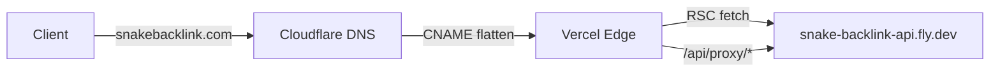

<!-- RT-R1: F1 (drop CORS *.vercel.app wildcard), F11 + F-sentry-defer (Sentry FE-only with hardening, BE deferred to Phase 4), Phase 0 prereq link -->
<!-- RT-R2: F5 (document VERCEL_URL preview Origin allowlist auto-fallback). CSP unchanged: `script-src 'self' https://plausible.io` correct because mobile nav + UserMenu are proper React components (no inline JS — RT-R2: revert-R1-F-shadcn-slim). -->
<!-- Effort delta: 2.5h → 2.5h (no significant change) -->

> **Pre-flight:** [Phase 0 prerequisites](phase-00-prerequisites.md) checklist must be complete (domain registered + Cloudflare DNS propagated + Vercel Pro account + Sentry org + Plausible account + GitHub secrets prepared) BEFORE this phase begins.

## Context Links

- Research R2: `plans/260426-0237-phase3-web-saas-foundation/research/researcher-r2-plumbing-deploy.md` (lines 207-274 — Vercel + Cloudflare DNS chain)
- Phase 06: `phase-06-landing-revamp.md` (sitemap + robots + locale routing)
<!-- RT-R2-PIVOT 2026-04-27: Custom domain `snakebacklink.com` DEFERRED to Phase 11 (was Phase 10). Phase 7-10 deploy to Vercel auto-subdomain `snake-backlink-forge.vercel.app`. All `snakebacklink.com` references below are PHASE 11 ACTIVATION ONLY — replace with `snake-backlink-forge.vercel.app` for Phase 7 prod env vars + CORS_ORIGINS. Custom domain DNS section DEFERRED. See phase-00 Phase 11 Re-activation Checklist. Trigger: tester referral active OR brand revenue justifies $9/yr. -->

- Phase 02: `phase-02-backend-auth-and-cors.md` (CORS env-driven; Phase 7-10 prod origin `https://snake-backlink-forge.vercel.app`; Phase 11 swaps to `https://snakebacklink.com`)
- Phase 03: `phase-03-frontend-auth-flow.md` (httpOnly cookie `secure: prod`)
- Master prompt: `docs/MASTER_PROMPT.md` §5.5 lines 1352-1357 (engineering bar — Sentry + Plausible)
- Scout: `plans/260426-0237-phase3-web-saas-foundation/reports/scout-codebase-state.md` (§7 — frontend deploy NONE; backend Fly.io existing)

## Overview

- **Priority:** P0 (without deploy, no production launch)
- **Status:** pending
- **Brief:** Set up Vercel Pro project `sbf-web` linked to GitHub `apps/web/`. Configure env vars (production + preview). Wire Cloudflare DNS: `snakebacklink.com` + `www.snakebacklink.com` CNAME `cname.vercel-dns.com` (DNS-only / gray cloud). Add Sentry `@sentry/nextjs` to FE only (RT-R1: F11 + F-sentry-defer; BE Sentry deferred to Phase 4 when AI generation introduces async failures benefiting from stack traces). Sentry FE hardening: `beforeSend` + `beforeBreadcrumb` redact auth headers + sbf_live_* substrings; replay maskAllInputs, blockAllMedia; tracesSampler returns 0 for `/login`+`/api/auth/verify`; sourcemaps deleted after upload (RT-R1: F11). Add Plausible analytics script (cookieless) in root layout. CORS_ORIGINS strict prod allowlist NO `*.vercel.app` wildcard (RT-R1: F1). Verify cross-origin smoke.

## Key Insights

- **Vercel Pro mandatory** ($20/mo) — Hobby forbids commercial SaaS use (R2 line 215-218); ToS violation risk
- **Cloudflare gray cloud (DNS-only)** required — orange cloud terminates TLS at Cloudflare, breaks Vercel Let's Encrypt HTTP-01 challenge (R2 line 257)
- **CNAME apex via Cloudflare flattening** — Cloudflare allows CNAME on root (`@`); other registrars require ALIAS or A records
- Vercel auto-issues SSL on domain add (typically 5-15 min wait after DNS propagation)
- Existing backend already on Fly.io with `/health` and `/ready` endpoints — re-use for cross-origin smoke
- Sentry Next.js SDK has Source Maps support; build step uploads automatically when `SENTRY_AUTH_TOKEN` set
- Backend Sentry: use `getsentry/sentry-go` v0.x; integrate via Fiber middleware after `recover` so panics flow to Sentry
- Plausible self-hosted vs cloud: pick **cloud** (`plausible.io`) for solo founder simplicity; cookieless GDPR-safe; ~$9/mo @ 10k pageviews
- Preview deploys: every PR/push to non-main branch gets `sbf-pr-XX-org.vercel.app` URL — point to **prod backend** for previews per R2 line 271 (read-only routes safe; mutations gated by per-user API key)

## Requirements

### Functional

- Vercel project `sbf-web` linked to git repo, deploys `apps/web/` from main branch
- Production domain: `snakebacklink.com` + `www.snakebacklink.com` (canonical: non-www OR www, choose **non-www** for shorter brand)
- Vercel env vars (set via dashboard, NOT committed):
  - Production: `NEXT_PUBLIC_API_BASE_URL=https://snake-backlink-api.fly.dev`, `NEXT_PUBLIC_APP_URL=https://snakebacklink.com`, `NEXT_PUBLIC_TELEGRAM_BOT_USERNAME=SnakeBacklinkForgeBot`, `NEXT_PUBLIC_PLAUSIBLE_DOMAIN=snakebacklink.com`, `NEXT_PUBLIC_SENTRY_DSN=<dsn>`, `SENTRY_AUTH_TOKEN=<token>` (server-only), `SENTRY_ORG`, `SENTRY_PROJECT`
  - Preview: same as Production except `NEXT_PUBLIC_APP_URL` uses Vercel preview URL pattern
- Backend Fly env (via `flyctl secrets set`):
  - `CORS_ORIGINS=https://snakebacklink.com,https://www.snakebacklink.com` — NO `*.vercel.app` wildcard (RT-R1: F1; preview deploys use server-side proxy, never browser→Fly direct)
  - `SENTRY_DSN_BACKEND` deferred (RT-R1: F-sentry-defer — Phase 4)
- Sentry Next.js FE only: `sentry.client.config.ts` (active) + `sentry.server.config.ts` + `sentry.edge.config.ts` (scaffolded empty for Phase 4) + `instrumentation.ts`
- Plausible: `<script defer data-domain="snakebacklink.com" src="https://plausible.io/js/script.js" />` in root layout `<head>`
- Smoke endpoint reachable: `curl https://snakebacklink.com/api/proxy/api/v1/health` → 200 (no cookie needed since health is public)
- DNS chain: `snakebacklink.com.` IN CNAME `cname.vercel-dns.com.` proxied=false

### Non-functional

- TLS A grade on `https://snakebacklink.com` (SSL Labs)
- Sentry sample rate 10% in prod, 100% in dev (cost control)
- Plausible script async + defer (no blocking)
- CSP header strict (`default-src 'self'; script-src 'self' https://plausible.io; connect-src 'self' https://plausible.io https://*.sentry.io`)
- 0 hardcoded URLs — all from env
- Preview deploys auto-purge after 30 days (Vercel default)

## Architecture

### DNS chain



### Sentry topology (RT-R1: F-sentry-defer — Phase 3 ships FE only)

| Service | DSN | SDK | Source Maps |
|---------|-----|-----|-------------|
| `apps/web` | `NEXT_PUBLIC_SENTRY_DSN` | `@sentry/nextjs` | uploaded on Vercel build, deleted from runtime per RT-R1: F11 (`deleteSourcemapsAfterUpload: true`) |
| `services/api` | DEFERRED to Phase 4 | DEFERRED | N/A — async stack traces for AI gen jobs benefit most |

Two separate Sentry projects scaffolded in Phase 0 (org/project ready). FE active Phase 3. BE activates Phase 4.

### CSP header

```
default-src 'self';
script-src 'self' https://plausible.io;
connect-src 'self' https://plausible.io https://*.sentry.io https://snake-backlink-api.fly.dev;
img-src 'self' data: https:;
style-src 'self' 'unsafe-inline';  -- Tailwind v4 still uses inline style attrs in some primitives
font-src 'self' data:;
frame-ancestors 'none';
form-action 'self';
base-uri 'self';
```

## Related Code Files

### Create

<!-- RT-R1: F-sentry-defer — server/edge config files scaffolded as empty stubs for Phase 4 BE Sentry; client config active -->
<!-- RT-R1: F11 — sentry.client.config.ts has hardened beforeSend, beforeBreadcrumb, replay configs, tracesSampler -->

- `apps/web/sentry.client.config.ts` (RT-R1: F11 — full hardening)
- `apps/web/sentry.server.config.ts` (SCAFFOLD empty Sentry.init — activated Phase 4)
- `apps/web/sentry.edge.config.ts` (SCAFFOLD empty Sentry.init — activated Phase 4)
- `apps/web/instrumentation.ts`
- `apps/web/src/lib/analytics/plausible.tsx` (Script component wrapper)
- `apps/web/vercel.json` (optional — only if explicit headers/redirects beyond what Next provides)
- `docs/deployment-guide.md` (NEW or extend if exists — runbook for Vercel + DNS + secrets)
<!-- BE Sentry files (services/api/internal/util/sentry.go, services/api/internal/middleware/sentry_capture.go) DEFERRED to Phase 4 — RT-R1: F-sentry-defer -->

### Modify

<!-- RT-R1: F-sentry-defer — BE main.go + server.go modifications DEFERRED to Phase 4. -->

- `apps/web/next.config.ts` — wrap with `withSentryConfig(...)` (RT-R1: F11 — `widenClientFileUpload: false`, `deleteSourcemapsAfterUpload: true`); add CSP headers via `async headers()`
- `apps/web/src/app/layout.tsx` — add `<PlausibleScript />` in `<head>`
- `apps/web/.env.example` — add `NEXT_PUBLIC_SENTRY_DSN=`, `SENTRY_AUTH_TOKEN=`, `NEXT_PUBLIC_PLAUSIBLE_DOMAIN=`
- `services/api/internal/config/config.go` — config-time assert: panic on boot if any `CORS_ORIGINS` entry contains `*` or regex metacharacters AND credentials enabled (RT-R1: F1)

### Delete

- None

## Implementation Steps

### Step 1 — Vercel project + GitHub link (15 min)

1. Vercel dashboard → "Add New Project" → Import GitHub repo
2. Root directory: `apps/web`
3. Framework preset: Next.js (auto-detected)
4. Build command: `pnpm --filter @sbf/web build` (or default `pnpm build` with workspace setup)
5. Install command: `pnpm install --frozen-lockfile`
6. Output directory: `.next` (default)
7. Project name: `sbf-web` → resulting URL `snake-backlink-forge.vercel.app`
8. Set env vars (Production + Preview both):
   ```
   NEXT_PUBLIC_API_BASE_URL=https://snake-backlink-api.fly.dev
   NEXT_PUBLIC_APP_URL=https://snakebacklink.com  (preview: leave empty → uses VERCEL_URL fallback)
   NEXT_PUBLIC_TELEGRAM_BOT_USERNAME=SnakeBacklinkForgeBot
   NEXT_PUBLIC_PLAUSIBLE_DOMAIN=snakebacklink.com
   NEXT_PUBLIC_SENTRY_DSN=<filled in Step 3>
   SENTRY_AUTH_TOKEN=<from Sentry org settings>
   SENTRY_ORG=<sbf-org>
   SENTRY_PROJECT=sbf-web
   ```

   **RT-R2: F5 — Vercel preview Origin allowlist auto-fallback:** The `/api/auth/verify` Route Handler (Phase 03) auto-adds `https://${VERCEL_URL}` to allowed origins when `VERCEL_ENV === 'preview'`. `VERCEL_URL` is auto-injected by Vercel runtime — no manual config needed. Without this fallback, login is broken on every preview branch deploy. This is documented for tester/operator clarity.
9. Click Deploy → wait for green build → visit `snake-backlink-forge.vercel.app` → confirm landing renders

### Step 2 — Cloudflare DNS chain (15 min)

1. Cloudflare dashboard → `snakebacklink.com` → DNS → Records
2. Add CNAME:
   - Type: `CNAME`
   - Name: `@` (apex)
   - Target: `cname.vercel-dns.com`
   - **Proxy: DNS only (gray cloud OFF)** ← critical
3. Add CNAME for `www`:
   - Name: `www`
   - Target: `cname.vercel-dns.com`
   - Proxy: DNS only
4. Vercel dashboard → `sbf-web` → Settings → Domains → Add `snakebacklink.com`
5. Vercel auto-detects DNS, issues Let's Encrypt cert (~5-15 min)
6. Add `www.snakebacklink.com` too; configure redirect to `https://snakebacklink.com` (canonical non-www)
7. Verify: `dig snakebacklink.com CNAME` → returns `cname.vercel-dns.com`
8. Verify: `curl -Iv https://snakebacklink.com` → TLS verified, 200

### Step 3 — Sentry FE setup (40 min)

```bash
cd apps/web
pnpm add @sentry/nextjs
# Sentry CLI wizard — creates DSN, configs, instrumentation.ts
pnpm dlx @sentry/wizard@latest -i nextjs --saas
```

Wizard creates files; **manually replace `sentry.client.config.ts` with hardened version (RT-R1: F11)**:

```ts
// sentry.client.config.ts — RT-R1: F11 hardening
import * as Sentry from '@sentry/nextjs'

const REDACT_HEADERS = ['authorization', 'cookie', 'set-cookie']
const KEY_PATTERN = /sbf_live_[A-Za-z0-9]+/g

function redactHeaders(headers?: Record<string, string>) {
  if (!headers) return headers
  for (const k of Object.keys(headers)) {
    if (REDACT_HEADERS.includes(k.toLowerCase())) headers[k] = '[REDACTED]'
  }
  return headers
}

function redactKeyMatches(s?: string) {
  return s?.replace(KEY_PATTERN, 'sbf_live_[REDACTED]')
}

Sentry.init({
  dsn: process.env.NEXT_PUBLIC_SENTRY_DSN,
  environment: process.env.VERCEL_ENV || 'development',

  // RT-R1: F11 — sample 0 for auth paths (avoid sending login traffic)
  tracesSampler(samplingContext) {
    const path = samplingContext.transactionContext?.name || ''
    if (path.startsWith('/login') || path.startsWith('/api/auth/verify')) return 0
    return 0.1
  },

  // RT-R1: F11 — replay tuned for security
  replaysSessionSampleRate: 0,
  replaysOnErrorSampleRate: 1.0,
  integrations: [
    Sentry.replayIntegration({
      maskAllText: false,    // need readable text for debugging
      maskAllInputs: true,   // mask form inputs (covers paste-key field)
      blockAllMedia: true,
    }),
  ],

  // RT-R1: F11 — strip auth headers + sbf_live_* substrings from event
  beforeSend(event) {
    if (event.request) {
      event.request.headers = redactHeaders(event.request.headers)
      event.request.cookies = undefined
      event.request.data = redactKeyMatches(typeof event.request.data === 'string' ? event.request.data : undefined)
    }
    if (event.message) event.message = redactKeyMatches(event.message) ?? event.message
    return event
  },

  // RT-R1: F11 — strip same fields from breadcrumb data (XHR/fetch trace)
  beforeBreadcrumb(breadcrumb) {
    if (breadcrumb.data) {
      breadcrumb.data.request_headers = redactHeaders(breadcrumb.data.request_headers)
      breadcrumb.data.response_headers = redactHeaders(breadcrumb.data.response_headers)
      if (typeof breadcrumb.data.url === 'string') {
        breadcrumb.data.url = redactKeyMatches(breadcrumb.data.url)
      }
    }
    return breadcrumb
  },
})
```

`sentry.server.config.ts` + `sentry.edge.config.ts` SCAFFOLD only:

```ts
// SCAFFOLD — RT-R1: F-sentry-defer — activated Phase 4 when AI gen ships
import * as Sentry from '@sentry/nextjs'
// Sentry.init({ dsn: process.env.NEXT_PUBLIC_SENTRY_DSN, ... })  // ENABLE in Phase 4
```

`instrumentation.ts`:

```ts
export async function register() {
  if (process.env.NEXT_RUNTIME === 'nodejs') await import('./sentry.server.config')
  if (process.env.NEXT_RUNTIME === 'edge') await import('./sentry.edge.config')
}
```

`next.config.ts` wrapped (RT-R1: F8 — no next-intl plugin):

```ts
// next.config.ts — RT-R1: F8 (no next-intl), RT-R1: F11 (sourcemap secure delete)
import { withSentryConfig } from '@sentry/nextjs'
import type { NextConfig } from 'next'

const cspValue = "default-src 'self'; script-src 'self' https://plausible.io; connect-src 'self' https://plausible.io https://*.sentry.io https://snake-backlink-api.fly.dev; img-src 'self' data: https:; style-src 'self' 'unsafe-inline'; font-src 'self' data:; frame-ancestors 'none'; form-action 'self'; base-uri 'self'"
const cspHeaders = [{ source: '/(.*)', headers: [
  { key: 'Content-Security-Policy', value: cspValue },
  { key: 'X-Frame-Options', value: 'DENY' },
  { key: 'X-Content-Type-Options', value: 'nosniff' },
] }]

const config: NextConfig = {
  reactStrictMode: true,
  async headers() { return cspHeaders },
}

export default withSentryConfig(
  config,
  {
    silent: true,
    org: process.env.SENTRY_ORG,
    project: process.env.SENTRY_PROJECT,
    // RT-R1: F11 — sourcemap secure delete after upload
    widenClientFileUpload: false,
    sourcemaps: { deleteSourcemapsAfterUpload: true },
  },
  { hideSourceMaps: true, disableLogger: true },
)
```

**Sourcemap verification (RT-R1: F11):** after deploy, run `curl -I https://snakebacklink.com/_next/static/chunks/main-*.js.map` → must return 404. If 200, sourcemap secure delete failed.

Add CSP via `next.config.ts` `async headers()`:

```ts
const cspValue = "default-src 'self'; script-src 'self' https://plausible.io; connect-src 'self' https://plausible.io https://*.sentry.io https://snake-backlink-api.fly.dev; img-src 'self' data: https:; style-src 'self' 'unsafe-inline'; font-src 'self' data:; frame-ancestors 'none'; form-action 'self'; base-uri 'self'"
const cspHeaders = [{ source: '/(.*)', headers: [{ key: 'Content-Security-Policy', value: cspValue }, { key: 'X-Frame-Options', value: 'DENY' }, { key: 'X-Content-Type-Options', value: 'nosniff' }] }]
```

### Step 4 — Plausible script (10 min)

`apps/web/src/lib/analytics/plausible.tsx`:

```tsx
import Script from 'next/script'

export function PlausibleScript() {
  const domain = process.env.NEXT_PUBLIC_PLAUSIBLE_DOMAIN
  if (!domain) return null
  return <Script defer data-domain={domain} src="https://plausible.io/js/script.js" strategy="afterInteractive" />
}
```

In `apps/web/src/app/layout.tsx`:

```tsx
import { PlausibleScript } from '@/lib/analytics/plausible'
// inside <body> or <head>
<PlausibleScript />
```

### Step 5 — (DEFERRED) Sentry Backend

<!-- RT-R1: F-sentry-defer — BE Sentry deferred to Phase 4. Reason: Phase 3 backend changes are mostly synchronous request/response handlers — Fiber recover middleware + zap structured logs already cover. Phase 4 (AI generation) introduces async job failures, retries, and context loss — that's where stack traces are valuable. Sentry org + project scaffolded in Phase 0 ready to flip on. -->

Skip this step. Sentry FE only in Phase 3 per RT-R1: F-sentry-defer.

### Step 6 — Production CORS update (10 min)

<!-- RT-R1: F1 — strict allowlist; NO `*.vercel.app` wildcard. Auth bypass risk too high. -->

```bash
flyctl secrets set CORS_ORIGINS="https://snakebacklink.com,https://www.snakebacklink.com" --app snake-backlink-api
```

**Why no preview wildcard (RT-R1: F1):**
- Vercel preview deploys do NOT need backend CORS — they use server-side proxy via Route Handler (`/api/proxy/[...path]/route.ts` from Phase 3)
- Server-side fetch from Vercel runtime → Fly carries `Authorization: Bearer` header; no browser CORS preflight involved
- Preview origins NEVER need direct browser → Fly. If a future preview test ever does need backend, add the SPECIFIC preview domain (not wildcard) to allowlist

**Config-time assert (added to Step 5 in Phase 02 wiring):**

```go
// services/api/internal/config/config.go
func (c *Config) Validate() error {
  for _, o := range c.CORSOrigins {
    // RT-R1: F1 — reject wildcards/regex chars; auth bypass via subdomain takeover or evil clone domain
    if strings.ContainsAny(o, "*?[](){}") {
      return fmt.Errorf("CORS_ORIGINS contains wildcard/regex char (banned with credentials): %q", o)
    }
  }
  return nil
}
```

Boot panics if invalid origin set. Defense against operator mistake reintroducing wildcard.

### Step 7 — Backend deploy (CORS only — RT-R1: F-sentry-defer) (5 min)

```bash
flyctl deploy --app snake-backlink-api
flyctl logs --app snake-backlink-api  # verify clean boot, no CORS validation panic
```

(Sentry BE init line skipped — deferred to Phase 4. RT-R1: F-sentry-defer.)

### Step 8 — Smoke test prod (15 min)

```bash
# DNS + TLS
dig snakebacklink.com CNAME
curl -Iv https://snakebacklink.com 2>&1 | grep -i 'http\|expire'

# Landing
curl -s https://snakebacklink.com | grep -i 'snake backlink'

# Cross-origin proxy chain
curl -i https://snakebacklink.com/api/proxy/api/v1/health

# Direct backend
curl -i https://snake-backlink-api.fly.dev/api/v1/health

# Sentry: trigger a 500 by hitting a nonexistent backend route through proxy
curl -s -i https://snakebacklink.com/api/proxy/api/v1/__force_500__
# Then check Sentry dashboard for event
```

### Step 9 — Plausible verification (5 min)

1. Plausible dashboard → Add site `snakebacklink.com`
2. Visit `https://snakebacklink.com/vi` once
3. Plausible "real-time" tab → confirm 1 visitor
4. View page source → `<script defer data-domain="snakebacklink.com" ...>` present, no cookies set (verify in DevTools Application tab)

### Step 10 — Documentation update (10 min)

Update or create `docs/deployment-guide.md`:

- Production URLs map (frontend, backend, Sentry projects, Plausible)
- DNS chain diagram (Cloudflare → Vercel)
- Env var matrix (which env where)
- Rollback procedure (Vercel: revert deploy via dashboard; Fly: `flyctl releases`)
- Incident response: Sentry alert routing, Plausible visitor anomaly check
- Cost: Vercel Pro $20 + Plausible $9 + Fly $5-15 + Sentry free tier (5k errors/mo)

## Todo List

- [ ] Phase 0 prereqs verified (domain, Cloudflare, Vercel Pro, Sentry org, Plausible, GitHub secrets)
- [ ] Step 1 — Vercel project created, env vars set, first deploy green on `snake-backlink-forge.vercel.app`
- [ ] Step 2 — Cloudflare CNAME apex + www → `cname.vercel-dns.com` (gray cloud); Vercel domain added
- [ ] Step 3 — Sentry FE: hardened `sentry.client.config.ts` (beforeSend + beforeBreadcrumb redact + replay maskAllInputs + tracesSampler 0 for /login + sourcemap secure delete) — RT-R1: F11
- [ ] Step 3b — `sentry.server.config.ts` + `sentry.edge.config.ts` SCAFFOLD only (RT-R1: F-sentry-defer — Phase 4 activates)
- [ ] Step 4 — Plausible script in root layout (cookieless)
- [ ] Step 5 — (DEFERRED) BE Sentry — RT-R1: F-sentry-defer
- [ ] Step 6 — Fly secret `CORS_ORIGINS=https://snakebacklink.com,https://www.snakebacklink.com` (NO `*.vercel.app` — RT-R1: F1) + config Validate panics on wildcard
- [ ] Step 7 — Backend redeployed with strict CORS; logs confirm clean boot
- [ ] Step 8 — Cross-origin smoke: `/api/proxy/api/v1/health` returns 200 from prod
- [ ] Step 8b — Sourcemap verification: `curl -I https://.../*.js.map` → 404 (RT-R1: F11)
- [ ] Step 9 — Plausible records first visit (real-time view)
- [ ] Step 10 — `docs/deployment-guide.md` written/updated (incl. RT-R1 hardening notes)

## Success Criteria

- `https://snakebacklink.com` and `https://www.snakebacklink.com` both serve via Vercel with valid TLS
- `www` → 301 redirect to non-www
- Lighthouse on prod URL ≥ 90 (validated in Phase 06; reconfirm here on real CDN)
- CSP header present on every response (`Content-Security-Policy`); no inline-script violations on landing or login
- Sentry FE: trigger an error (e.g., bad route) → event appears in Sentry within 60s
- Sentry BE: trigger a 500 by hitting protected route without auth (returns 401 — not 500; instead trigger via crafted body to a known panicky path) → event appears in Sentry
- Plausible real-time tab shows visits without setting cookies
- `flyctl logs` shows `sentry init success` line on boot
- DNS propagation complete (`whatsmydns.net` shows green globally)
- Backend `/api/v1/health` reachable from prod frontend through proxy
- No CORS preflight failures in browser DevTools when navigating dashboard

## Risk Assessment

| Risk | Likelihood | Impact | Mitigation |
|------|-----------|--------|-----------|
| Operator reintroduces `*.vercel.app` CORS wildcard | Med | Critical | RT-R1: F1 — config Validate panics on boot if `CORS_ORIGINS` contains `*` chars with credentials |
| Sentry leaks API key via breadcrumb URL or response header | Med | Critical | RT-R1: F11 — `beforeBreadcrumb` redacts headers + URL `sbf_live_*` substrings; `beforeSend` redacts request body |
| Sentry sourcemap leak exposes source code | Med | High | RT-R1: F11 — `widenClientFileUpload: false` + `deleteSourcemapsAfterUpload: true`; verify `/_next/static/.../*.map` returns 404 post-deploy |
| Cloudflare orange-cloud accidentally enabled → Vercel SSL fails | Med | High | Phase 0 prereq + `dig` check in runbook; manual review before "Add Domain" click |
| Vercel build cache poisoned (wrong env applied to wrong env target) | Low | Med | Verify env scoping per-target in Vercel dashboard; clear cache and redeploy if suspect |
| CSP breaks shadcn primitives using inline styles | Med | Med | `style-src 'self' 'unsafe-inline'` allows inline styles (still blocks inline scripts); verify on prod via DevTools Console |
| Plausible script blocked by ad blockers | High | Low | Accepted — affected users won't be tracked; not critical for Phase 3 |
| Login page traffic floods Sentry quota | Med | Med | RT-R1: F11 — `tracesSampler` returns 0 for `/login` + `/api/auth/verify` paths |

## Security Considerations

- **TLS:** Let's Encrypt via Vercel; auto-renewal; A grade SSL Labs target
- **HSTS:** Vercel auto-adds `Strict-Transport-Security: max-age=...` once domain stable
- **CSP:** Strict policy blocks inline scripts → defense against XSS exfiltrating cookie
- **CORS (RT-R1: F1):** Backend allowlist EXPLICIT prod domains only — `https://snakebacklink.com,https://www.snakebacklink.com`. No wildcards, no `*.vercel.app`, no regex. Config-time Validate panics on boot if invalid. Preview deploys use server-side proxy (no browser→Fly direct).
- **Sentry data (RT-R1: F11):** `beforeSend` strips Authorization, Cookie, Set-Cookie headers + redacts `sbf_live_*` substrings in request body + URL. `beforeBreadcrumb` strips same fields from breadcrumb data (XHR/fetch trace). `tracesSampler` returns 0 for auth paths to keep them out entirely. Replay `maskAllInputs: true, blockAllMedia: true`. Sourcemaps deleted after upload.
- **Plausible:** No cookies, no user IDs sent — GDPR-safe by design
- **Secrets in env:** `SENTRY_AUTH_TOKEN` (server-only, no `NEXT_PUBLIC_`), `WP_ENC_KEY`, `JWT_SECRET` etc — verify none leak via `next build` bundle inspection
- **Vercel access:** Solo founder = 1 seat; require 2FA on Vercel + Cloudflare + Fly accounts

<!-- RT-R1: F11 — full hardened Sentry config moved to Step 3 above; section removed to avoid duplication -->

## Next Steps

- **Depends on:** Phase 02 (CORS env var), Phase 03 (cookie secure flag), Phase 06 (sitemap + robots ready for SEO)
- **Unblocks:** Phase 08 (Lighthouse CI runs against deployed URL)
- **Follow-up:** Phase 9 — Sentry release tracking via semantic-release tag; Phase 10 — soak test against prod URL

## Resolved unresolved questions (from R2)

- **R2 Q5 (Vercel seat count):** RESOLVED — solo founder = 1 seat (Pro $20/mo).
- **R2 Q2 (edge runtime for proxy):** DEFERRED — Node runtime stays for Phase 3 (cookie ergonomics + Sentry compatibility); reconsider in Phase 9 perf pass.
- **R2 Q3 (cookie encryption via iron-session):** DEFERRED — httpOnly + secure + SameSite=Lax sufficient for Phase 3; revisit if compliance requires.
- **Scout Q7 (FE deploy target):** RESOLVED — Vercel Pro.
