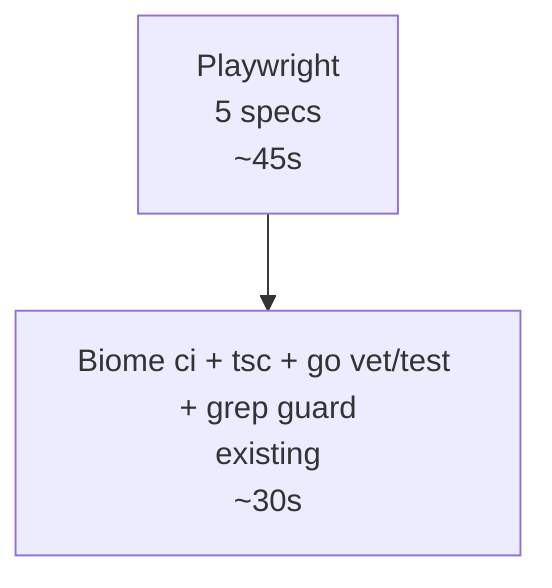

<!-- RT-R1: F-vercel-action (drop amondnet, use Vercel native), F-lighthouse-flake (warn-level perf), F9 (E2E open-redirect test), F15 (Go contract test integration) -->
<!-- RT-R2: F4 (drop Vitest + testcontainers + Lighthouse + kin-openapi — keep Playwright only); F12 (drop kin-openapi contract test entirely); F7 (Playwright fixture cookie name __Host-sbf_key + secure:true via mkcert HTTPS); F3 (CI grep guard against TanStack Query imports); F8 (proxy-body-limit.spec.ts for 2MB→413 verification) -->
<!-- Effort delta: 5h → 3h (drop Vitest -1.5h, drop testcontainers -1h, drop Lighthouse -0.5h, drop kin-openapi -0.5h, fixture fix +30min, proxy-body-limit spec +20min, grep guard +5min) -->

## Context Links

- Phase 02: `phase-02-backend-auth-and-cors.md` (`auth_apikey` middleware contract)
- Phase 03: `phase-03-frontend-auth-flow.md` (login flow + proxy 1MB cap — RT-R2: F8)
- Phase 04: `phase-04-app-shell-and-dashboard.md` (dashboard data flow)
- Phase 05: `phase-05-wp-sites-connect.md` (WP REST mock target; useTransition + router.refresh — RT-R2: F3)
- Phase 07: `phase-07-deploy-and-observability.md` (Vercel preview URL pattern)
- Master prompt: `docs/MASTER_PROMPT.md` §5.5 lines 1352, 1358 (test pyramid + CI/CD bar)
- Scout: `plans/260426-0237-phase3-web-saas-foundation/reports/scout-codebase-state.md` (§7 — existing CI: pnpm install → biome ci → pnpm -r typecheck → pnpm -r build; go vet/lint/test; gitleaks)

## Overview

- **Priority:** P0 (gates merge to main; trust without tests is dangerous for fintech-adjacent code)
- **Status:** pending
- **Brief:** Set up Playwright in `apps/web/e2e/` with 5 specs: login-flow, login-redirect (open-redirect cases), dashboard-load, wp-connect-mock, proxy-body-limit (RT-R2: F8 — 2MB→413). Update `.github/workflows/ci.yml`: add `pnpm --filter @sbf/web exec playwright test`. CI grep guard against `@tanstack/react-query` imports (RT-R2: F3 — enforce R1+R2 architectural decision). Fixture cookie uses `__Host-sbf_key` + `secure: true` via mkcert HTTPS dev certs (RT-R2: F7). DROPPED (RT-R2: F4): Vitest unit tests, testcontainers-go integration test, Lighthouse CI. Existing Phase 2 backend tests cover middleware sufficiently; Lighthouse manual-once-before-launch.

## Key Insights (RT-R2)

- **Test pyramid simplified to Playwright + Biome + tsc + go test:** R1 had 5 layers (Vitest unit, testcontainers integration, Playwright E2E, Lighthouse perf, kin-openapi contract). R2 found this is over-engineered for solo founder Phase 3:
  - Vitest unit tests for cookies/redirect-safe — Playwright `login-redirect.spec.ts` already covers via real flow
  - testcontainers Go integration test for auth_apikey — existing Phase 2 backend tests (no testcontainers in prod path) cover sufficiently
  - Lighthouse CI — flaky on shared runners; manual run once before launch
  - kin-openapi contract test — dropped entirely (RT-R2: F12); Playwright E2E catches drift
- **Playwright kept** as the single E2E layer — covers login flow, redirect sanitization, dashboard load, WP connect mock, proxy body limit. Real-flow tests are higher value than mocked unit tests for this codebase shape.
- **`__Host-` cookie + Playwright (RT-R2: F7):** Phase 03 sets `__Host-sbf_key` with `secure: true` (RT-R1: F10). Playwright fixture must match (`secure: true`) — but secure cookies require HTTPS. Solution: mkcert localhost certs for `playwright webServer`. One-time setup, documented in `apps/web/e2e/README.md`.
- **CI grep guard (RT-R2: F3):** R1 dropped TanStack Query (F13). R2 found Phase 5 `sites-table.tsx` was still importing `@tanstack/react-query` despite the architectural decision. Add `grep -rn '@tanstack/react-query' apps/web/src/` step that fails build. Prevents regression.

## Requirements

### Functional

- Playwright specs (5 total, each ~50-100 lines):
  - `e2e/login-flow.spec.ts` — bad key → toast; valid key (mocked backend) → dashboard land
  - `e2e/login-redirect.spec.ts` — 9 open-redirect cases (RT-R1: F9): `next=//evil`, `next=https://evil`, `next=/login`, `next=/api/`, `next=/dashboard%2F..`, `next=/dashboard/../admin`, `next=javascript:`, `next=/dashboard` ✓, `next=/sites` ✓
  - `e2e/dashboard-load.spec.ts` — authed cookie → 3 cards render with mocked data; verify single `/me` call (RT-R2: F-bundled-cache-dedup verification)
  - `e2e/wp-connect-mock.spec.ts` — mock `/api/proxy/api/v1/wp-sites` POST 201 → redirect; mock 422 invalid_credentials → toast; mock 502 → wp_server_error_502 toast (RT-R2: F-bundled-retry-drop verification)
  - `e2e/proxy-body-limit.spec.ts` (NEW — RT-R2: F8) — POST 2MB body to `/api/proxy/api/v1/echo` → 413 payload_too_large
- CI workflow `.github/workflows/ci.yml`:
  - `node` job: existing steps + grep guard (RT-R2: F3) + `pnpm --filter @sbf/web exec playwright install --with-deps chromium` + `pnpm --filter @sbf/web exec playwright test`
  - `go` job: existing steps unchanged (no testcontainers — RT-R2: F4; no kin-openapi — RT-R2: F12)
  - Existing `gitleaks` job unchanged
  - NO Lighthouse job (RT-R2: F4 — manual once before launch)

<!-- RT-R2: F4 — DROPPED requirements:
  - Vitest unit tests (cookies, redirect-safe, currency, date, client)
  - testcontainers-go auth_apikey integration test
  - Lighthouse CI step
  - kin-openapi Go contract test integration (already dropped in Phase 1 + 2)
-->

### Non-functional

- Playwright runs headless in CI; uses Chromium only (skip WebKit/Firefox for cost)
- Test fixtures: `__Host-sbf_key` + `secure: true` (RT-R2: F7); HTTPS dev server via mkcert
- CI total time budget: ≤ 6 min on free GitHub runners (down from R1's 8min — Vitest+testcontainers+Lighthouse all dropped)

## Architecture

### Test pyramid (R2 simplified — RT-R2: F4)



**Dropped layers (RT-R2: F4):** Vitest unit, testcontainers Go integration, Lighthouse perf, kin-openapi contract. Existing Phase 2 backend tests + Playwright E2E provide sufficient confidence for Phase 3 ship.

### Vercel preview URL extraction (kept from R1)

<!-- RT-R1: F-vercel-action — drop `amondnet/vercel-action@v25` (third-party, abandonment risk). Use Vercel native GitHub integration (auto-deploys on PR, posts URL as bot comment). -->
<!-- RT-R2: F4 — Lighthouse step DROPPED. Vercel preview URL extraction no longer needed. Vercel comment-based URL still useful for manual smoke. -->

NO automated Lighthouse job (RT-R2: F4). Vercel native GitHub integration auto-deploys every PR + posts comment with preview URL — operator clicks it for manual smoke.

## Related Code Files

### Create

<!-- RT-R2: F4 — DROPPED: vitest.config.ts, vitest.setup.ts, *.test.ts unit tests, testutil/containers.go, lighthouserc.json -->
<!-- RT-R2: F8 — proxy-body-limit.spec.ts NEW -->
<!-- RT-R2: F7 — fixture cookie uses __Host-sbf_key + secure:true; mkcert README -->

- `apps/web/playwright.config.ts`
- `apps/web/e2e/login-flow.spec.ts`
- `apps/web/e2e/login-redirect.spec.ts` (RT-R1: F9 — 9 cases for `next` param)
- `apps/web/e2e/dashboard-load.spec.ts`
- `apps/web/e2e/wp-connect-mock.spec.ts`
- `apps/web/e2e/proxy-body-limit.spec.ts` (RT-R2: F8 — 2MB→413 verification)
- `apps/web/e2e/fixtures/auth.ts` (helper sets `__Host-sbf_key` + secure:true — RT-R2: F7)
- `apps/web/e2e/README.md` (mkcert setup instructions for HTTPS dev — RT-R2: F7)

<!-- RT-R2: F4 — DROPPED files:
  - apps/web/vitest.config.ts
  - apps/web/vitest.setup.ts
  - apps/web/src/lib/auth/redirect-safe.test.ts
  - apps/web/src/lib/auth/cookies.test.ts
  - apps/web/src/lib/format/currency.test.ts
  - apps/web/src/lib/format/date.test.ts
  - apps/web/src/lib/api/client.test.ts
  - services/api/internal/middleware/auth_apikey_test.go (testcontainers)
  - services/api/internal/testutil/containers.go
  - .github/lighthouserc.json
-->

### Modify

- `apps/web/package.json` — add scripts `test:e2e`, `test:e2e:ui`; add devDeps (`@playwright/test`). DROPPED: vitest, @vitest/ui, happy-dom, @testing-library/* (RT-R2: F4)
- `.github/workflows/ci.yml` — extend node job with grep guard (RT-R2: F3) + Playwright; NO lighthouse job (RT-R2: F4)
- `apps/web/.gitignore` — add `playwright-report/`, `test-results/`

<!-- RT-R2: F4 — DROPPED modifications: services/api/go.mod testcontainers; vitest deps in package.json -->

### Delete

- None

## Implementation Steps

<!-- RT-R2: F4 — Steps 1-2 (Vitest), Step 5 (testcontainers), Step 7 + 9 (Lighthouse) DROPPED entirely. Renumbered. -->

### Step 1 — Playwright setup (30 min)

```bash
cd apps/web
pnpm add -D @playwright/test
pnpm exec playwright install --with-deps chromium
```

`apps/web/playwright.config.ts`:

```ts
import { defineConfig, devices } from '@playwright/test'
export default defineConfig({
  testDir: './e2e',
  timeout: 30_000,
  retries: process.env.CI ? 2 : 0,
  use: {
    // RT-R2: F7 — HTTPS for __Host- cookie + secure:true match
    baseURL: process.env.E2E_BASE_URL || 'https://localhost:3000',
    trace: 'on-first-retry',
    ignoreHTTPSErrors: true, // mkcert local certs on CI runner
  },
  webServer: process.env.E2E_BASE_URL ? undefined : {
    // RT-R2: F7 — dev server with HTTPS via mkcert; see e2e/README.md
    command: 'pnpm dev:https',
    url: 'https://localhost:3000',
    reuseExistingServer: !process.env.CI,
    timeout: 60_000,
  },
  projects: [{ name: 'chromium', use: { ...devices['Desktop Chrome'] } }],
})
```

Add scripts to `apps/web/package.json`:

```json
{
  "scripts": {
    "dev:https": "next dev --experimental-https",
    "test:e2e": "playwright test",
    "test:e2e:ui": "playwright test --ui"
  }
}
```

`apps/web/e2e/README.md` (RT-R2: F7 mkcert setup):

```markdown
# Playwright E2E setup

Tests run against HTTPS dev server because Phase 3 uses `__Host-sbf_key` cookie with `secure: true`.

## Local setup (one-time)

```bash
# Install mkcert (https://github.com/FiloSottile/mkcert)
mkcert -install
mkdir -p apps/web/.certs
cd apps/web/.certs
mkcert localhost
# Produces localhost.pem + localhost-key.pem
```

Next.js 15.5 `--experimental-https` auto-detects these certs.

## CI

CI uses Next's auto-generated self-signed cert via `--experimental-https`. `ignoreHTTPSErrors: true` in playwright.config bypasses cert validation in test mode.
```

### Step 2 — Playwright fixtures with __Host-sbf_key (15 min)

<!-- RT-R2: F7 — fixture cookie matches Phase 3 production setup: __Host-sbf_key prefix, secure:true, sameSite Lax (Strict is verify-only). Without this match, dashboard tests fail because middleware doesn't recognize the cookie. -->

`apps/web/e2e/fixtures/auth.ts`:

```ts
import { Page } from '@playwright/test'

// RT-R2: F7 — match Phase 3 cookie exactly: __Host- prefix + secure:true + Lax
export async function seedAuthCookie(page: Page, key = 'sbf_live_e2e_test_key') {
  await page.context().addCookies([{
    name: '__Host-sbf_key',  // RT-R2: F7 — was 'sbf_key' in R1; mismatch broke middleware
    value: key,
    domain: 'localhost',
    path: '/',
    httpOnly: true,
    secure: true,            // RT-R2: F7 — was false in R1; __Host- requires Secure
    sameSite: 'Lax',
  }])
}
```

### Step 3 — `login-redirect.spec.ts` for open-redirect (RT-R1: F9) (15 min)

```ts
import { test, expect } from '@playwright/test'

const cases = [
  { next: '//evil.com',                expected: '/dashboard' },
  { next: 'https://evil.com',          expected: '/dashboard' },
  { next: '/login',                    expected: '/dashboard' }, // loop guard
  { next: '/api/proxy/api/v1/me',      expected: '/dashboard' }, // API path block
  { next: '/dashboard%2F..%2Fadmin',   expected: '/dashboard' }, // encoded escape
  { next: '/dashboard/../admin',       expected: '/dashboard' }, // traversal
  { next: 'javascript:alert(1)',       expected: '/dashboard' }, // protocol scheme
  { next: '/dashboard',                expected: '/dashboard' }, // happy path stays
  { next: '/sites',                    expected: '/sites' },     // happy path other route
]

for (const { next, expected } of cases) {
  test(`sanitizeNext rejects "${next}" → ${expected}`, async ({ page }) => {
    await page.route('**/api/auth/verify', r => r.fulfill({ status: 200, body: JSON.stringify({ ok: true, user: { id: 'u1' } }) }))
    await page.route('**/api/proxy/api/v1/me', r => r.fulfill({ status: 200, body: JSON.stringify({ user_id: 'u1', balance_credits: 0, key_prefix: 'sbf_live_x', key_last4_hash: '0000' }) }))
    await page.route('**/api/proxy/api/v1/transactions**', r => r.fulfill({ status: 200, body: JSON.stringify({ items: [] }) }))
    await page.goto(`/login?next=${encodeURIComponent(next)}`)
    await page.getByPlaceholder('sbf_live_...').fill('sbf_live_e2e')
    await page.getByRole('button').click()
    await expect(page).toHaveURL(new RegExp(expected.replace(/\//g, '\\/') + '$'))
  })
}
```

### Step 4 — `login-flow.spec.ts` (30 min)

```ts
import { test, expect } from '@playwright/test'

test('rejects bad key', async ({ page }) => {
  await page.route('**/api/auth/verify', r => r.fulfill({ status: 401, body: JSON.stringify({error:'invalid_key'}) }))
  await page.goto('/login')
  await page.getByPlaceholder('sbf_live_...').fill('sbf_live_bogus')
  await page.getByRole('button', { name: /Đăng nhập|Login/i }).click()
  await expect(page.getByText(/không hợp lệ|invalid/i)).toBeVisible()
})

test('valid key lands dashboard', async ({ page }) => {
  await page.route('**/api/auth/verify', r => r.fulfill({ status: 200, body: JSON.stringify({ ok: true, user: { id: 'u1', key_prefix: 'sbf_live_Zk3' } }) }))
  await page.route('**/api/proxy/api/v1/me', r => r.fulfill({ status: 200, body: JSON.stringify({ user_id: 'u1', balance_credits: 1000, key_prefix: 'sbf_live_Zk3', key_last4_hash: 'a3f9' }) }))
  await page.route('**/api/proxy/api/v1/transactions**', r => r.fulfill({ status: 200, body: JSON.stringify({ items: [] }) }))
  await page.goto('/login')
  await page.getByPlaceholder('sbf_live_...').fill('sbf_live_valid_e2e')
  await page.getByRole('button', { name: /Đăng nhập|Login/i }).click()
  await expect(page).toHaveURL(/\/dashboard/)
  await expect(page.getByText(/Tổng quan|Overview/i)).toBeVisible()
})
```

### Step 5 — `dashboard-load.spec.ts` (20 min)

```ts
import { test, expect } from '@playwright/test'
import { seedAuthCookie } from './fixtures/auth'

test('dashboard renders 3 cards', async ({ page }) => {
  await seedAuthCookie(page)

  let meCallCount = 0
  await page.route('**/api/proxy/api/v1/me', r => {
    meCallCount++
    r.fulfill({ status: 200, body: JSON.stringify({ user_id: 'u1', balance_credits: 1500000, key_prefix: 'sbf_live_Zk3', key_last4_hash: 'a3f9' }) })
  })
  await page.route('**/api/proxy/api/v1/transactions**', r => r.fulfill({ status: 200, body: JSON.stringify({ items: [{ id:'t1', created_at:'2026-04-25T00:00:00Z', amount: 500000, status:'paid', package:'tier_pro' }] }) }))

  await page.goto('/dashboard')
  await expect(page.getByText(/Số dư|Balance/i)).toBeVisible()
  await expect(page.getByText(/Giao dịch|Recent/i)).toBeVisible()
  await expect(page.getByText(/Nạp thêm|Top up/i)).toBeVisible()

  // RT-R2: F-bundled-cache-dedup verification — /me deduped to single call via React.cache()
  await page.waitForLoadState('networkidle')
  expect(meCallCount).toBe(1)
})
```

NOTE: server-side fetch in RSC happens before Playwright sees the request — `page.route()` intercepts browser requests but RSC fetch goes through the proxy Route Handler. Mock at the proxy level (`**/api/proxy/api/v1/*`).

### Step 6 — `wp-connect-mock.spec.ts` (30 min)

```ts
import { test, expect } from '@playwright/test'
import { seedAuthCookie } from './fixtures/auth'

test('successful wp connect', async ({ page }) => {
  await seedAuthCookie(page)
  await page.route('**/api/proxy/api/v1/wp-sites', r => {
    if (r.request().method() === 'POST') {
      r.fulfill({ status: 201, body: JSON.stringify({ id:'s1', base_url:'https://example.com', status:'connected' }) })
    } else r.continue()
  })
  await page.goto('/sites/connect')
  await page.getByLabel(/Site URL/i).fill('https://example.com')
  await page.getByLabel(/App username/i).fill('admin')
  await page.getByLabel(/App password/i).fill('xxxx xxxx xxxx xxxx xxxx xxxx')
  await page.getByLabel(/Label/i).fill('Test')
  await page.getByRole('button', { name: /Kết nối|Connect/i }).click()
  await expect(page).toHaveURL(/\/sites$/)
})

test('invalid credentials shows error', async ({ page }) => {
  await seedAuthCookie(page)
  await page.route('**/api/proxy/api/v1/wp-sites', r => {
    if (r.request().method() === 'POST') {
      r.fulfill({ status: 422, body: JSON.stringify({ error: 'invalid_credentials' }) })
    } else r.continue()
  })
  await page.goto('/sites/connect')
  await page.getByLabel(/Site URL/i).fill('https://example.com')
  await page.getByLabel(/App username/i).fill('admin')
  await page.getByLabel(/App password/i).fill('xxxx xxxx xxxx xxxx xxxx xxxx')
  await page.getByRole('button', { name: /Kết nối|Connect/i }).click()
  await expect(page.getByText(/sai|incorrect/i)).toBeVisible()
})

// RT-R2: F-bundled-retry-drop — 502 returns specific code, single attempt no retry
test('502 wp_server_error shows specific message', async ({ page }) => {
  await seedAuthCookie(page)
  await page.route('**/api/proxy/api/v1/wp-sites', r => {
    if (r.request().method() === 'POST') {
      r.fulfill({ status: 422, body: JSON.stringify({ error: 'wp_server_error_502' }) })
    } else r.continue()
  })
  await page.goto('/sites/connect')
  await page.getByLabel(/Site URL/i).fill('https://example.com')
  await page.getByLabel(/App username/i).fill('admin')
  await page.getByLabel(/App password/i).fill('xxxx xxxx xxxx xxxx xxxx xxxx')
  await page.getByRole('button', { name: /Kết nối|Connect/i }).click()
  await expect(page.getByText(/Site server tạm thời không phản hồi/i)).toBeVisible()
})
```

### Step 7 — `proxy-body-limit.spec.ts` NEW (RT-R2: F8) (20 min)

<!-- RT-R2: F8 — verify proxy 1MB body cap rejects 2MB POST with 413 before body read. -->

`apps/web/e2e/proxy-body-limit.spec.ts`:

```ts
import { test, expect } from '@playwright/test'
import { seedAuthCookie } from './fixtures/auth'

// RT-R2: F8 — verifies proxy 1MB body cap (Phase 03 forward()) returns 413 pre-body-read
test('proxy rejects 2MB body with 413', async ({ page, request }) => {
  await seedAuthCookie(page)

  // Build 2MB payload — well over 1MB cap
  const bigBody = JSON.stringify({ data: 'x'.repeat(2 * 1024 * 1024) })

  // Use request fixture (raw HTTP, no rendering)
  const r = await request.post('/api/proxy/api/v1/echo', {
    data: bigBody,
    headers: { 'Content-Type': 'application/json' },
    failOnStatusCode: false,
  })

  expect(r.status()).toBe(413)
  const json = await r.json()
  expect(json.error).toBe('payload_too_large')
  expect(json.max_bytes).toBe(1048576)
})

test('proxy accepts <1MB body', async ({ page, request }) => {
  await seedAuthCookie(page)
  // Mock backend response since we're hitting through proxy
  await page.route('**/api/v1/echo', r => r.fulfill({ status: 200, body: '{"ok":true}' }))
  const smallBody = JSON.stringify({ data: 'small' })
  const r = await request.post('/api/proxy/api/v1/echo', {
    data: smallBody,
    headers: { 'Content-Type': 'application/json' },
    failOnStatusCode: false,
  })
  // 1MB cap not triggered; backend mock returns 200
  expect(r.status()).not.toBe(413)
})
```

### Step 8 — CI workflow update with grep guard (RT-R2: F3) (20 min)

Edit `.github/workflows/ci.yml` (extend existing `node` job):

```yaml
node:
  runs-on: ubuntu-latest
  steps:
    - uses: actions/checkout@v4
    - uses: pnpm/action-setup@v4
      with: { version: 9.15.9 }
    - uses: actions/setup-node@v4
      with: { node-version: 20, cache: pnpm }
    - run: pnpm install --frozen-lockfile
    - run: pnpm biome ci .
    - run: pnpm -r typecheck
    - run: pnpm -r build

    # RT-R2: F3 — enforce R1+R2 architectural decision: NO TanStack Query in apps/web/
    - name: Verify no TanStack Query imports
      run: |
        if grep -rn '@tanstack/react-query' apps/web/src/; then
          echo "TanStack Query was removed in R1 (F13). Use useTransition + router.refresh()."
          exit 1
        fi

    - run: pnpm --filter @sbf/web exec playwright install --with-deps chromium
    - run: pnpm --filter @sbf/web test:e2e
      env:
        CI: true
    - if: failure()
      uses: actions/upload-artifact@v4
      with: { name: playwright-report, path: apps/web/playwright-report/ }
```

`go` job unchanged (no testcontainers — RT-R2: F4; no kin-openapi — RT-R2: F12):

```yaml
go:
  runs-on: ubuntu-latest
  steps:
    - uses: actions/checkout@v4
    - uses: actions/setup-go@v5
      with: { go-version: '1.22' }
    - run: go vet ./...
      working-directory: services/api
    - run: golangci-lint run
      working-directory: services/api
    - run: go test -race -cover -timeout 5m ./...
      working-directory: services/api
```

<!-- RT-R2: F4 — Lighthouse job DROPPED. Manual run before launch:
   pnpm dlx lighthouse@12.0.0 https://snakebacklink.com -->

### Step 9 — Smoke local + push (15 min)

```bash
# Local — Playwright only (RT-R2: F4 — no Vitest, no testcontainers)
cd apps/web
pnpm exec playwright install --with-deps chromium  # one-time
pnpm test:e2e                                      # auto-starts HTTPS dev server

# Manual Lighthouse before launch (RT-R2: F4)
pnpm dlx lighthouse@12.0.0 https://snakebacklink.com --output=json --output-path=./lh.json

# Push to PR branch and observe CI
git push origin feature/phase3-foundation
gh pr create --base main
# Verify all 3 jobs (node, go, gitleaks) green on PR
```

## Todo List

- [ ] Step 1 — Playwright installed + `playwright.config.ts` with HTTPS baseURL + e2e/README.md mkcert setup (RT-R2: F7)
- [ ] Step 2 — `e2e/fixtures/auth.ts` cookie seeding helper uses `__Host-sbf_key` + `secure:true` (RT-R2: F7)
- [ ] Step 3 — `login-redirect.spec.ts` 9 open-redirect cases (RT-R1: F9)
- [ ] Step 4 — `login-flow.spec.ts` — bad key + valid key paths
- [ ] Step 5 — `dashboard-load.spec.ts` — 3 cards visible + verify single `/me` call (RT-R2: F-bundled-cache-dedup)
- [ ] Step 6 — `wp-connect-mock.spec.ts` — success + 422 + 502 paths (RT-R2: F-bundled-retry-drop)
- [ ] Step 7 — `proxy-body-limit.spec.ts` (RT-R2: F8 — 2MB→413, <1MB→accepted)
- [ ] Step 8 — `.github/workflows/ci.yml`: node job + grep guard against TanStack Query imports (RT-R2: F3); go job unchanged; NO Lighthouse (RT-R2: F4)
- [ ] Step 9 — Local smoke green; push PR; CI green end-to-end

<!-- RT-R2: F4 — DROPPED todos:
  - Vitest install + setup + 5 unit test files
  - testcontainers Go integration test
  - Lighthouse CI job + lighthouserc.json
  - kin-openapi contract test integration
-->

## Success Criteria

- `pnpm --filter @sbf/web test:e2e` passes 5 specs locally (login-flow, login-redirect, dashboard-load, wp-connect-mock, proxy-body-limit)
- All 9 `login-redirect.spec.ts` cases pass (RT-R1: F9)
- `dashboard-load.spec.ts` verifies single `/me` call per render (RT-R2: F-bundled-cache-dedup)
- `wp-connect-mock.spec.ts` 502 case shows VN message "Site server tạm thời không phản hồi" (RT-R2: F-bundled-retry-drop)
- `proxy-body-limit.spec.ts` confirms 2MB POST → 413 + `payload_too_large` (RT-R2: F8); <1MB passes through
- CI grep guard fails build if `@tanstack/react-query` reintroduced anywhere in `apps/web/src/` (RT-R2: F3)
- CI green on PR: 3 jobs (node, go, gitleaks) all pass (NO lighthouse — RT-R2: F4)
- Playwright HTML report uploaded as artifact on failure
- Manual Lighthouse run before launch: ≥ 90 on Accessibility/Best-Practices/SEO (RT-R2: F4)

## Risk Assessment

<!-- RT-R2: F4 — Vitest+testcontainers+Lighthouse risks REMOVED entirely. -->

| Risk | Likelihood | Impact | Mitigation |
|------|-----------|--------|-----------|
| Playwright flake on slow CI | Med | Med | `retries: 2` in CI; trace on retry; ample explicit timeouts |
| Mock interception misses RSC server-side fetch (Phase 04 dashboard) | High | High | E2E target the proxy layer (`/api/proxy/*`) where browser-visible; if RSC bypasses, switch to `force-dynamic` + browser-visible fetch in test mode |
| HTTPS dev server breaks on CI runner without mkcert | Med | Med | RT-R2: F7 — Next 15.5 `--experimental-https` auto-generates self-signed cert on CI; `ignoreHTTPSErrors: true` in playwright.config |
| `__Host-sbf_key` cookie rejected if test domain is `localhost` (no Domain attribute) | Low | Med | RT-R2: F7 — `__Host-` prefix accepts no-Domain cookies; `localhost` works; verified via Playwright DevTools |
| TanStack Query reintroduced silently | Med | High | RT-R2: F3 — CI grep guard fails build; explicit error message references R1: F13 |
| Lighthouse score regressing without CI catch | Med | Low | RT-R2: F4 — manual run before launch; deferred to post-launch perf phase |
| Operator forgets to run Lighthouse before launch | Med | Med | RT-R2: F4 — add to deployment checklist in `docs/deployment-guide.md` (Phase 7) |

## Security Considerations

- E2E test cookies use fake `sbf_live_e2e_test_*` value — never collides with real keys; document for ops
- Playwright traces (HAR-like) may contain test cookie — only uploaded on failure, retention 30 days max (GitHub artifact policy)
- CI secrets (`VERCEL_TOKEN` etc.) stored in GitHub Secrets; not exposed to forked-PR CI runs (default GitHub Actions behavior)
- HTTPS dev server uses self-signed cert (mkcert local, Next auto on CI) — fine for test isolation, NOT for production
- `__Host-sbf_key` + secure:true match between fixture and production (RT-R2: F7) — prevents Phase 03 cookie hardening from being bypassed in tests

## Next Steps

- **Depends on:** All previous phases (01-07) — tests cover their surfaces
- **Unblocks:** Production launch (Phase 10 in master prompt; effectively here for foundation); confidence to merge to `main`
- **Follow-up:** Phase 4-9 each add their own Playwright specs; Codecov integration deferred (RT-R2: F4 — no Vitest coverage to upload)

## Resolved unresolved questions

- **R1 Q1 (TanStack Query v5 React 19 compat):** RESOLVED — DROPPED entirely (RT-R1: F13 + RT-R2: F3 enforced via CI grep guard).
- **R1 Q2 (sonner vs shadcn toast):** RESOLVED — sonner picked in Phase 03.
- **R1 Q3 (Next 16 timeline):** DEFERRED — stay on 15.5 until Phase 9; reassess post-launch.

## Deferred from earlier phases

- **Cookie encryption with iron-session** (R2 Q3) — defer to post-launch if compliance arises
- **Edge runtime for proxy** (R2 Q2) — defer; Node runtime fine for Phase 3 load
- **Vitest unit tests** (RT-R2: F4) — defer indefinitely; Playwright real-flow tests cover
- **testcontainers-go integration test** (RT-R2: F4) — defer indefinitely; existing Phase 2 backend tests cover
- **Lighthouse CI** (RT-R2: F4) — manual once before launch; full CI integration if perf regressions emerge
- **kin-openapi Go contract test** (RT-R2: F12) — dropped entirely; Hey API codegen + Playwright E2E catches drift
